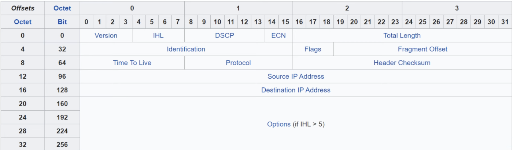

## IPv4 Header

### Version field
- Length: 4 bits
- Identifies the version of IP used
- `IPv4 = 4 (0100)`
- `IPv6 = 6 (0110)`

### Internet Header Length (IHL)
- Length: 4 bits
- The final field of the IPv4 header (Options) is variable in length, so this field is necessary to indicate the total length of the header
- Identifies the length of the header **in 4-bite increments**
- `Value of 5 = 5 * 4-bytes = 20 bytes`
- Minimum value is 5 (= 20 bytes)
- Maximum value is 15 (15 * 4-bytes = 60 bytes)
- `MINIMUM IPv4 HEADER LENGTH = 20 BYTES`
- `MAXIMUM IPv4 HEADER LENGTH = 60 BYTES`

### DSCP field
- 'Differentiated Services Code Point'
- Length: 6 bits
- Used for QoS (Quality of Service)
- Used to prioritize delay-sensitive data (streaming voice, video, etc.)

### ECN field
- 'Explicit Congestion Notification'
- Length: 2 bits
- Provides end-to-end (between two endpoints) notification of network congestion **without dropping packets**

### Total Length field
- Length: 16 bits
- Indicates the total length of the packet (L3 header + L4 segment)
- Measured in bytes (**not 4-byte increments like IHL**)
- Minimum value of 20 (=IPv4 header with no encapsulated data)
- Maximum valueo is 65535 (maximum 16-bit value)

### Identification field
- If a packet is fragmented due to being too large, this field is used to identify which packet the fragment belongs to
- All fragments of the same packet will have their own IPv4 header with the same value in this field
- Packets are fragmented if larger than the **MTU** (Maximum Transmission Unit)
- The MTU is usually **1500 bytes**
- Fragments are reassembled by the receiving host

### Flags field
- Length: 3 bits
- Used to control/identify fragments
- Bit 0: Reserved, always set to 0
- Bit 1: Don't Fragment (DF bit), used to indicate a packet that should not be fragmented
- Bit 2: More fragments, set to 1 if there are more fragments in the packet, set to 0 for the last fragment (unfragmented packets will always have their MF bit set to 0)

### Fragment Offseet field
- Length: 13 bits
- Used to indicate the position of the fragment within the original, unfragmented IP packet
- Allows fragmented packets to be reasssembled even if the fragments arrive out of order

### Time To Live field
- Length: 8 bits
- A router will drop a packet with a TTL of 0
- Used to prevent infinite loops
- Originally designed to indicate the packet's maximum lifetime in seconds
- In practice, indicates a 'hop count': each time the packet arrives at a router, the router decreases the TTL by 1
- Recommended default TTL: 64

### Protocol field
- Length: 8 bits
- Indicates the protocol of the encapsulated L4 PDU
- Value of 6: TCP
- Value of 17: UDP
- Value of 1: ICMP
- Value of 89: OSPF (dynamic routing protocol)

### Header Checksum field
- Length: 16 bits
- A calculated checksum used to check for errors in the IPv4 header
- When a router receives a packet, it calculates the checksum of the header and compares it to the one in this field of the header
- If they do not match, the router drops the packet
- Used to check for errors in the IPv4 header
- IP relies on the encapsulated protocol to detect errors in the encapsulated data
- Both TCP and UDP have their own checksum fields to detect errors in the encapsulated data

### Source/Destination IP Address fields
- Length: 32 bits (each)
- Source IP Address = IPv4 address of the sender of the packet
- Destination IP Address = IPv4 address of the intended receiver of the packet

### Options fields
- Length: 0-320 bits
- Rarely used
- If the IHL field is greater than 5, it means that Options are present

### Quiz:
1. What is the fixed binary value of the fixed binary value of the first field of an IPv4 header?
*d) 0100*

2. Which field will cause the packet to be dropped if it has a value of 0?
*a) TTL*

3. How are errors in an IPv4 packet's encapsulated data detected?
*b) The encapsulated protocol (TCP, UDP) checks for errors.*

4. Which field of an IPv4 header is variable in length?
*a) Options*

5. Which bit will be set to 1 on all IPv4 packet fragments except the last fragment?
*b) More Fragments bit*