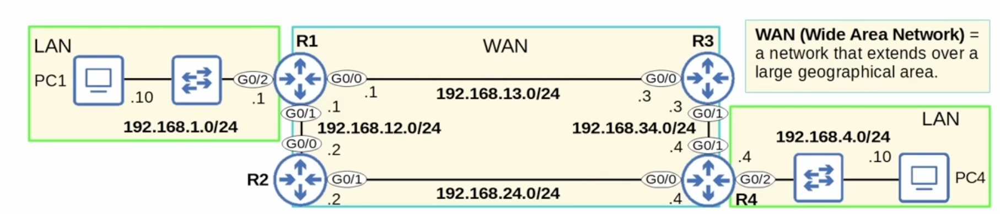
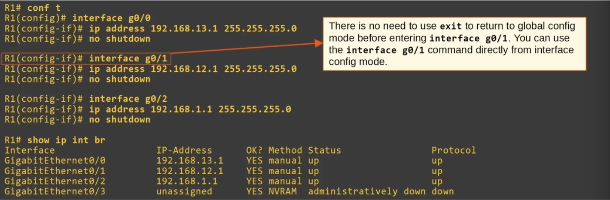
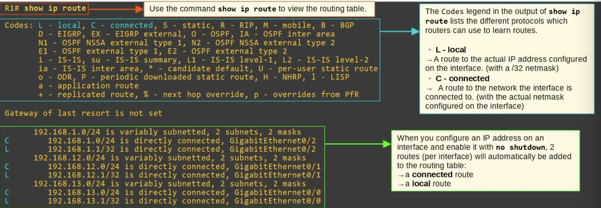
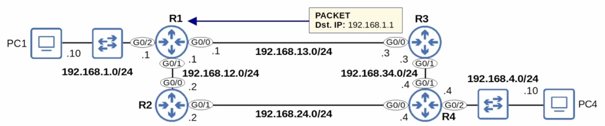
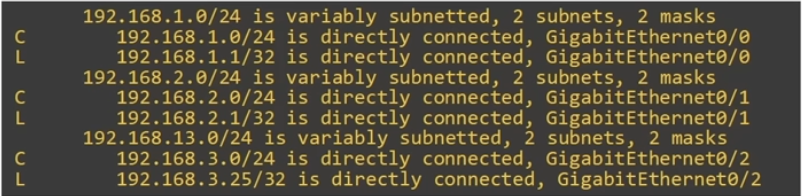
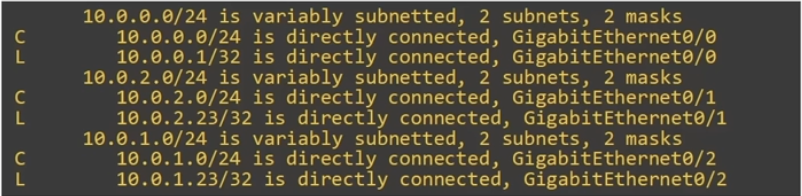

## Routing Fundamentals

### What is routing?
- **Routing** is the precess that routers use to determine the path that IP packets should take over a network to reach their destination
- Routers store routes to all of their known destinations in a **routing table**
- When routers receive packets, they look in the **routing table** to find the best route to forward that packet
- There are two main routing methods (methods that routers use to learn routes):
**Dynamic Routing**: Routers use *dynamic routing protocols* (ie. OSPF) to share routing information with each other automatically and build their routing tables
**Static Routing**: A network engineer/admin manually configures routes on the router
- A **route** tells the router: *to send a packet to destination X, you should send the packet to **next-hop** Y*
**next-hop** = the next router in the path to the destination
- Or, if the destination is directly connected to the router, *send the packet directly to the destination*
- Or, if the destination is the router's own IP address, *receive the packet for yourself (don't forward it)*
- **WAN (Wide Area Network)** = a network that extends over a large geographical area

### Connected and Local routes
- A **connected** route is a route to the network the interface is connected to
- `R1 G0/2 IP = 192.168.1.1/24`
- `Network Address = 192.168.1.0/24`
- It provides a route to all hosts in that network (ie. 192.168.1.10, 192.168.1.100, 192.168.1.232, etc.)
- R1 knows: "If I need to send a packet to any host in the 192.168.1.0/24 network, I should send it out of G0/2"
- A **local** route is a route to the exact IP address configured on the interface
- A `/32` netmask is used to specifiy the exact IP address of the interface
- `/32` means all 32 bits are 'fixed', they can't change
- Even though R1's G0/2 is configured as `192.168.1/24`, the connected route is to `192.168.1.1/32`
- R1 knows: "If I receive a packet destined for this IP address, the message is for me"
- **`192.168.1.0/24`** *matches* `192.168.1.0 - 192.168.1.255`
- If R1 receives a packet with a destination in that range, it will send the packet out of G0/2
- A route **matches** a packet's destination if the packet's destination IP address is part of the network specified in the route
- If there is **no match**, the packet is sent using a different route or is dropped if there is no matching route

### Route Selection

- A packet destined for **`192.168.1.1`** is matched by both routes: `192.168.1.0/24, 192.168.1.1/32`
- Which route will R1 use for a packet destined for `192.168.1.1`?
- It will choose the **most specific** matching route
- The route **`192.168.1.0/24`** includes 256 different IP addresses 
- The route **`192.168.1.1/32`** includes only 1 IP address (192.168.1.1)
- This route is more **specific**
- When R1 receives a packet destined for `192.168.1.1` it will select the route to `192.268.1.1/32`
- R1 will receive the packet for itself, rather than forward it out of G0/2
- **Local** route = keep the packet, don't forward
`192.168.1.0/24 is variably subnetted, 2 subnets, 2 masks`
- In the routing table, there are two routes to *subnets* that fit within the `192.268.1.0/24` Class C network, with two different netmasks (/24 and /32)

### Quiz
1. The IP address on a router interface will appear in the routing table as what kind of route?
*c) Local*

2. Examine R1's routing table. What will it do when it receives a packet destined for `192.168.3.25`?

*b) It will receive for itself*

3. Which of the following statements about the behavior of routers and switches are true? (select two)
*b) Switches flood frames with an unknown destination*
*c) Routers drop packets with an unknown destination*

4. Which two types of routes are automatically added to the routing table when you configure an IP address on an interface and enable it?
*a) C, L*

5. Examine R1's routing table below. If R1 receives a packet destined for `10.0.1.23`, how many routes match that destination? And which is the most specific matching route?

*c) Two matching routes: `10.0.1.0/24, 10.0.1.23/32`. Most specific: `10.0.1.23/32`
