## Static Routing

### Routing Packets: Default Gateway
- End hosts like PC1 and PC4 can send packets directly to destinations in their connected network
- PC1 is connected to `192.168.1.0/24`, PC4 is connected to `192.168.4.0/24`
- To send packets to destinations outside of their local network, they must send the packets to their **default gateway**

**PC1** (Linux) Config:


**PC2** (Linux) Config:


- The **default gateway** configuration is also called a **default route**
- It is a route to `0.0.0.0/0` = all netmask bits set to 0; includes all addresses from `0.0.0.0` to `255.255.255.255`
- End hosts usually have no need for any more specific routes
- They just need to know: to send packets outside of my local network, I should send them to my default gateway
- To learn R1 G0/2's MAC address, PC1 will first send an ARP request to `192.168.1.1`
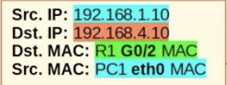

- The **default route** is the *least specific* route possible, because it includes **all** IP addresses
- `0.0.0.0/0 = 4,294,967,296` IP addresses
- A /32 route (ie. Local route) is the *most specific* route possible, because it specifies **only one** IP address
- **`192.168.1.1/32`**` = 1` IP address

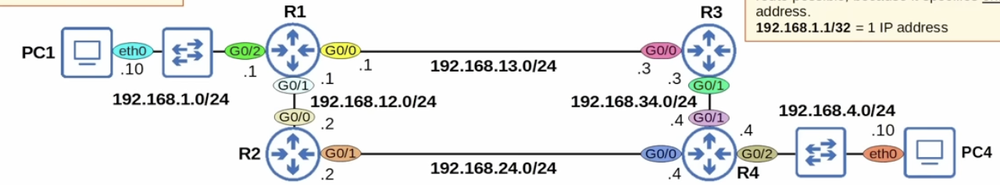

- When R1 receives the frame from PC1, it will de-encapsulate it (remove L2 header/trailer) and look inside the packet
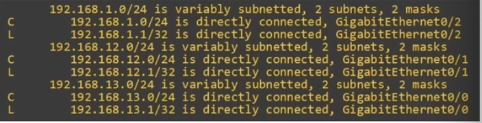
- It will check the routing table for the most-specific matching route
- R1 has no matching routes in its routing table
- It will drop the packet
- To properly forward the packet, R1 needs a route to the destination network (`192.168.4.0/24`)
- Routes are instructions: *To send a packet to destinations in network `192.168.4.0/24`, forward the packet to next hop Y*

- There are two possible path packets from PC1 to PC4 can take:
```bash
1) PC1 -> R1 -> R3 -> R4 -> PC4
2) PC1 -> R1 -> R2 -> R4 -> PC4
```
- The path R3 is chosen during this lesson, not the path via R2

- It is possible to configure the routers to:
    * *load-balance* between path `1)` and `2)`
    * Use path `1)` as the main path and path `2)` as a backup path

### Static Route Configuration
- Each router in the path needs **two** routes: a route to `192.168.1.0/24` and a route to `192.168.4.0/24`
- This ensures **two-way reachability** (PC1 can send packets to PC4, PC4 can send packets to PC1)
- R1 already has a **connected route** to `192.168.1.0/24`; R4 already has a **connected route** to `192.168.4.0/24`
- The other routes must be manually be configured (using **static routes**)
- Routers don't need routes to all networks in the path to the destination
- R1 doesn't need a route to `192.168.34.0/24`
- R4 doesn't need a route to `192.168.13.0/24`
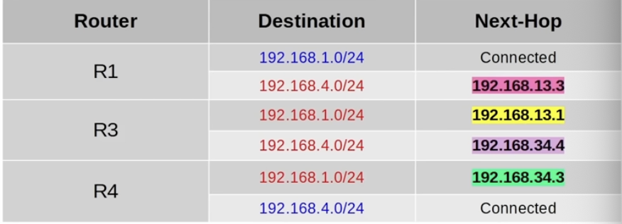
- To allow PC1 and PC4 to communicate with each other over the network, these **static routes** need to be configured on R1, R3 and R4
```bash
R1(config)# ip route ip-address netmask next-hop
```

- Static route configuration for R1:
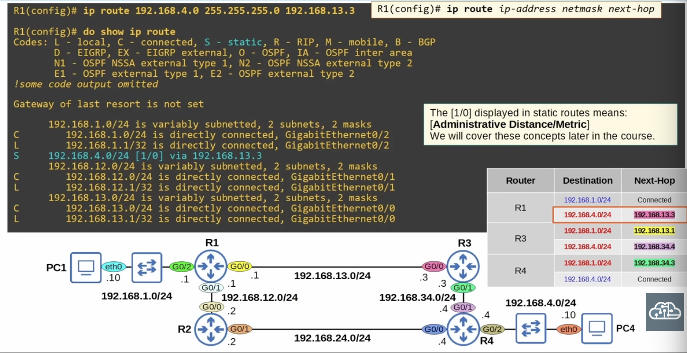

- Static route configuration for R3:
```bash
R3(config)# ip route 192.168.1.0 255.255.255.0 192.168.13.1
R3(config)# ip route 192.168.4.0 255.255.255.0 192.168.32.4
```

- Static route configuration for R4:
```bash
R4(config)# ip route 192.168.1.0 255.255.255.0 192.168.34.3
```

- Testing the route:
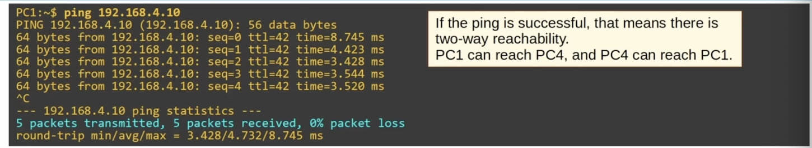

### Static Route Configuration with `exit-interface`
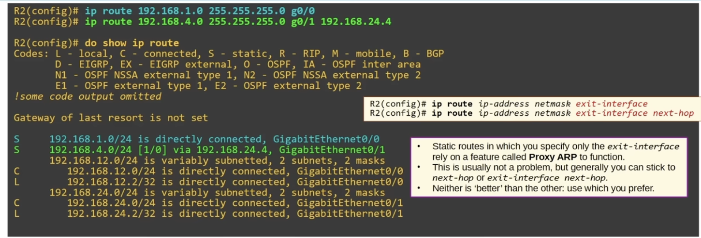

### Default Route
- If the router doesn't have any specific routes that match a packet's destination IP address, the router will forward the packet using the **default route**
- A default route is often used to direct traffic to the Internet
- More specific routes are used for destinations in the internal coroporate network
- Traffic to destinations outside of the internal network is sent to the Internet
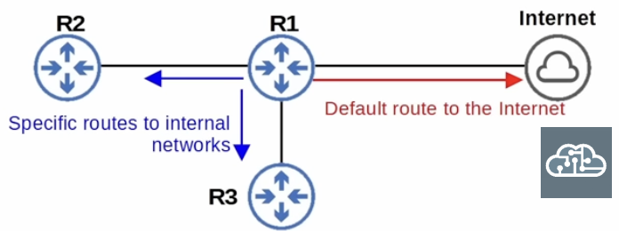
- When no default route is configured:

- Here's how to configure a default route:
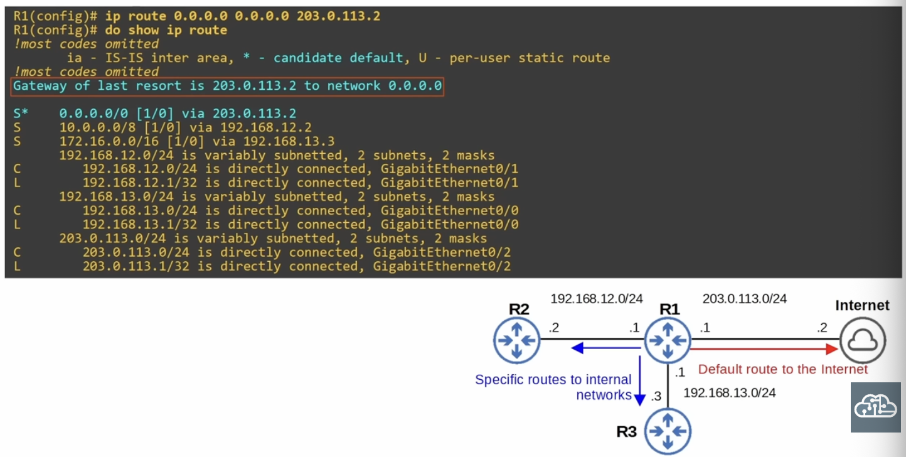

### Quiz
1. Which of the following commands configures a default route on a Cisco router?
*a) `R1(config)# ip route 0.0.0.0 0.0.0.0 10.1.1.255`

2. Examine R1's routing table. Which interface will it use to forward packets destined for `8.8.8.8`?
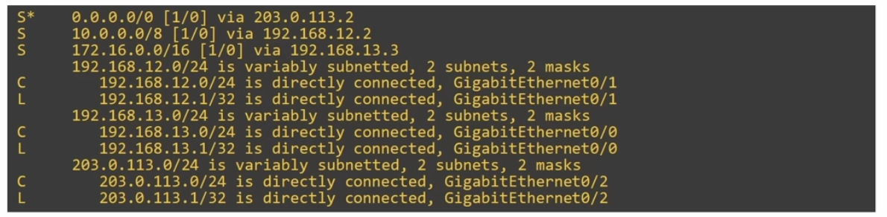
*c) GigabitEthernet0/2*

3. Examine the network below. Complete the graph with the static routes needed to allow PC1 and PC2 to communicate with each other.
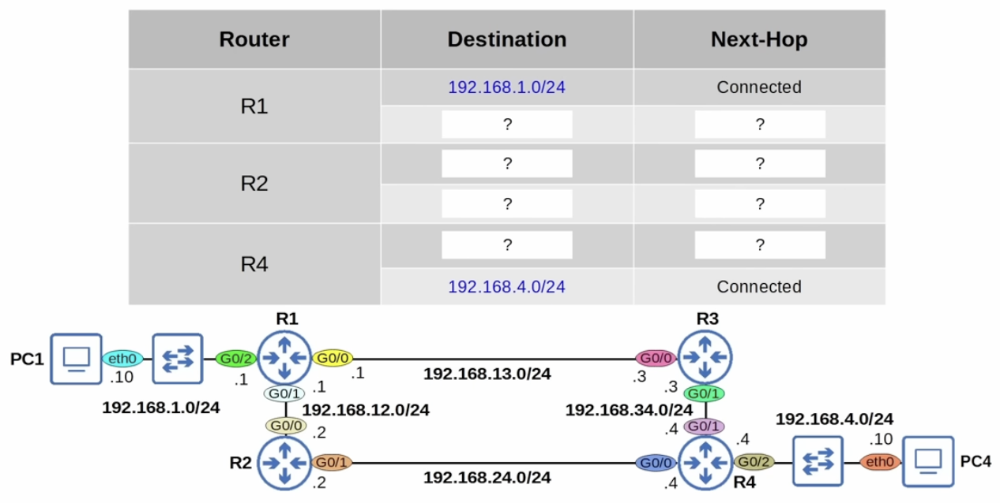

| Router | Destination | Next-Hop |
| :---: | :---: | :---: |
| R1 | `192.168.1.0/24` | Connected |
| | `192.168.4.0/24` | `192.168.12.2/24` |
| R2 | `192.168.1.0/24` | `192.168.12.1/24` |
| | `192.168.4.0/24` | `192.168.24.4/24` |
| R4 | `192.168.1.0/24` | `192.168.24.2/24` |
| | 192.168.4.0/24 | Connected |

4. Examine the following static route in R1's routing table. What command was used to configure this route?

*d) `R1(config)# ip route 172.20.0.0 255.255.0.0 g0/1`

5. Examine the diagram below. How many static routes would you have to configure on R3 for it to know all other destination networks shown in the diagram?
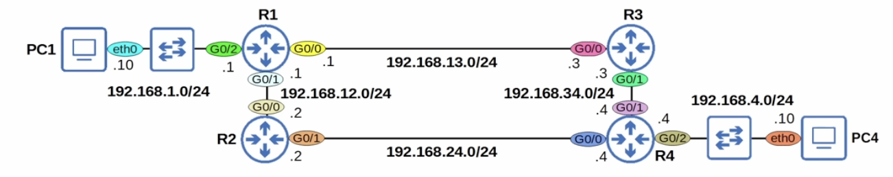
*d) Four routes*

