## The Life of a Packet

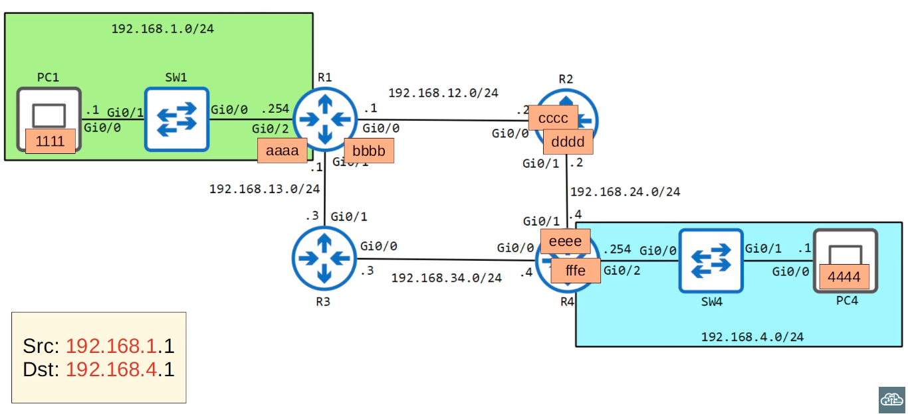
- Assuming staic route through R2

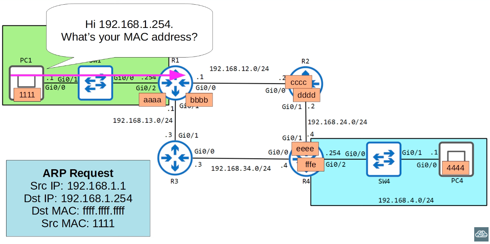
- Broadcast destination MAC address

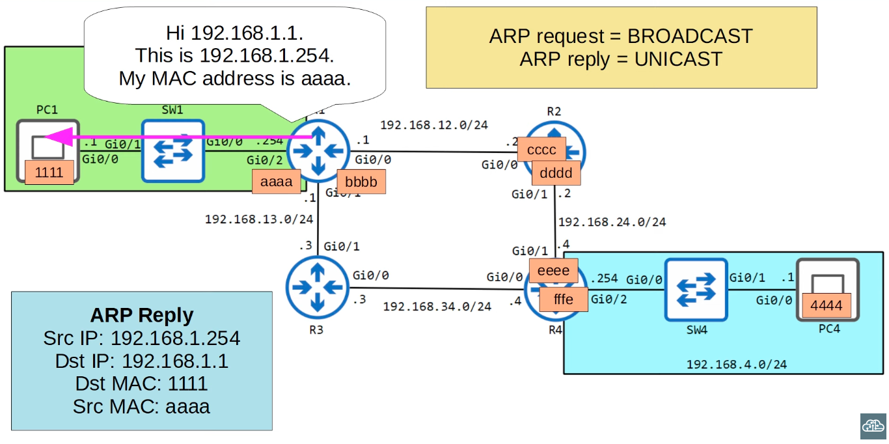

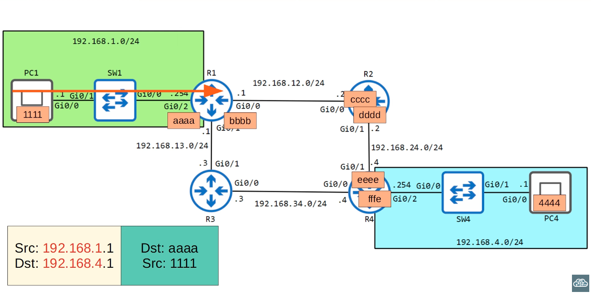

- PC1 sends the ethernet frame to R1 which removes the header and looks up in its routing table for the next hop
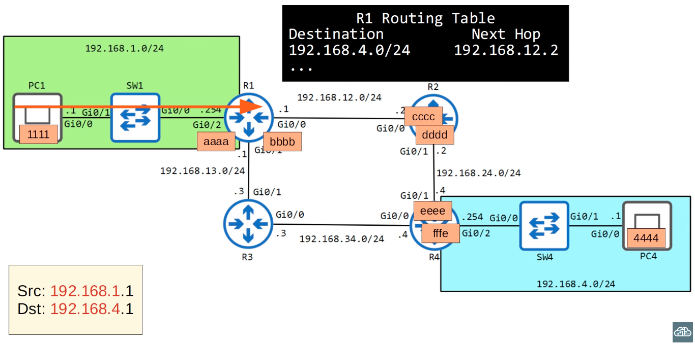

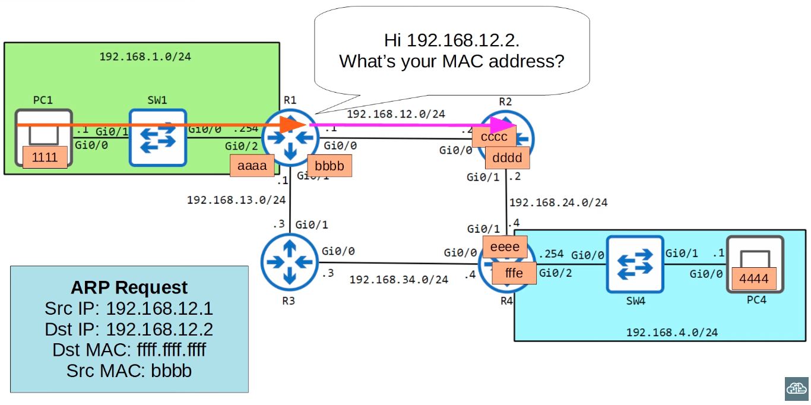
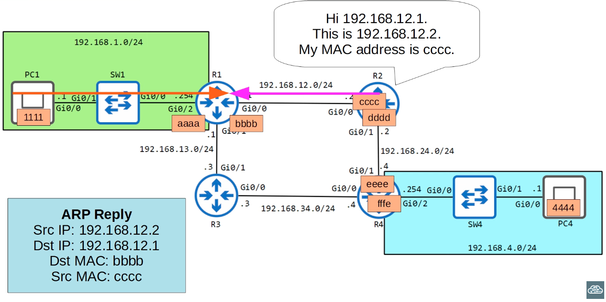

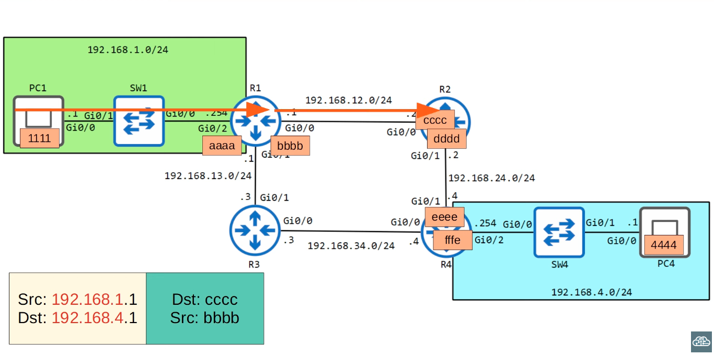

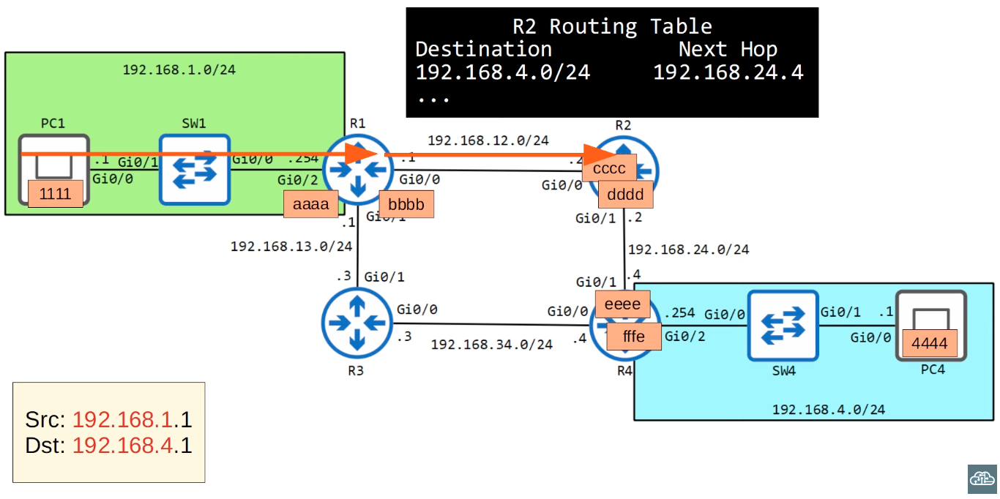

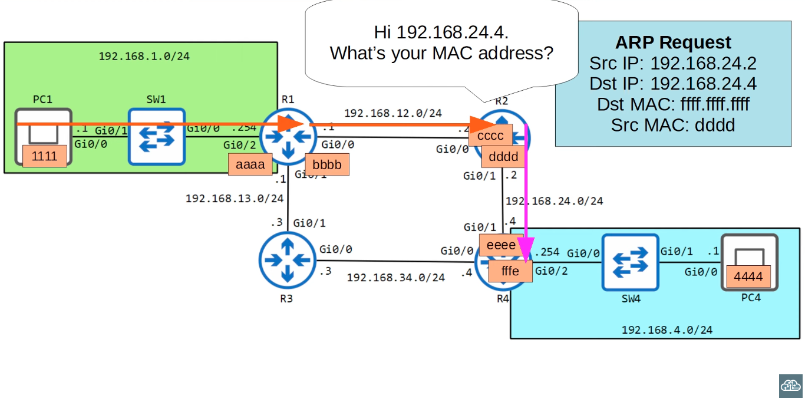
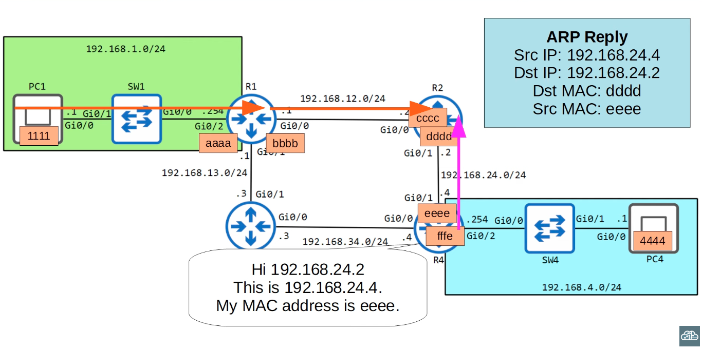

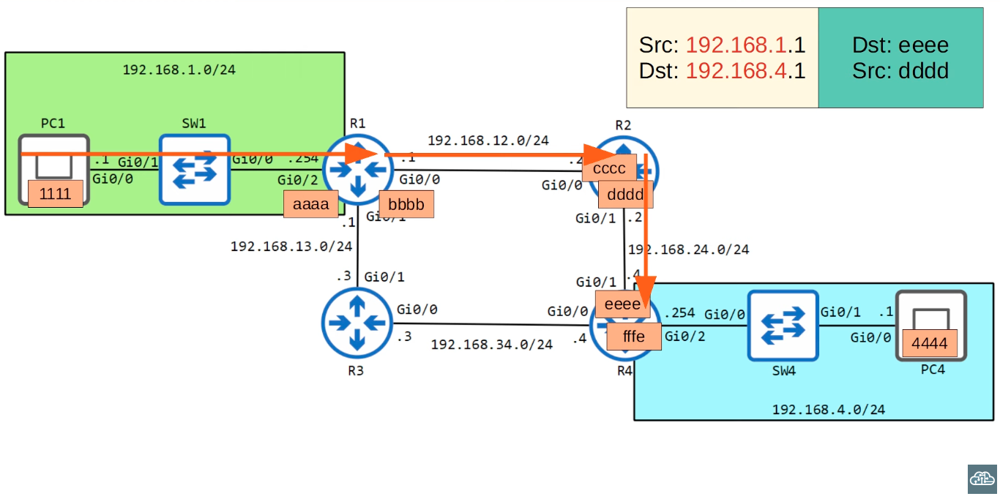

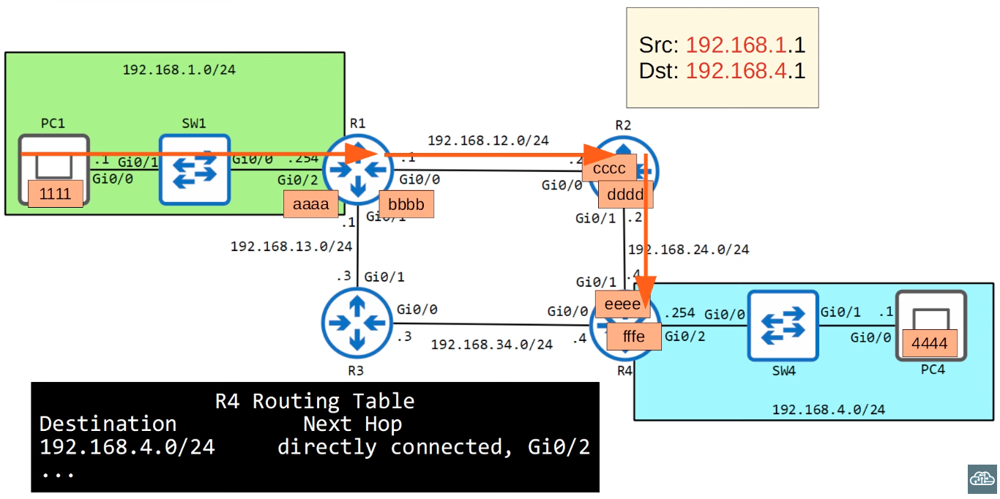

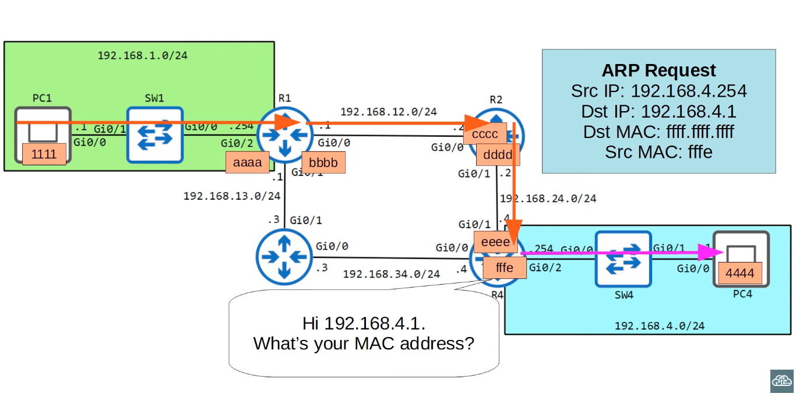
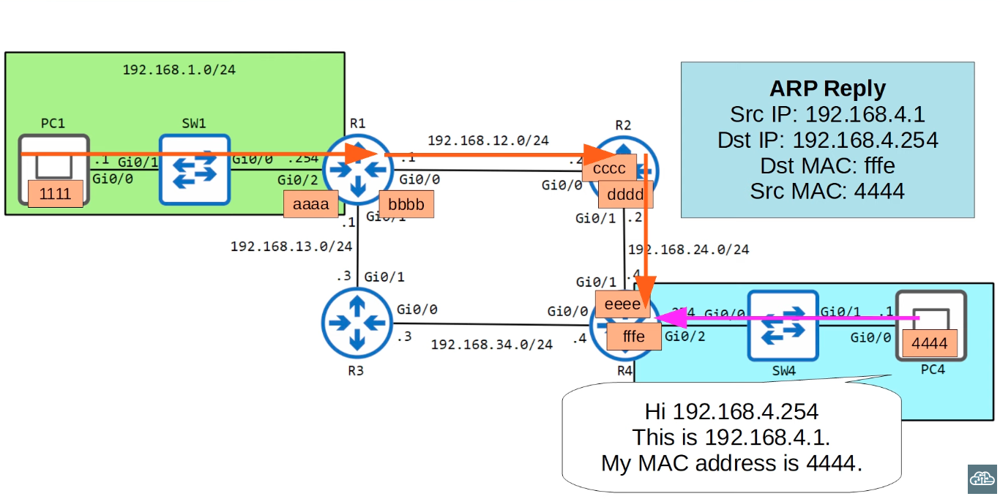

- If we send another packet from PC4 to PC1, no ARP requests will be longer needed
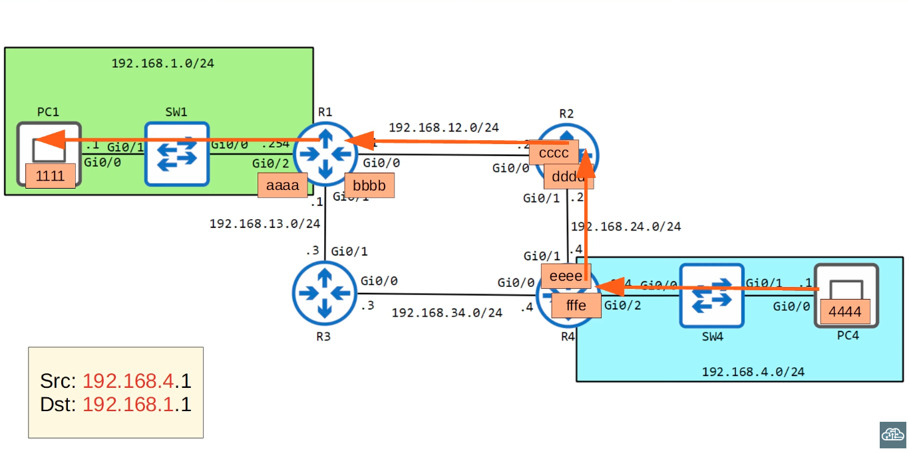

### Quiz

1. PC4 sends a packet to PC1. What is the **destination MAC addres** when it is sent from **PC4's network interface**?
*`fffe`*

2. PC4 sends a packet to PC1. What is the **source MAC addrss** when itis received on **R1's g0/0 interface**?
*`cccc`*

3. PC4 sends a packet to PC1. What is the **source MAC address** when it is sent from **SW1's g0/1 interface**?
*`aaaa`*

4. PC4 sends a packet to PC1. What is the **destination IP address** when it is sent from **R4's g0/1 interface**?
*`192.168.1.1`*

5. PC4 sends a packet to PC1. What is the **source IP address** when it is received on **R1's g0/0 interface**?
*`192.168.4.1`*

