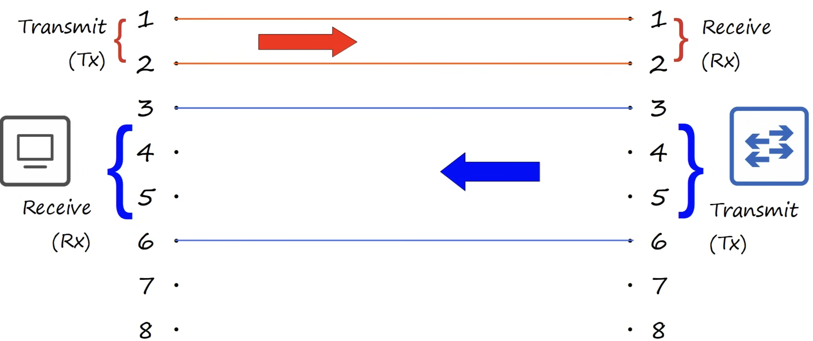
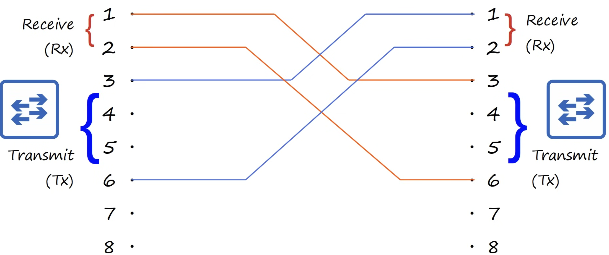
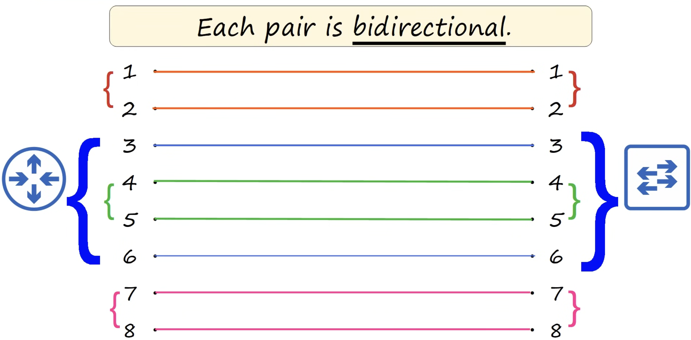
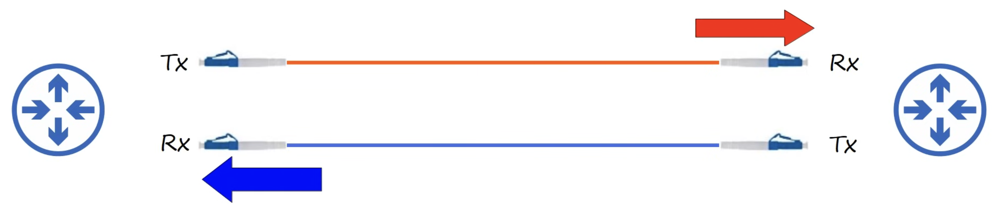
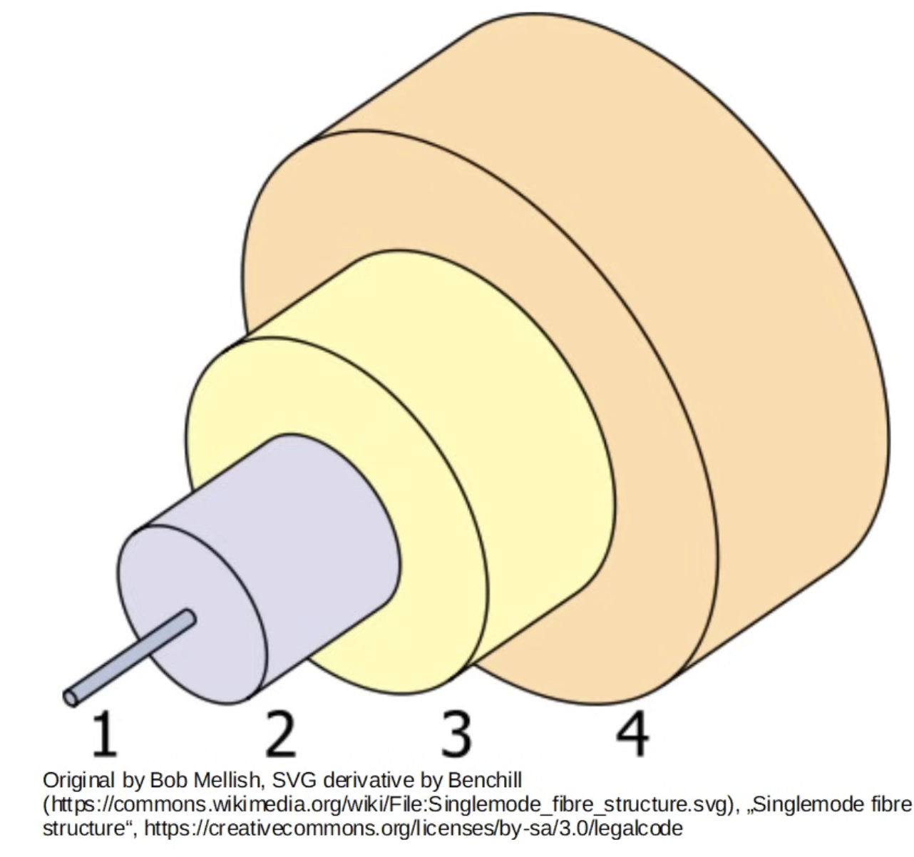
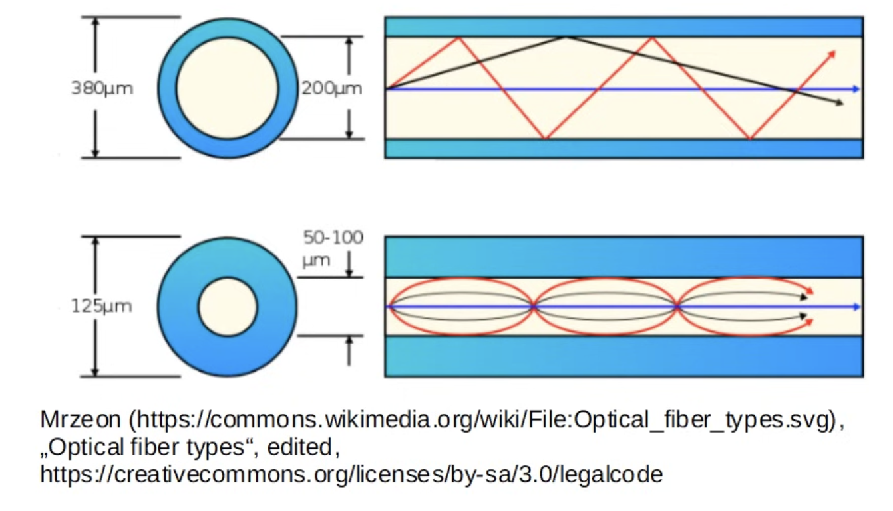
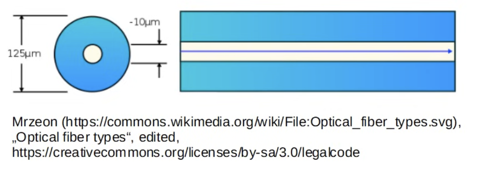
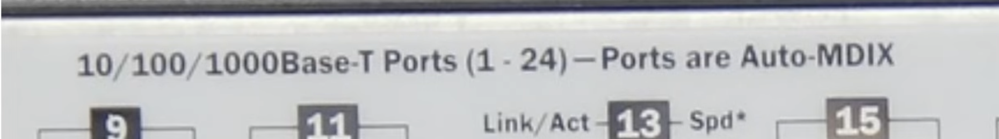

### Ethernet
- A collection of network protocols/standards

### Bits and Bytes
- Speed ismeasured in bits per second (Kbps, Mbps, Gbps, etc)
- 1 kilobit (Kb) = 1000 bits
- 1 megabits (Mb) = 1000000 bits
- 1 gigabit (Gb) = 1000000000 bits

### Ethernet Standards
- Defined in the IEEE 802.3 standard in 1983

| Speed | Common Name | IEEE Standard | Informal Name | Maximum Length |
|-------|-------------|--------------|---------------|----------------|
| 10 Mbps | Ethernet | 802.3i | 10BASE-T | 100 m |
| 100 Mbps | Fast Ethernet | 802.3u | 100BASE-T | 100 m |
| 1 Gbps | Gigabit Ethernet | 802.3ab | 1000BASE-T | 100 m |
| 10 Gbps | 10 Gig Ethernet | 802.3an | 10GBASE-T | 100 m |

### UTP Cables
- Unshielded Twisted Pair - protects against EMI (Electromagnetic Interference)
- `10BASE-T` and `100BASE-T` use 2 pairs (4 wires)
- `1000BASE-T` and `10GBASE-t` use 4 pairs (8 wires)

#### 10BASE-T, 100BASE-T
- Full-Duplex transmission
- *Straight-through cable:*

- *Crossover cable:*

| Device Type | Transmit (Tx) Pins | Receive (Rx) Pins |
|-------------|-------------------|-------------------|
| Router      | 1 and 2           | 3 and 6           |
| Firewall    | 1 and 2           | 3 and 6           |
| PC          | 1 and 2           | 3 and 6           |
| Switch      | 3 and 6           | 1 and 2           |

#### Auto MDI-X
- Auto MDI-X is a feature on Ethernet ports that automatically detects the required transmit and receive pin configuration and adjusts internally, allowing either straight-through or crossover cables to work without manual configuration.

#### 1000BASE-T, 10GBASE-T

### Fiber-Optic Connections
- A Fiber-Optic cable is connected to a SFP Transceier (Small Form-Factor Pluggable)
- Fiber-optic cable:

1. the fierglass core itself
2. cladding that teflects light
3. a protective buffer
4. the outer jacket of the cable

#### Multimode Fiber

- Core diameter is wider than single-mode fiber
- Allows multiple angles (modes) of light waves to enter the fiberglass core
- Allows longer cables than UTP, but shorter cables than single-mode fiber
- Cheaper than single-mode fiber (due to cheaper LED-based SFP transmitters)

#### Single-mode Fiber

- Core diameter is narrower than multimode fiber
- Light enters at a single angle (mode) from a laser-based transmitter
- Allows longer cables than both UTP and multimode fiber
- More expensive than multimode fiber (due to more expensive laser-based SFP transmitters)

| Informal Name | IEEE Standard | Speed | Cable Type | Maximum Length |
| :--- | :--- | :--- | :--- | :--- |
| **1000BASE-LX** | 802.3z | 1 Gbps | Multimode or Single-Mode | 550 m (MM) / 5 km (SM) |
| **10GBASE-SR** | 802.3ae | 10 Gbps | Multimode | 400 m |
| **10GBASE-LR** | 802.3ae | 10 Gbps | Single-Mode | 10 km |
| **10GBASE-ER** | 802.3ae | 10 Gbps | Single-Mode | 30 km |

### UTP vs Fiber-Optic Cabling

| Feature | UTP (Unshielded Twisted Pair) | Fiber-Optic |
| :--- | :--- | :--- |
| **Cost** | Lower cost than fiber-optic | Higher cost than UTP |
| **Max Distance** | Shorter (~100m) | Longer maximum distance |
| **EMI Vulnerability** | Vulnerable to Electromagnetic Interference | No vulnerability to EMI |
| **Port Type & Cost** | Cheaper RJ45 ports | More expensive SFP ports (SM > MM) |
| **Security Risk** | Signal leaks outside (copy risk) | No signal leakage (no security risk) |

### Quiz
1. You connect two old routers with a UTP cable, however data is not successfully sent and received betwee them. What could be the problem?
*a) They are connected with a straight-through cable*

2. Your company wants to connect switches in two separate buildings that are about 150 meters apart. They want to keep costs down, if possible. What kind of cable should they use?
*c) Multimode fiber*

3. Your company wants to connect two offices that are about 3 kilometers apart. They want to keep costs down if possible. Which kind of cable should they use?
*b) Single-mode fiber*
4. A switch has the following indication over its network interfaces:

What would happen if you connect it to an identical switch with a straight-through cable?
*c) They would operate normally*
5. Your company needs to connect many end hosts to a switch which is in a wiring cabinet on the same office floor as the hosts. What kind of cable should they use?
*a) UTP*
