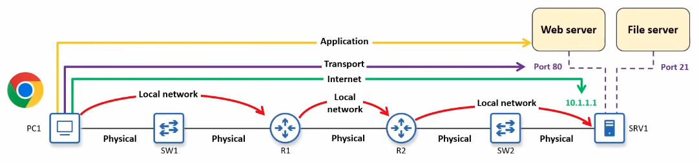
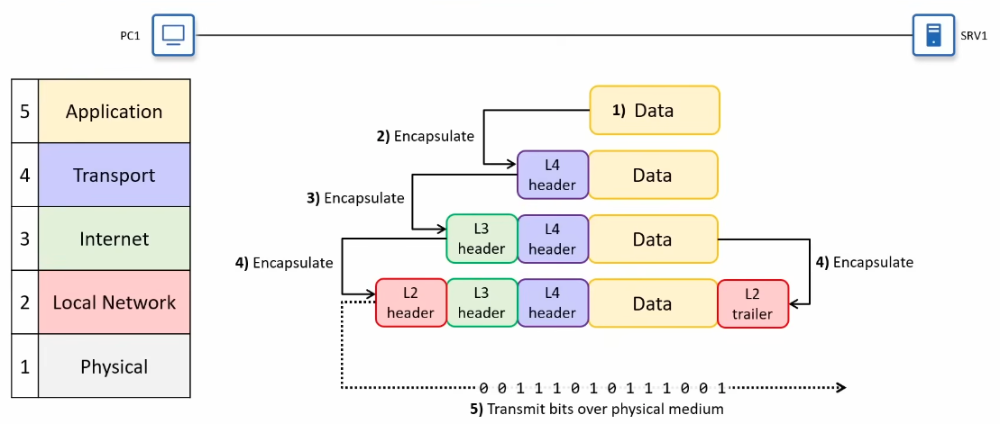
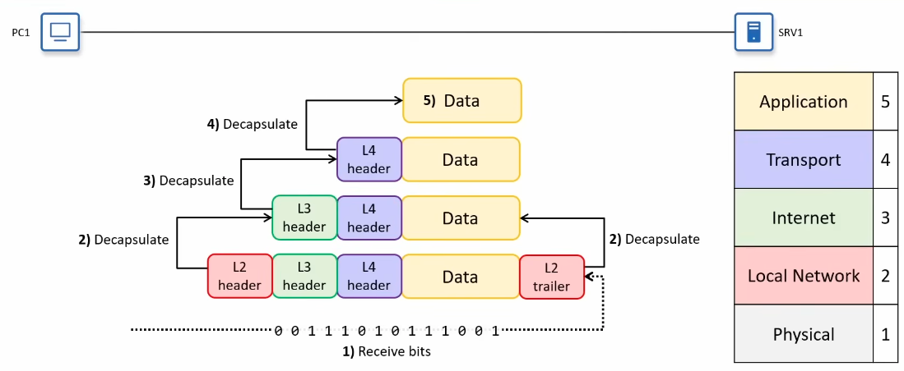
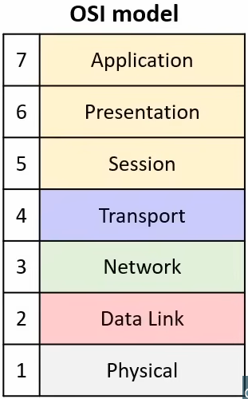
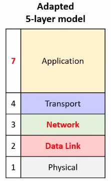

- **Transmission Control Protocol (TCP)**
- **Internet Protocol (IP)**
#### Layered models
- Each layer has a specific role
- Each layer uses the services of the layer below and provides services to the layer above
- Netwoek stack: stack of protocols that work as a team
1. **Application** layer
2. **Transport** layer (TCP, UDP)
3. **Internet** layer (IPv4, IPv6)
4. **Link** layer (Ethernet, Wi-Fi)

#### The TCP/IP model
1. Application layer: protocols for communication between application processes; create and interpret the data
2. Transport layer: provides end-to-end communication between application processes using **port numbers**
3. Internet layer: provides end-to-end communication between hosts across networks using **IP addresses** and routers
4. Local Network layer: provides hop-to-hop delivery within a local network using **MAC adresses** and switches
5. Physical layer: sends bits as electrical, optical, or radio signals over the physical medium

##### The physical layer
- Sends bits as electrical, optical, or radio signals over the physical medium
- Defines things like cables, connectors, signal levels, and link speeds
- Examples: copper UTP cables, fiber-optic cables, Wi-Fi radios and atennas, network interface cards (NICs)
- The physical aspects of transmitting data are very complex

##### The Local Network layer
-  Provides hop-to-hop delivery of messages on a local network
- A **hop** is one step along the path between two devices: from one router or host to next router or host in the path
- Switches don't count as hops: a switch just extends the local network, allowing multiple devices to connect
- Uses **MAC (Media Access Control) addresses** to identify interfaces
- Protocols at this layer include: Ethernet (IEEE 802.3) and Wi-Fi (IEEE 802.11)

##### The Internet layer
- Provides end-to-end delivery between hosts across multiple networks
- Internet = internetwork (between networks)
- Uses **IP addresses** to identify hosts in the network
- **Routers** operate mainly at this layer, using the message's destination IP address to forward the message toward its final destination host
- Protocols at this layer include: IP (IPv4, IPv6), ICMP (Internet Control Message Protocol)

##### The Transport layer
- Provides end-to-end communication between application processes
- Uses **port numbers** to identify the processes on each host
- Runs mainly on yhe communicating hosts (PC1 and SRV1); routers normally operate based on IP (layer 3), not on Transport-layer communication
- Protocols at this layer include
    * UDP (User Datagram Protocol): simple and efficient
    * TCP (Transmission Control Protocol): more robust features beyond basic message addressing

##### The Application layer
- Where network communications meet applications
- Usually called **layer 7**
- Defines how application processes format, send, and interpret data
- Protcols at this layer define message formats and rules for specific tasks, such as:
    * Browsing web pages (HTTP/HTTPS)
    * Transfering files (FTP, TFTP)
    * Sending/receiving email (SMTP, POP3, IMAP)
- Network infrastructure devices (routers, switches) don't care about Application-layer details: they just move messages across the network, only the communicating hosts interpret the data

#### Encapsulation & decapsulation
##### Encapsulation

- The **Appliction layer** prepares data to be sent over the network
- As the message moves down the stack, each layer **encapsulates** the data with a **header** including information needed for that layer
    * Soure and destination addresses (port numbers, IP addresses, MAC addresses), etc.
    * Layer 2 also adds a **trailer** that the receiving device uses to check for trasmission errors
- The **Physical layer** transmits the bits as signals over the physical medium
    * The **L2 header** is transmitted first, and the **L2 trailer** is transmitted last

##### Decapsulation

- The receiving device receives the message as a stream of bits at layer 1
- The device examines the information in the layer 2 header and trailer, and then removes them (**decapsulation**)
    * The decapsulation process continues up the stack: layer 3 removes the L3 header, then layer 4 removes the L4 header, and then the data is delivered to the Application layer
- The application processes the data and, if needed, generates a response that goes back down the stack

#### Protocol data units
- At each stage in the encapsulation/decapsulation process, there is a name given to the message:
    * The combination of data and a L4 header is called a **segment** (TCP) or **datagram** (UDP) (L4PDU)
    * The combination of a **segment/datagram** and a L3 header is called a **packet** (L3PDU)
    * The combination of a packet and a L2 header/trailer is called a **frame** (L2PDU)
- The contents of each PDU are called a **payload**

#### The OSI model
- 7-layer **Open Systems Interconnection (OSI) model**

