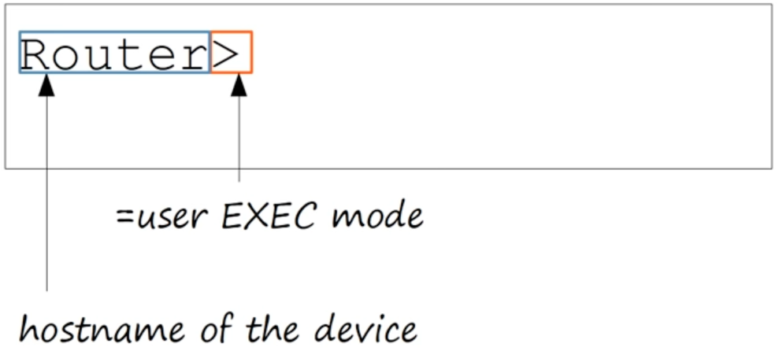
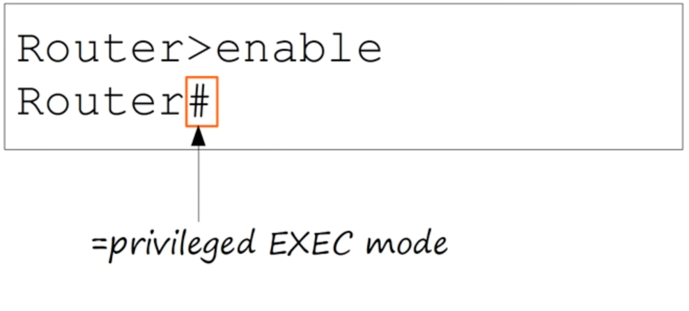
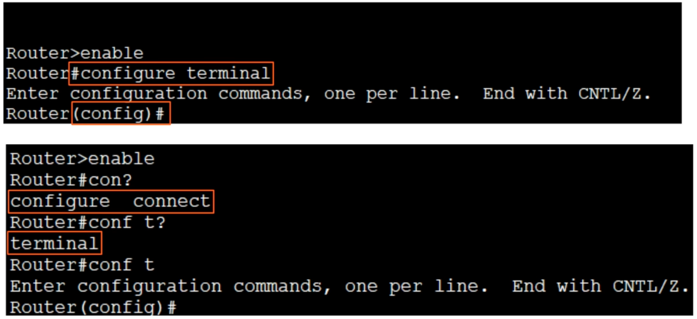
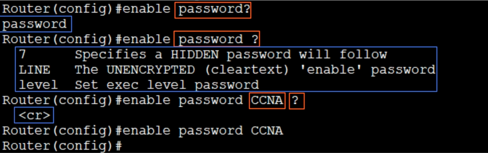
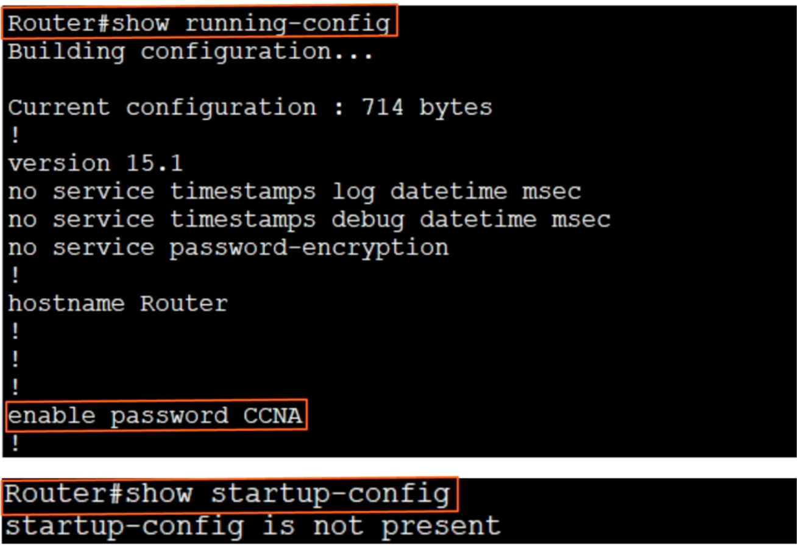
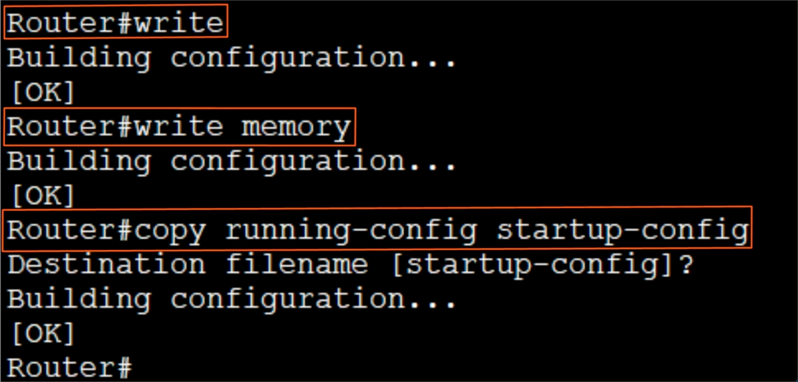
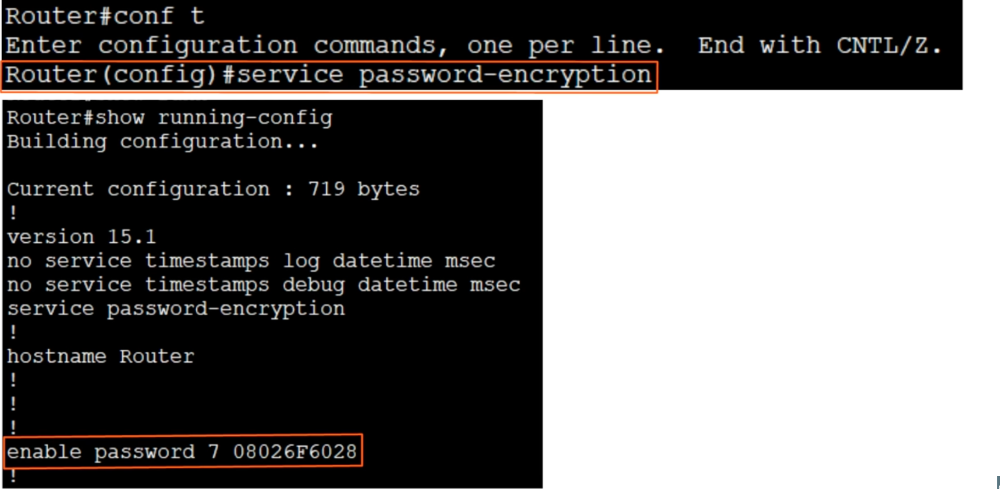
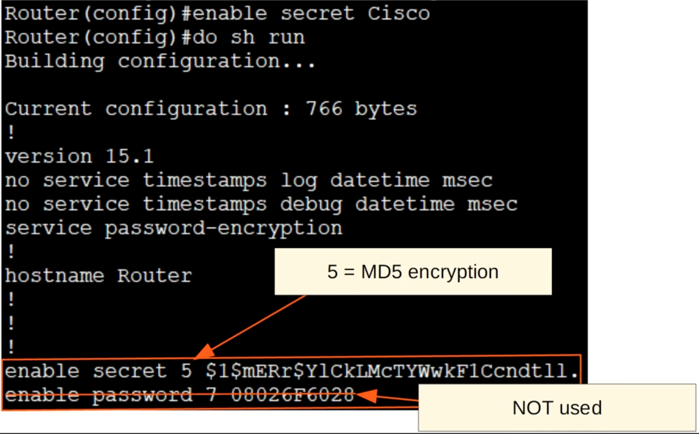
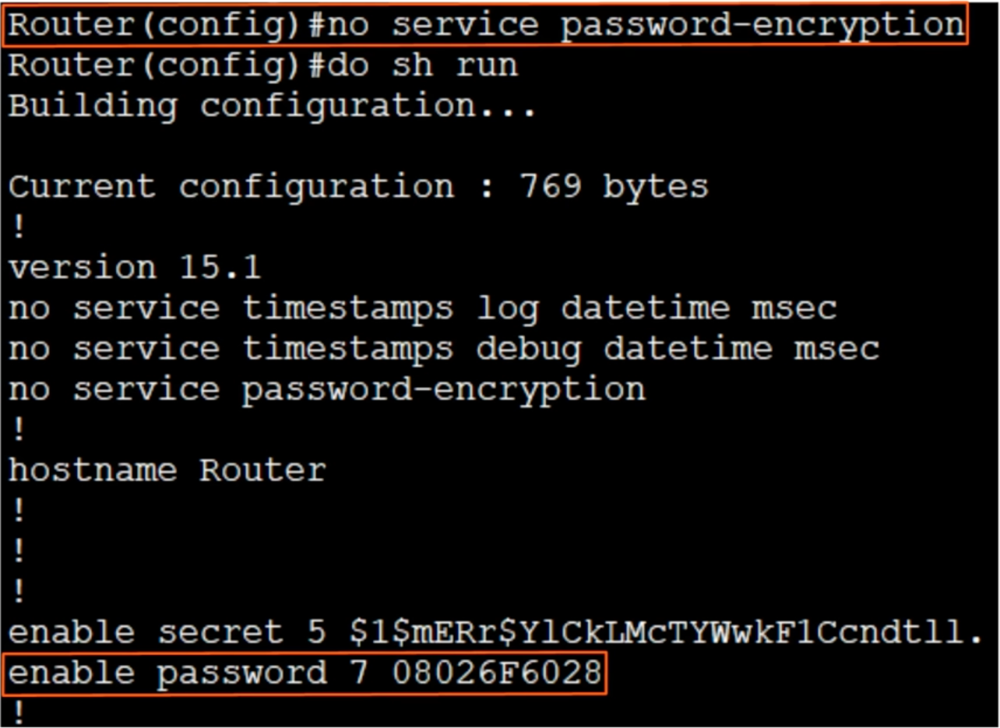

### Intro to the CLI
- Cisco IOS CLI

#### How to connect to a Cisco device? (Console port)
- Rollover cable


#### Terminal Emulator (PuTTy)
```
Speed (baud): 9600
Data bits: 8
Stop bits: 1
Parity: None
Flow control: None
```

#### User EXEC Mode
- Very limited
- Can't make any changes to the configuration
- Also called 'user mode'


#### Privileged EXEC mode
- Provides complete access to view the device's configuration, restart the device, etc.
- Cannot change the configuration, but can change the time on the device, save the configuration file, etc.


#### Global Configuration Mode



#### `enable password`
- Passswords **are** case-sensitive


#### `running-config / startup-config`
- There are two separate configuration files kept on the device at once
- **Running-config** = the current, active configuration file on the device; as you enter commands in the CLI, you edit the active configuration
- **Startup-config** = te configuration file that will be loaded upon restart of the device

#### `show running-config / show startup-config`


#### Saving the configuration


#### `service password-encryption`


- Not secure
- If you enable **service password-encryption**
    * current passwords **will** be encrypted
    * future passwords **will** be encrypted
    * the **enable secret** will not be affected
- If you disable **service password-encryption**
    * current passwords **will not** be decrypted
    * future passwords **will not** be encrypted
    * the **enable secret** will not be affected

#### `enable secret`


- More secure

#### Canelling commands



#### Quiz
1. What kind of cable is used to connect to a Cisco device via the RJ45 console port?
*a) Rollover cable*
2. You type enable to enter privileged exec mode on your Cisco router, however the password you enter is not accepted. What could be the problem?
*c) Caps Lock is on*
3. What is the most secure method to protect access to privileged EXEC mode?
*c) The enable secret command*
4. If both the enable password and the enable secret command are configured, what will happen when you see enable to enter privileged EXEC mode?
*c) You must enter the enable secret only*
5. You enter the conf t command to enter global configuration mode. What is the full-length version of the command?
*b) configure terminal*

