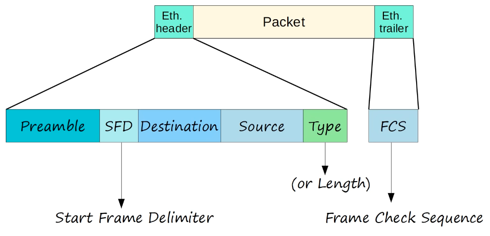

### Ethernet LAN Switching

#### Local Area Networks:
- Network contained in a small area
- Separate LANs are connected by routers

#### Ethernet Frame:



- 26 bytes (header + trailer)

**Preamble:**
- Length: 7 bytes (56 bits)
- Alternating 1's and 0's
- `10101010 * 7`
- Allows devices to synchronize their receiver clocks

**SFD:**
- 'Start Frame Delimiter'
- Length: 1 byte (8 bits)
- `10101011`
- Marks the end of the preamble, and the beginning of the rest of the frame

**Destination and Source:**
- Indicate the devices sending and receiving the frame
- Consist of of the destination and source 'MAC address'
- MAC = Media Access Control = 6 byte (48-bit) address of the physical device

**Type / Length:**
- 2 byte (16-bit) field
- A value of 1500 or less in this field indicates the LENGTH of the encapsulated packet (in bytes)
- A value of 1536 or greater in this field indicates the TYPE of the encapsulated packet (usually IPv4 or IPv6), and the length is determined via other methods
```
IPv4 = 0x0800
IPv6 = 0x86DD
```

**FCS (Frame Check Sequence):**
- 4 bytes (32 bits)
- Detects corrupted data by running a 'CRC' algorithm over the received data
- CRC = 'Cyclic Redundancy Check'

#### MAC Address
- 6-byte (48-bit) physical address assigned to the device when it is made
- A.K.A. 'Burned-In Address' (BIA)
- Is globally unique
- The first 3 bytes are the OUI (Organizationally Unique Identifier), which is assigned to the company making the device
- The last 3 bytes are unique to the device itself
- Written as 12 hexadecimal characters
- Unicast frame: a frame destined for a single target
- MAC address table (also known as a CAM table) is a database stored in a network switch that maps specific MAC addresses to the physical ports (interfaces) where those devices can be reached
- The switch populates the table automatically by examining the source MAC address of every incoming Ethernet frame. When a frame arrives on a port, the switch records that MAC address and associates it with that specific interface
- Known Unicast: If a switch receives a frame and the destination MAC address is already in its table, it forwards the frame only out of the specific port associated with that address
- Unknown Unicast (Flooding): If the destination MAC address is not in the table, the switch "floods" the frame by sending it out of all ports except the one it arrived on
- On Cisco switches, these dynamically learned entries are not permanent. They are typically removed after five minutes of inactivity from that device to keep the table clean and up-to-date

### Quiz:
1. Which field of an Ethernet frame provides receiver clock synchronization?
*a) Preamble*

2. How long is the physical address of a network device?
*d) 48 bits*

3. What is the OUI of this MAC address? `E8BA.7011.2874`
*b) `E8BA.70`*

4. Which field of an Ethernet frame does a switch use to populate its MAC address table?
*c) Source MAC address*

5. What kind of frame does a switch flood out of all interfaces except the one it was received on?
*a) Unknown unicast*

