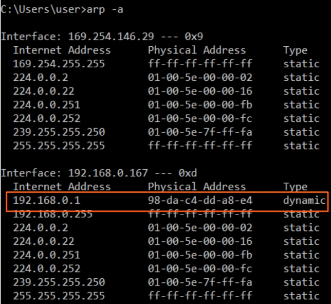

## Ethernet LAN Switching (Part 2)

### Ethernet Frame:
- The **Preamble + SFD** is usually not considered part of the Ethernet header
- Therefore the size of the Ethernet header + trailer is 18 bytes (6 + 6 + 2 + 4)
- The minimum size for an Ethernet frame (Header + Payload [Packet] + Trailer) is **64 bytes**
- **64 bytes - 18 bytes** (header + trailer size) = 46 bytes
- Therefore the minimum payload (packet) is 46 bytes
- If te payload is **less than 46 bytes**, padding bytes are added
- ie. 34-byte packet + 12-byte padding = 46 bytes

### ARP:
- ARP stands for 'Address Resolution Protocol'
- ARP is used to discover the Layer 2 address (MAC address) of a known Layer 3 address (IP address)
- Consists of two messages: **ARP Request, ARP Reply**
- **ARP Request** is **broadcast** = sent to all hosts on the network
- **ARP Reply** is **unicast** = sent only to one host (the host that sent the request)

#### ARP Table:
- Use `arp -a` to view the ARP table
- `Internet Address` = IP address (Layer 3 address)
- `Physical Address` = MAC address (Layer 2 address)
- `Type static` = default entry
- `Type dynamic` - learned via ARP


### Ping:
- A network utility that is used to test reachability
- Measures round-trip time
- Uses two messages: **ICMP Echo Request, ICMP Echo Reply**
- Command to use ping: `ping (ip-address)`

### MAC Address Table
- To view: `show mac address-table`
- Clearing the MAC Address Table: 
```bash
clear mac addres-table dynamic
clear mac address-table dynamic address --mac-address
clear mac address-table dynamic interface --interface-id
```

### Quiz:
1. You send a 36-byte ping to another computer aand perform a packet capture to analyze the network traffic. You notice a long series of bytes of 00000000 at the end of the Ethernet payload. Howcan you explain these zeroes?
*b) They are padding bytes.*

2. Which of these messages is sent to all hosts on the local network?
*a) ARP request*

3. Which fields are present in the output of the `show mac address-table` command on a Cisco switch?
*c) VLAN, MAC Address, Type, Ports*

4. Which types of frames does a switch send out of all interfaces, except the one the frame was received on?
*a) Broadcast, unknown unicast*

5. Which command is used on a Cisco switch to clear all dynamic MAC addresses on a specific interface from the MAC address table?
*d) `clear mac address-table dynamic interface --interface-id`*

