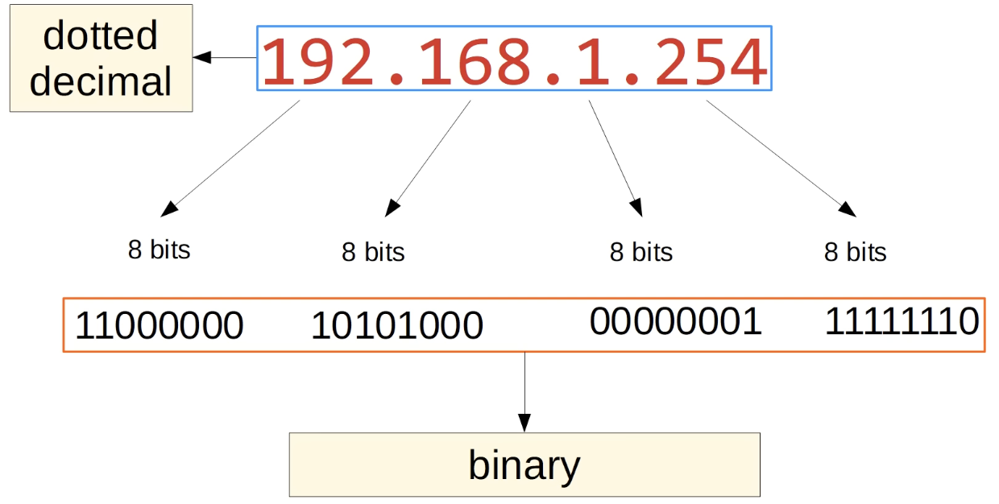

## IPv4 Addressing (Part 1)

- IP addresses are 32 bits (4 bytes) in length

- The slash `/` at the end of the address represents how many bits are assigned to represent the network portion of the address and how many bits are assigned to represent the host portion of the address

### IPv4 Address Classes
| Class | First octet | First octet numeric range |
|-------|------------|---------------------------|
| A     | 0xxxxxxx   | 0–127                     |
| B     | 10xxxxxx   | 128–191                   |
| C     | 110xxxxx   | 192–223                   |
| D     | 1110xxxx   | 224–239                   |
| E     | 1111xxxx   | 240–255                   |
- Prefix length: `/8` for Class A, `/16` for Class B and `/24` for Class C

### Loopback Addresses
- Address range `127.0.0.0` - `127.255.255.255`
- Used to test the 'network stack' (think OSI, TCP/IP model) on the local device

### Netmask:
- Class A: `255.0.0.0`
- Class B: `255.255.0.0`
- Class C: `255.255.255.0`

### Network Address:
- **Host portion** of the address is all 0's = **Network Address**
- **Host portion** of the address is all 1's = **Broadcast Address**
- The **broadcast address** CANNOT be assigned to a host

### Quiz:
1. Convert the following IPv4 address to dotted decimal notation:
`00111111 00111000 11100111 00010011`
*(1+2+4+8+16+32).(8+16+32).(1+2+4+128+64+32).(1+2+16)=63.56.231.19*

2. Convert the following IPv4 address to dotted decimal notation:
`11110011 01111111 01100010 00000001`
*(1+2+128+64+32+16).(1+2+4+8+16+32+64).(2+64+32).1=243.127.98.1*

3. Convert the following IPv4 address to dotted decimal notation:
`01101111 00000110 01011001 11000111`
*(1+2+4+8+32+64).(2+4).(1+8+16+64).(1+2+4+128+64)=111.6.89.199*

4. Convert the following IPv4 address to dotted decimal notation:
`11001111 11000110 00101111 01001100`
*(1+2+4+8+128+64).(2+4+128+64).(1+2+4+8+32).(4+8+64)=207.198.47.76*

5. Convert the following IPv4 address to dotted decimal notation:
`01100100 11001001 00100001 11111101`
*(4+64+32).(128+64+1+8).(32+1).(1+4+8+16+32+64+128)=100.201.33.253*

6. Convert the following IPv4 address to binary notation:
`88.46.90.91`
*01011000.00101110.01011010.01011011*

7. Convert the following IPv4 address to binary notation:
`221.234.246.163`
*(128+64+16+8+4+1).(128+64+32+8+2).(128+64+32+16+4+2).(128+32+2+1)=11011101.11101010.11110110.10100011*

8. Convert the following IPv4 address to binary notation:
`3.41.143.222`
*00000011.00101001.10001111.11011110*

9. Convert the following IPv4 address to binary notation:
`10.200.231.91`
*00001010.11001000.11100111.01011011*

10. Convert the following IPv4 address to binary notation:
`248.87.255.152`
*11111000.01010111.11111111.10011000*

