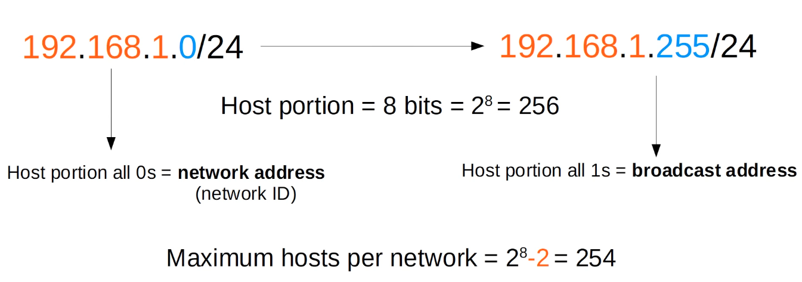
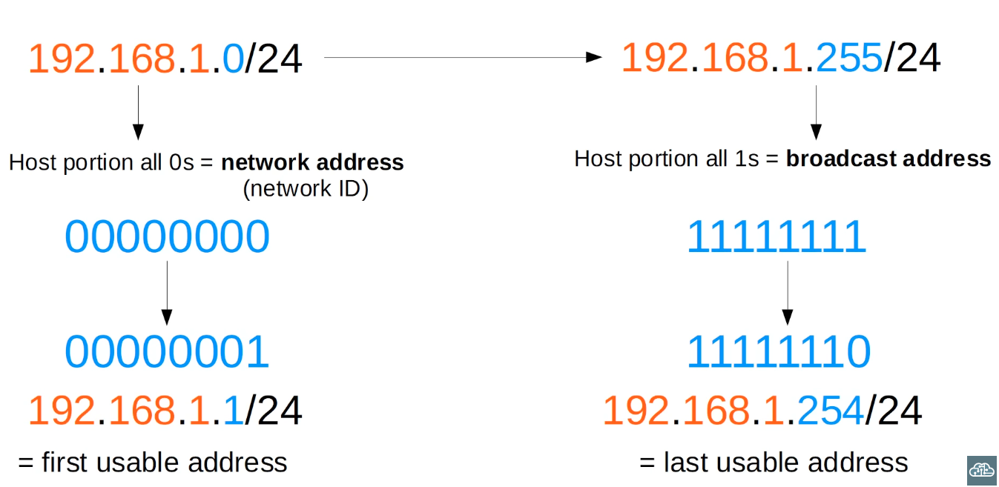
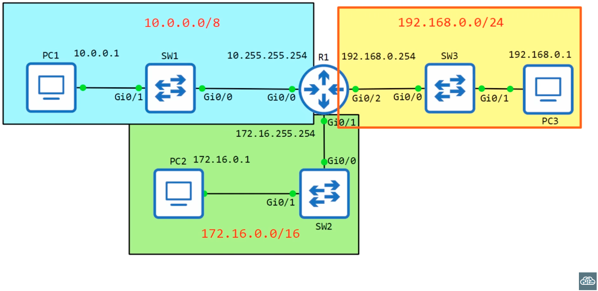
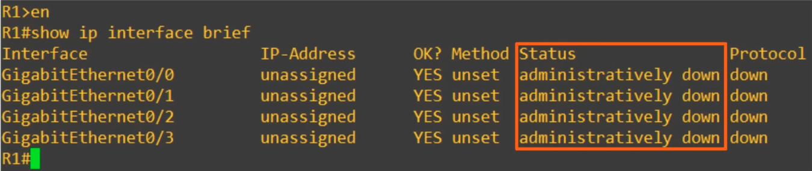
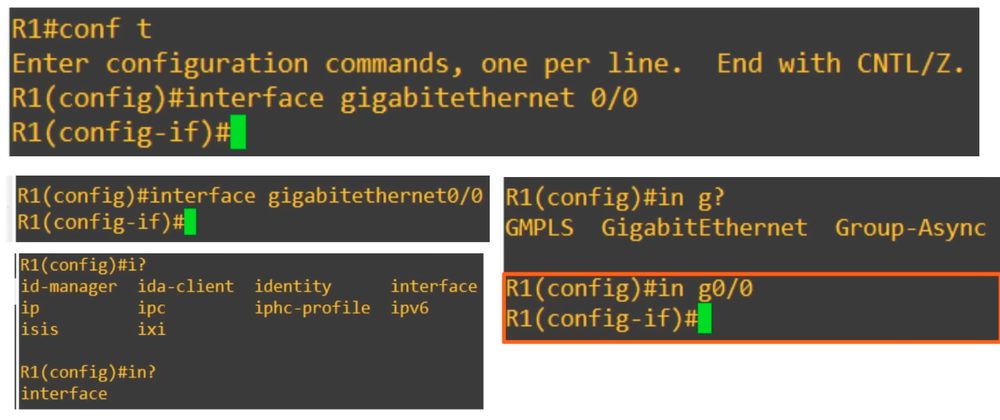
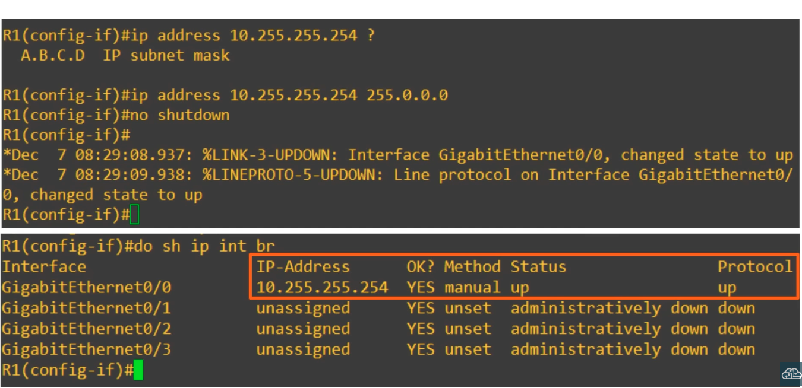
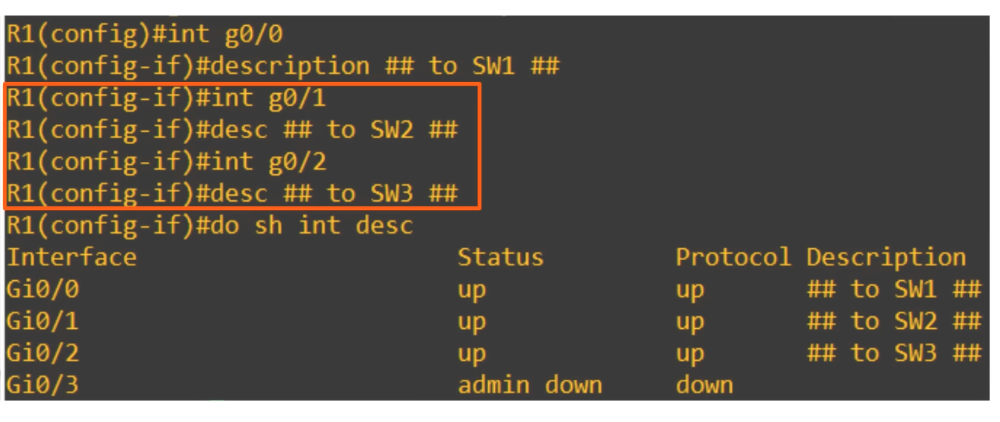

## IPv4 Addressing (Part 2)

### Maximum Hosts per Network


```
Maximum hosts per network = 2^n - 2
(n - number of host bits)
```

### First/Last Usable Address


### IPv4 Addressing

- CLI of R1:

- `administratively down`: Interface has been disabled with the 'shutdown' command
- This is the default `Status` of Cisco router interfaces
- Cisco switch interfaces are NOT `administratively down` by default
- Entering interface configuration mode:

- Setting IP address for interface:


- Useful commands:
```bash
show interfaces [interface]
show interfaces description
```

- Changing description of interfaces:


### Quiz:
1. PC1 has an IP address of 43.109.23.12/8
Find the following:
Network address: *43.0.0.0*
Maximum number of hosts in the network: *2^24 - 2 = 16777214*
Network broadcast address: *43.255.255.255*
First usable address of the network: *43.0.0.1*
Last usable address of the network: *43.255.255.254*

2. PC2 has an IP address of 129.221.23.13/16
Find the following:
Network address: *129.221.0.0/16*
Maximum number of hosts in the network *2^16 - 2 = 65534*
Network broadcast address: *129.221.255.255*
First usable address of the network: *129.221.0.1*
Last usable address of the network: *129.221.255.254*

3. PC8 has an IP address of 209.211.3.22/24
Find the following:
Network address: *209.211.3.0*
Maximum number of hosts in the network *2^8 - 2 = 254*
Network broadcast address: *209.211.3.255*
First usable address of the network: *209.211.3.1*
Last usable address of the network: *209.211.3.254*

4. PC5 has an IP address of 2.71.209.233/8
Find the following:
Network address: *2.0.0.0*
Maximum number of hosts in the network *2^24 - 2 = 16777214*
Network broadcast address: *2.255.255.255*
First usable address of the network: *2.0.0.1*
Last usable address of the network: *2.255.255.254*

5. PC6 has an IP address of 155.200.201.141/16
Find the following:
Network address: *155.200.0.0*
Maximum number of hosts in the network *2^16 - 2 = 65534*
Network broadcast address: *155.200.255.255*
First usable address of the network: *155.200.0.1*
Last usable address of the network: *155.200.255.254*

