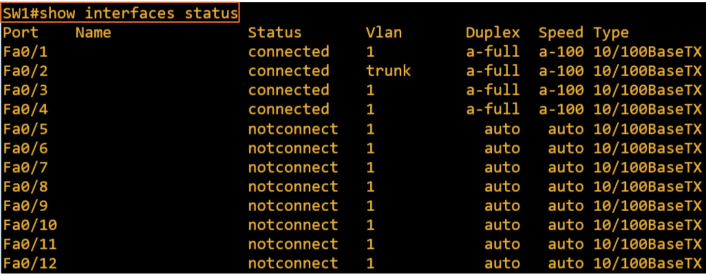
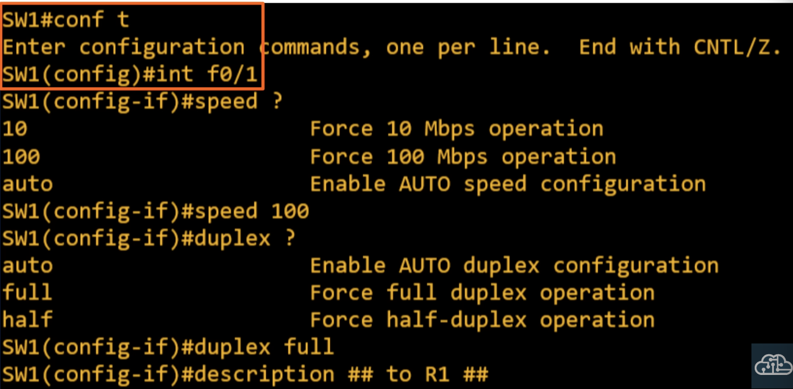
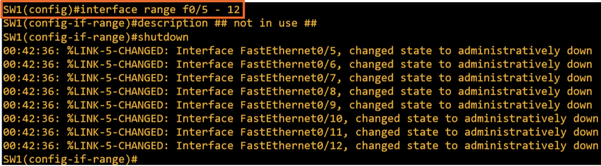
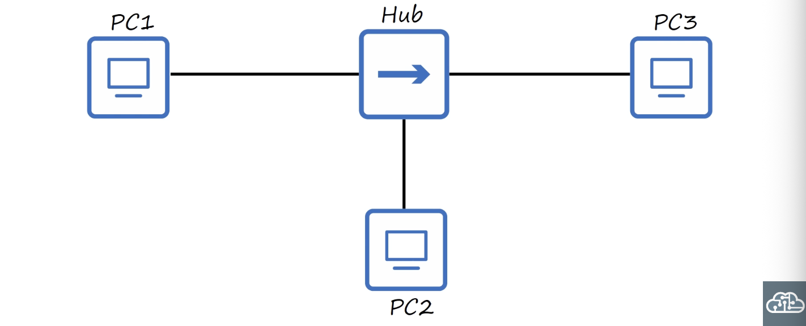
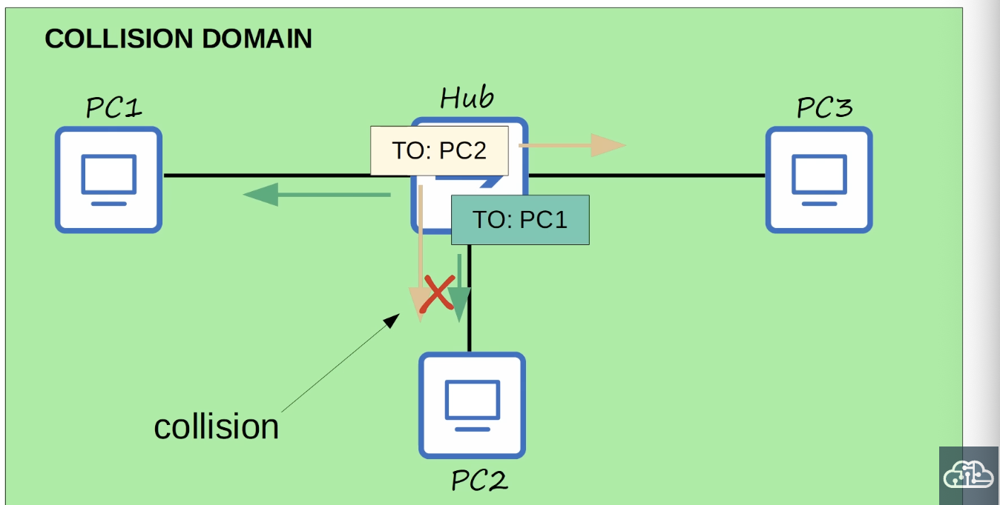
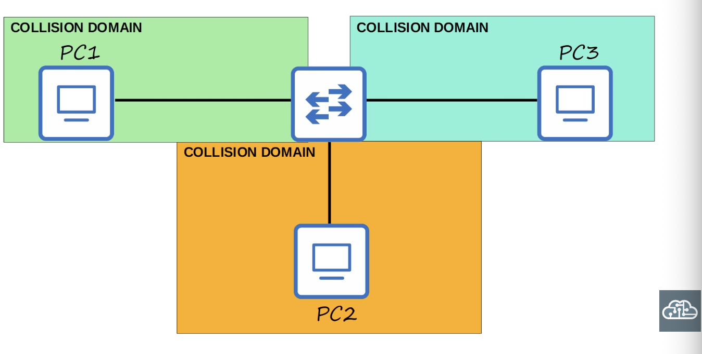
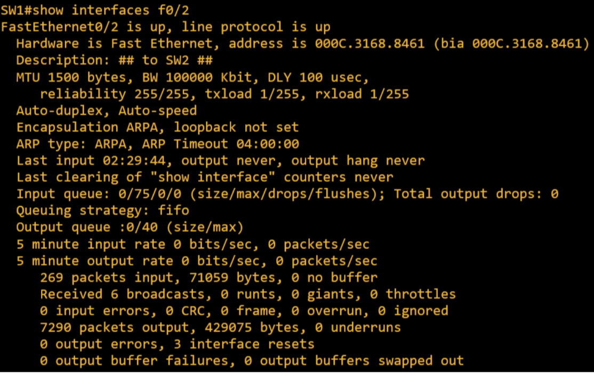

## Switch Interfaces

### `show ip interface brief`
- **Router** interfaces have the `shutdown` command applied by default = will be in the `administratively down/down` state by default
- **Switch** interfaces do NOT have the `shutdown` command applied by default = will be in the `up/up` state if connected to another device OR int the `down/down` state if not connected to another device

### `show interfaces status`

### Configuring interface speed and duplex

### `interface range`

### Full/Half Duplex
- **Half duplex**: The device cannot send and receive data at the same time. If it is receiving a frame, it must wait before sending a frame
- **Full duplex**: The device **can** send and receive data at the same time. It does not have to wait.
- Devices attached to a **switch** can operate in full duplex

### LAN Hubs

- Devices attached to a **hub** must operate in half duplex

### CSMA/CD
- **C**arrier **S**ense **M**ultiple **A**ccess with **C**ollision **D**etection
- Before sending frames, devices 'listen' to the collision domain until they detect other devices are not sending
- If a collision does occur, the device sends a jamming signal to inform the other devices that a collision happened
- Each device will wait a random period of time before sending frames again 
- The process repeats

### Speed/Duplex Autonegotiation
- Interfaces that can run at different speeds (10/100 or 10/100/1000) have default settings of `speed auto` and `duplex auto`
- Interfaces 'advertise' their capabilities to the neighboring device, and they negotiate the best `speed` and `duplex` settings they are both capable of
- What if autonegotiation is disabled on the device connected to the switch?
- **SPEED**: The switch will try to sense the speed that the other device is operating at. If it fails to sense the speed, it will use the slowest supported speed (ie. 1000 Mbps a 10/100/1000 interface)
- **DUPLEX**: If the speed is 10 or 100 Mbps, the switch will use half duplex. If the speed is 1000 Mbps or greater, use full duplex.

### Interface Errors

- **Runts**: Frames that are smaller than the maximum frame size (64 bytes)
- **Giants**: Frames that are larger than the maximum frame size (1518 bytes)
- **CRC**: Frames that failed the CRC check (in the Ethernet FCS trailer)
- **Frame**: Frames that have an incorrect format (due to an error)
- **Input errors**: Total of various counters, such as the above four
- **Output errors**: Frames the switch tried to send, but failed due to an error

### Quiz:
1. There is a duplex mismatch between SW1's F0/1 inrerface and SW2's F0/1 interface, which are connected. Autonegotiation is disabled. What will be the result?
*b) Collisions will occur*

2. What is used on half-duplex interfaces to detect and avoid collisions?
*a) CSMA/CD*

3. Which command shows various cunters of errors detected on an interface?
*a) `show interfaces`*

4. Which are examples of errors that might occur on a network interface?
*d) Runsts, Giants, CRC*

5. SW1 is trying to autonegotiate interface speed settings with SW2. However, autonegotiation is disabled on SW2's interface. SW2's interface is configured with a speed 100 Mbps and full duplex. What speed and duplex settings will SW1 use, assuming it succeeds is sensing the speed?
*b) Speed: 100 Mbps, Duplex: Half*

