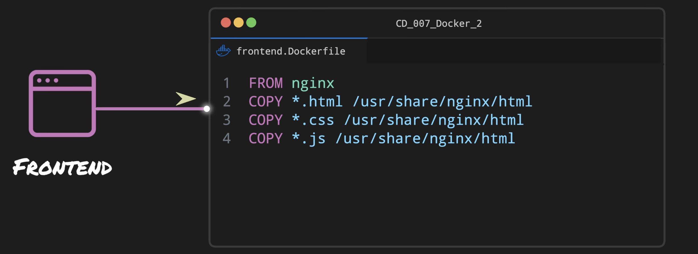
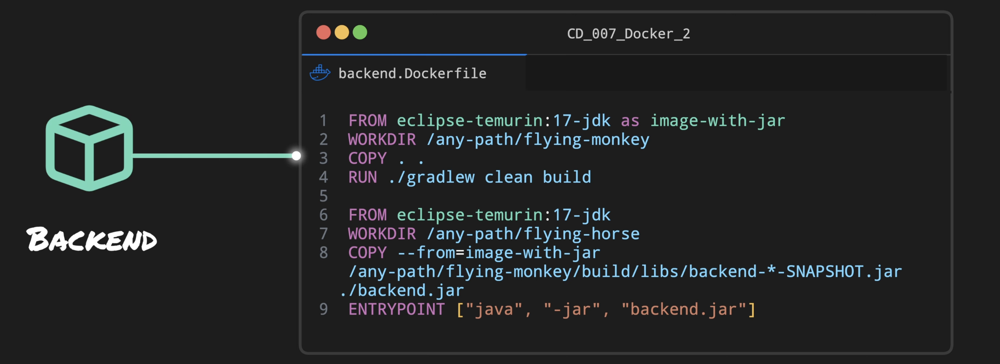
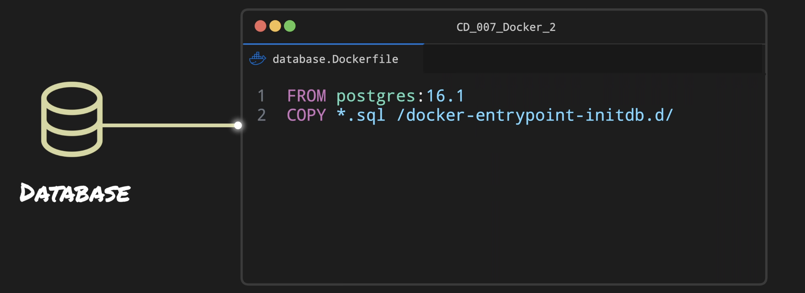
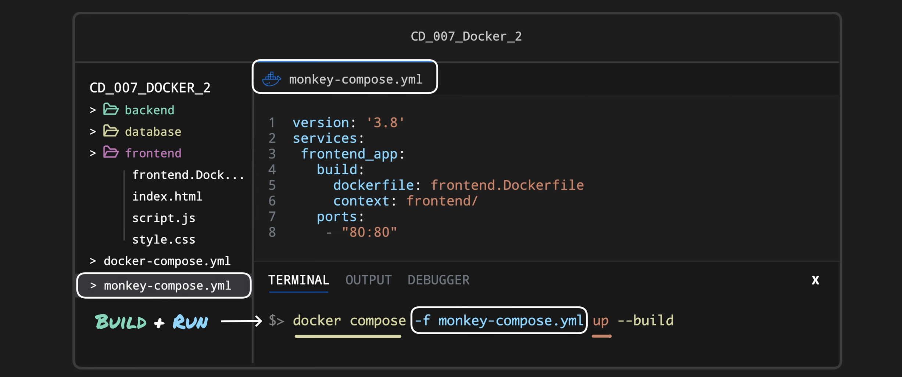
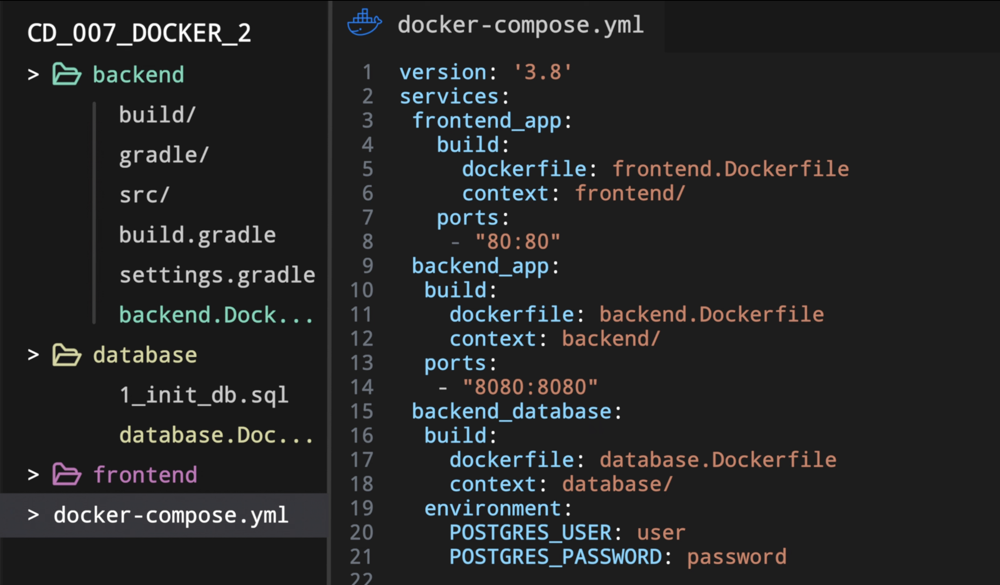

# Docker Compose Stack

## Multi Service Applications

- Example:
1. Frontend

    - Copying `html`, `css` and `js` to the hosting directory of `nginx`
2. Backend

    - The first layer copies the Java backend code into the current working directory, compiles it and then creates an executable `.jar` file
    - The second layer simply executes that jar file
3. Database

    - The `.sql` are copied in the directory
    - `postgres` will execute any `.sql` files present in this directory at the time of startup
4. Docker Compose for the frontend

    - Using the `-f` parameter we can specify the `.yaml` file name
    - Using `--build` parameter, a new image is built each time `docker compose up` is ran
    - `context:` specifies the location of the `dockerfile`
5. Adding backend and database to Docker Compose:

- When running Docker Compose, it automatically creates a network, assigning an IP address to each container
- For example the backend communicates with the database using address, port and database name using a connection string (ex. `jdbc:postgresql://backend_database:5432/backend_db`)
- Nginx sends the page to the browser, but the browser also sends requests to the backend, so we have to expose ports both from the Nginx container and backend container
- The network uses the `bridge` driver

## Default Network & Service Discovery
* **Automatic Creation:** Running `docker compose up` creates a default bridge network named `<project-name>_default`.
* **DNS Resolution:** Every container automatically joins this network and can discover other containers directly by their **service name** (e.g., `http://db:5432`). 
* **Dynamic IPs:** Container IPs change upon restart, so you must always use the service name instead of hardcoded IP addresses.
* **Ports:** `HOST_PORT` exposes the service to the outside world, while `CONTAINER_PORT` is used for internal service-to-service communication.

## Custom & External Networks
* **Custom Networks (`networks`):** You can define multiple networks to isolate services (e.g., a `frontend` network for the app/proxy and a `backend` network for the app/database).
* **Internal Networks:** Setting `internal: true` restricts a network from accessing the host interfaces or the internet, perfect for securing databases.
* **External Networks (`external: true`):** Allows Compose to connect to a pre-existing network created via `docker network create`. This is essential for **connecting multiple Compose projects** together.

## Advanced Configurations
* **Network Modes:** You can override the default bridge network per service using `network_mode` (e.g., `host` to share the host's network stack, or `none`).
* **Custom DNS (`extra_hosts`):** Allows injecting custom hostname-to-IP mappings into the container's `/etc/hosts` file. Using `host.docker.internal:host-gateway` maps a hostname to the host machine's IP.
* **Links:** Used to define legacy aliases for services, though standard service discovery is preferred.

## Debugging & Troubleshooting
* **`docker compose port <service> <port>`:** Locates the exact host port mapped to a container port (highly useful for dynamic port mappings or scaled replicas).
* **`docker network inspect <network-name>`:** Verifies which containers are currently attached to a specific network.
* **`docker compose exec <service> <command>`:** Runs network diagnostic tools (like `curl` or `ping`) directly from inside a running container to test live connectivity.