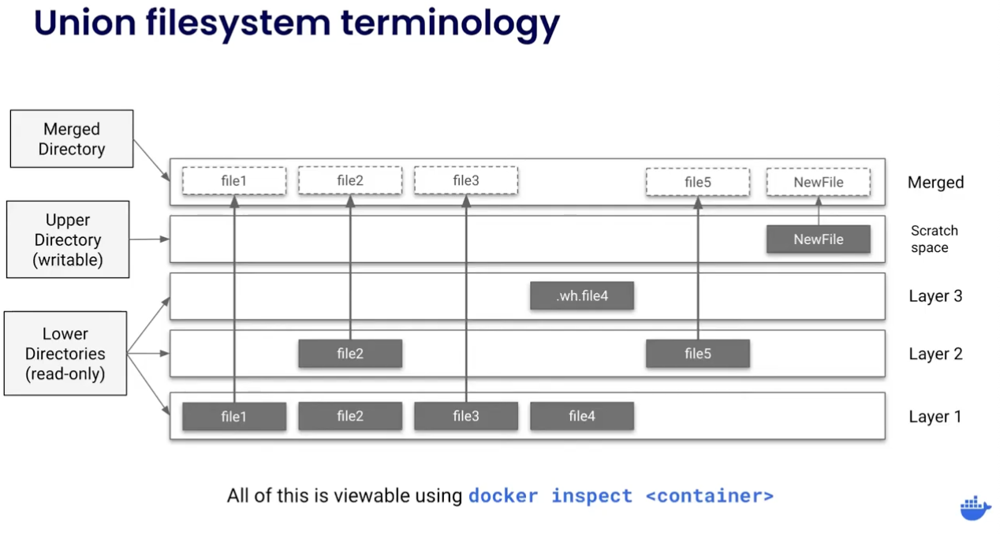

## Docker Layers

```bash
luca@debian-eos:~$ sudo docker run hello-world
[sudo] password for luca: 

Hello from Docker!
This message shows that your installation appears to be working correctly.

To generate this message, Docker took the following steps:
 1. The Docker client contacted the Docker daemon.
 2. The Docker daemon pulled the "hello-world" image from the Docker Hub.
    (amd64)
 3. The Docker daemon created a new container from that image which runs the
    executable that produces the output you are currently reading.
 4. The Docker daemon streamed that output to the Docker client, which sent it
    to your terminal.

To try something more ambitious, you can run an Ubuntu container with:
 $ docker run -it ubuntu bash

Share images, automate workflows, and more with a free Docker ID:
 https://hub.docker.com/

For more examples and ideas, visit:
 https://docs.docker.com/get-started/
```

- **Docker images** are the **blueprints** of docker containers
- Dockerfile example:
```dockerfile
FROM fedora:32  # Layer n

WORKDIR /2048   # Layer n + 1
COPY 2048.c /2048/  # Layer n + 2

RUN dnf install -y gcc # Layer n + 3
RUN gcc -o 2048 2048.c  # Layer n + 4

RUN dnf update -y   # Layer n + 5
RUN dnf install -y wget # Layer n + 6

RUN useradd docker  # Layer n + 7
USER docker # Layer n + 8

CMD /2048/2048  # Layer n + 9
```
- Each line where a dockerfile command is run will generate one layer in the image
- An image is made up of every layer stacked on top
- Each lower layer is made up as a diff or a delta between itself and the previous layer (kind of like git)
- When the dockerfile is built, each layer takes a hash of all of its contents, so as long as nothing changes, docker knows it can use the previously built cached version of that layer (from cache), as long as nothing in that layer has changed and none of its parents has changed
- If something has changed in a previous layer or its parents, it has to be rebuilt
- Layers can be optimized, for example commands that install packages/dependencies by combining them (`&&`), especially large steps in the dockerfile should be put before compiler commands for example, because most often dependencies won't be changed as often, but source code will
- Optimized dockerfile example:
```dockerfile
FROM fedora:32

RUN dnf update -y \
    && dnf install -y gcc wget \
    && dnf clean all

WORKDIR /2048
COPY 2048.c /2048/

RUN gcc -o 2048 2048.c

RUN useradd docker
USER docker

CMD /2048/2048
```
- Docker uses the following filesystem when building an image:

1. After each layer is downloaded, it is extracted into its own directory on the host filesystem.
2. When you run a container from an image, a union filesystem is created where layers are stacked on top of each other, creating a new and unified view.
3. When the container starts, its root directory is set to the location of this unified directory, using `chroot`.
- The lower directories are common in every container we run
- The upper directory is unique to every container we run, which allows us to run separate containers of the same image and changes in one are not seen in another

### Manual Image Layers
```bash
luca@debian-eos:~$ sudo docker run --name=base-container -ti ubuntu
root@d8c5ca119fcd:/ apt update && apt install -y nodejs
root@d8c5ca119fcd:/ node -e 'console.log("Hello world!")'
Hello world!
```

- Docker container commit is the command used to save a container's volatile read-write layer into a permanent, read-only image layer
- Manual image building timeline:
```bash
# Base state: Native Ubuntu layers (Lower directories / Read-Only)

# Layer n + 1 (Modifying the Upper Directory of base-container)
apt update && apt install -y nodejs 

# Commit layer n + 1 into a static image layer named 'node-base'
docker container commit -m "Add node" base-container node-base

# Layer n + 2 (Modifying the Upper Directory of app-container)
echo 'console.log("Hello from an app")' > app.js

# Commit layer n + 2, adding runtime instruction metadata (CMD)
docker container commit -c "CMD node app.js" -m "Add app" app-container sample-app
```

- Each manual commit creates a distinct, static layer on the host filesystem based on the differences made during that session
- An image built this way stacks these independent layer states sequentially
- Inspecting the layer stack composition via the CLI:
```bash
luca@debian-eos:~$ sudo docker image history sample-app
IMAGE          CREATED              CREATED BY                                      SIZE      COMMENT
c1502e2ec875   About a minute ago   /bin/bash                                       33B       Add app
5310da79c50a   4 minutes ago        /bin/bash                                       126MB     Add node
2b7cc08dcdbb   5 weeks ago          /bin/sh -c #(nop)  CMD ["/bin/bash"]            0B        
<missing>      5 weeks ago          /bin/sh -c #(nop) ADD file:07cdbabf782942af0…   69.2MB    
```

- The unique hashes in the `IMAGE` column represent immutable states stored chronologically, where each layer retains a delta of filesystem additions or modifications
- Metadata configuration parameters introduced via the -c flag do not increase storage size significantly because they append execution definitions to the layer metadata rather than raw binaries
- Docker tracks manual image construction through standard union filesystem mechanics:
1. Modifying a running container writes data strictly to the ephemeral upper directory unique to that isolated container environment.
2. Executing a commit halts the state, packages the contents of that specific upper directory, and stores it on the host as a new immutable lower layer directory.
3. Launching a new container from this updated image stacks a clean, empty read-write upper directory directly over the newly committed lower layers.
- The lower layers remain shared assets across the filesystem engine, ensuring subsequent container runtimes cannot cross-contaminate original data states.
- The upper layer remains fully unique to the target instance, isolating ongoing structural operations from the underlying frozen image architecture.