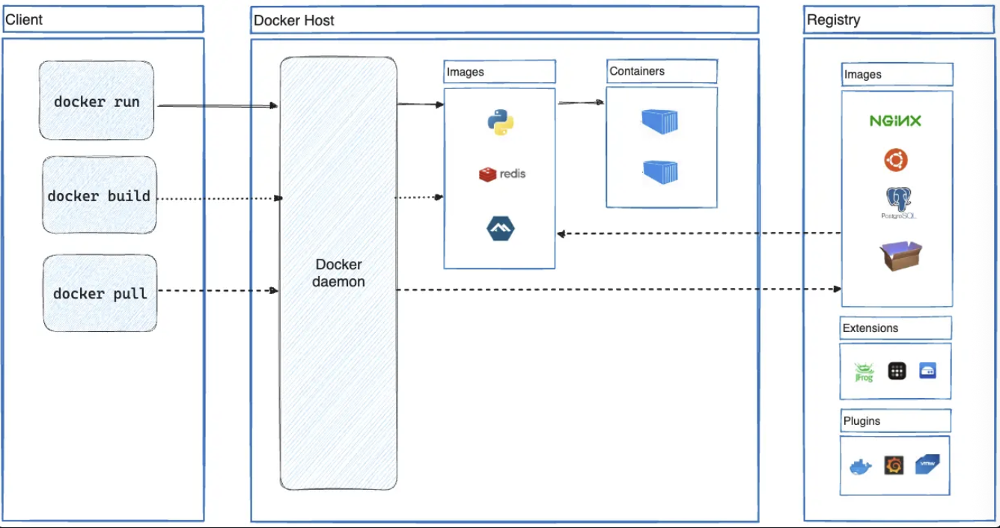
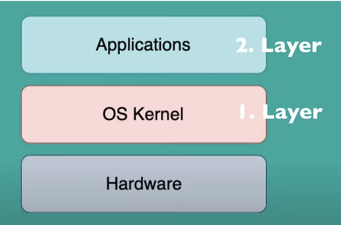
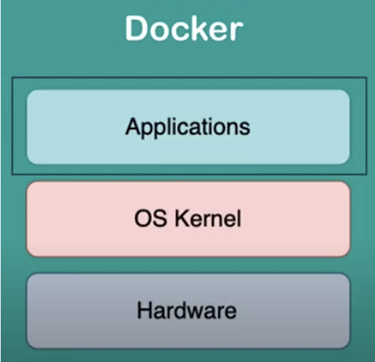
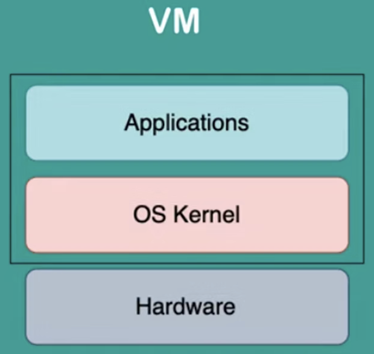

## VM vs. Container

### Docker

- A tool that can package software into containers that run reliably in any environment
- One way is to run the app on a VM (Virtual Machine) where we install the required OS and dependenices, but this tends to be bulky and slow
- A docker container virtualizes the os instead of virtualizing hardware, so all apps (containers) are run by a single kernel, which makes everything faster and more efficient
- Docker streamlines the development lifecycle by allowing developers to work in standardized environments using local containers which provide your applications and services.
- Docker uses a client-server architecture; the Docker client talks to the Docker daemon, which does the heavy lifting of building, running, and distributing your Docker containers; the Docker client and daemon can run on the same system, or you can connect a Docker client to a remote Docker daemon; the Docker client and daemon communicate using a REST API, over UNIX sockets or a network interface; another Docker client is Docker Compose, that lets you work with applications consisting of a set of containers


### Dockerfile
- Code that tells docker how to build an image

### Image
- Snapshot of the software with all of its dependencies down to the OS level
- It is immutable and can be used to spin up multiple containers which is the actual software running
- Start `FROM` an existing template image (ex. Ubuntu) which is pulled down from the cloud
- Custom images can be uploaded to a variety of different docker registries
- `RUN` is used to run a terminal command that installs dependencies into the image
- Set environment variables using `ENV`
- Using `CMD` we set a default command that's executed when the container is started
- Example:
```dockerfile
FROM ubuntu:20.04
RUN apt-get install sl
ENV PORT=8080
CMD ["echo", "Hello World!"]
```
- The image file is created by running the following command, specifying the name tag (`-t`) and path to dockerfile (`./`)
```bash
docker build -t myapp ./
```
- This command goes through each step in our dockerfile to build the image layer by layer
- We can then build this image to life as a container with the following command:
```bash
docker run myapp
```

### Docker vs.VM
- OS layers:


- Both Docker and VMs are virtualization tools, but Docker virtualizes the application layer of the OS:

- When a Docker image is downloaded, it contains the applications layer of the OS and other applications installed on top of it
- Accordingly, **Docker uses the host's kernel**, because it doesn't have its own

- VirtualBox or a VM:

- VirtualBox, or a VM, on the other hand, has its own kernel and application layer
- So it **virtualizes the entire OS**
- So it boots up its own kernel when a CM image is downloaded on the host machine

1. Image Size
- Docker images (a couple megabytes usually) are much smaller and faster than VM images (a couple gigabytes usually), since Docker images only have to implement one layer
2. Speed
- Docker containers also start up much faster than VMs, because they only need to start the applications layer
- In contrast, VMs need to start the entire OS
3. Compatibility
- VM images can be ran on any OS hosts, but Docker images can't directly
- For example, a Linux based Docker image cannot use the windows kernel; it would need a Linux kernel to run, because you can't run a Linux application layer on a Windows kernel, so that's an issue with Docker
- Docker has solved this issue with Docker Desktop which uses a hypervisor layer with a lightweight Linux distribution on top of it to provide the needed Linux kernel and this way make running Linux based containers possible on Windwos and Mac OSs
