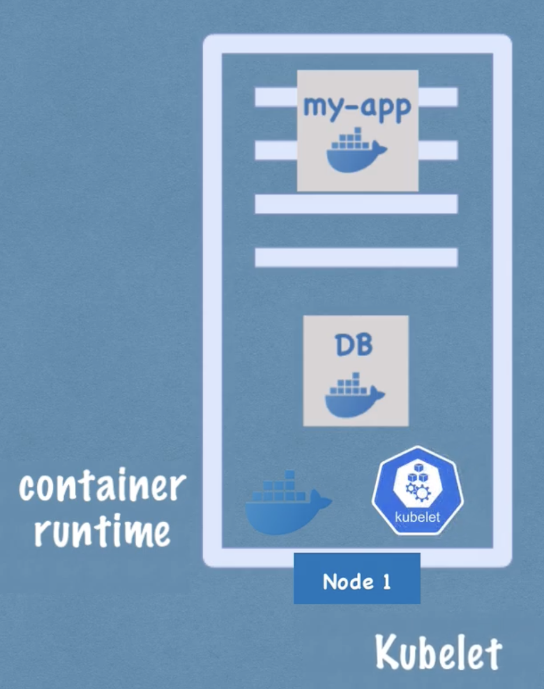
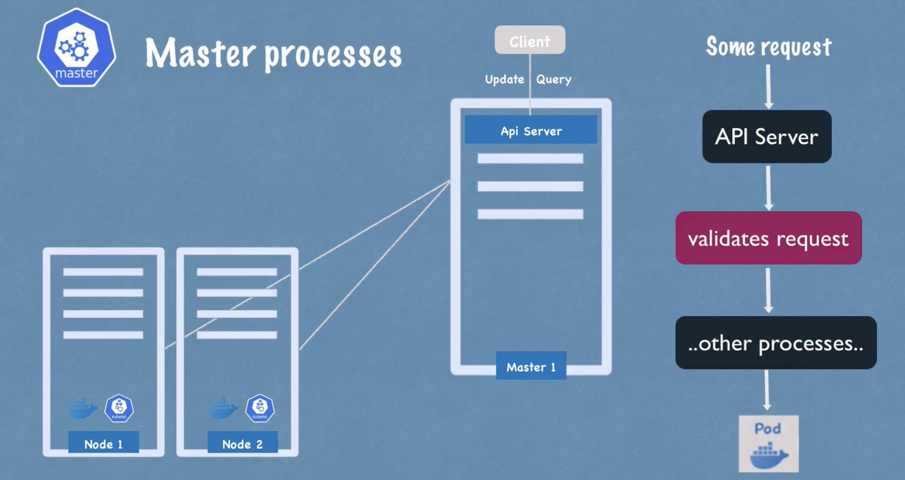

# Kubernetes Architecture

- For example, one node (worker server), multiple pods:


- Each node has multiple application pods running on it
- 3 processes must be installed on every node
    - The first process is the container runtime (ex. Docker): all the containers running inside the pods run on this container runtime
    - The second process is called Kubelet, which interacts with both - the container and node responsible for taking the configuration and running/starting a pod with a container inside and assigning resources from the node to the container like CPU, RAM or storage resources
- Worker nodes do the actual work
- A Kubernetes cluster is usally made up of multiple nodes which all have the container runtime and Kubelet running in them
- Communication between the nodes is done using services, which act as load balancers which catches requests and forwards them to the respective pods
    - The third process that is responsible for forwarding requests from services to pods is Kube proxy which also must be installed on every node; it has intelligent forwarding logic inside that makes sure that the communication is efficient
- We can interact with clusters using master nodes, which have completely different processes running inside which control the cluster state and the worker nodes as well
    - API Server: when a user wants to deploy a new app in a kubernetes cluster, it interacts with the API server using a client (ex. Kubernetes Dashboard); it acts like a cluster gateway which gets the initial requests of any updates into the cluster or the queries; it also acts as a gatekeeper for authentication to make sure that only authenticated and authorized requests get through the cluster; it acts as the only one entrypoint into the cluster
    
    - Scheduler: if the user wants to schedule a new pod it goes through the API server, it validates the request and sends it to the scheduler in order to start the application pod on one of the worker nodes; instead of randomly assigning to any node, it decides on which specific worker node the next pod will be scheduled based of the required resources of the pod and the available resources of each; the scheduler just decides the node, Kubelet actually starts the pod
    - Controller manager: detects cluster state changes (ex. crashing of pods); when pods die, the controller manager tries to get the cluster state as soon as possible and for that it makes a request to the scheduler to reschedule those dead pods 
    - etcd: acts like a cluster brain, every change in the cluster (ex. when pods die or get rescheduled); the other processes in the master nodes work because of the data stored here (ex. available resources, cluster state changes, cluster health); application data is not stored in the etcd; the data stored here only serves the master process
- A Kubernetes cluster can be be made up of multiple masters where each master node runs its master processes


## Kubernetes Components


## Pods
- Example of a pod which consists of a container running the image `nginx:1.14.2`.
```yaml
apiVersion: v1
kind: Pod
metadata:
  name: nginx
spec:
  containers:
  - name: nginx
    image: nginx:1.14.2
    ports:
    - containerPort: 80

```
- To create the pod, the following command is ran:
```bash
kubectl apply -f https://k8s.io/examples/pods/simple-pod.yaml
```

- *In Kubernetes, applications should be scaled and managed using workload resources like Deployments, Jobs, or StatefulSets to control groups of replicated Pods, rather than creating individual Pods directly.*
- *Instead of creating ephemeral Pods directly, you should manage them through workload resources to ensure they survive node failures and evictions, keeping in mind that a Pod's name should follow restrictive DNS label rules for the best hostname compatibility.*
- *To ensure correct node placement and policy enforcement, you must explicitly set the `.spec.os.name` field to `windows` or `linux` while also using a `nodeSelector` targeting the `kubernetes.io/os label`, since the scheduler does not automatically route Pods based on the OS field alone.*
- *You can use workload resources to create and manage multiple Pods for you. A controller for the resource handles replication and rollout and automatic healing in case of Pod failure. For example, if a Node fails, a controller notices that Pods on that Node have stopped working and creates a replacement Pod. The scheduler places the replacement Pod onto a healthy Node.*
- *While Kubernetes typically schedules Pods individually, you can use the spec.schedulingGroup field to link tightly-coupled Pods to a PodGroup, enabling the scheduler to make coordinated placement decisions for the entire group simultaneously.*
- *Workload resources use embedded PodTemplates to define and generate actual Pods, meaning any updates to a template will not alter existing Pods but will instead prompt the resource's controller to replace them according to its specific update strategy.*
    - Example:
        ```yaml
            apiVersion: batch/v1
            kind: Job
            metadata:
            name: hello
            spec:
            template:
                # This is the pod template
                spec:
                containers:
                - name: hello
                    image: busybox:1.28
                    command: ['sh', '-c', 'echo "Hello, Kubernetes!" && sleep 3600']
                restartPolicy: OnFailure
                # The pod template ends here
        ```
- *When updating a running Kubernetes Pod directly, most metadata is immutable, and modifications are strictly limited to fields like container images, scheduling gates, tolerations (additions only), termination periods, and decreasing active deadlines.*
- *Beyond standard updates, certain Pod fields can be modified through specific subresources, which allow for resizing container resources, adding ephemeral containers, updating pod status, and binding the pod to a node.*
- *Kubernetes increments a Pod's metadata.generation field with every spec update, while the kubelet uses status.observedGeneration to track whether status fields reflect the current specification (Generation N) or the previous one (Generation N-1).*
    - *Generation Counter: New Pods start at `metadata.generation: 1`, and the value increases by 1 each time a mutable field in spec is updated.*
    - *Direct Status Updates (Generation N): Fields that immediately reflect the requested specification—such as resource resize status, allocated resources, and newly added waiting ephemeral containers—are tied to the current generation.*
    - *Indirect Status Updates (Generation N-1): Fields that depend on an ongoing process—like active container images, actual resource usage during a resize, container restart states, and the effects of deletion or deadline timeouts—remain tied to the previous generation until the system fully processes the change.*
- A pod can specify a set of shared storage volumes. All containers in the pod can access the shared volumes, allowing those containers to share data. Volumes also allow persistent data in a pod to survive in case one of the containers within needs to be restarted.
- Each pod is assigned a unique IP address for each address family. Every container in a pod shares the network namespace, including the IP address and network ports. Containers in different pods must communicate over IP networking due to distinct IP addresses and isolated IPC environments.
    - Containers within the pod see the system hostname as being the same as the configured `name` for the pod.
- *Resource requests guide the scheduler in placing a Pod on an appropriate node, while resource limits restrict container usage via CPU throttling or OOM kills to prevent noisy neighbor problems, though setting CPU limits requires balancing workload performance with cluster isolation.*
- *Kubernetes Pods encapsulate one or more tightly coupled containers that are co-scheduled on the same machine to share network, storage, and lifecycle resources as a single cohesive unit.*
    - *Pods most frequently wrap a single container, but they can encapsulate multiple containers that need to collaborate closely and share resources (like a web server and a file-syncing container).*
    - *Init Containers: These specialized containers run sequentially and must complete their execution before the main application containers are allowed to start.*
    - *Sidecar Containers: Native support allows init containers configured with a restartPolicy: Always to act as long-running sidecars, which start up before the main application and remain active for the entire lifetime of the Pod to provide auxiliary services (e.g., service meshes or logging).*