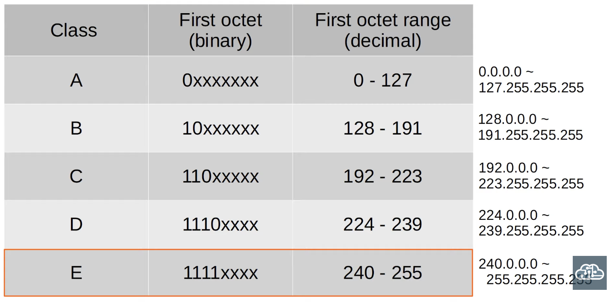
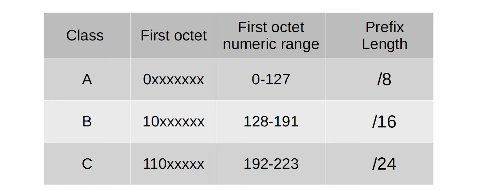
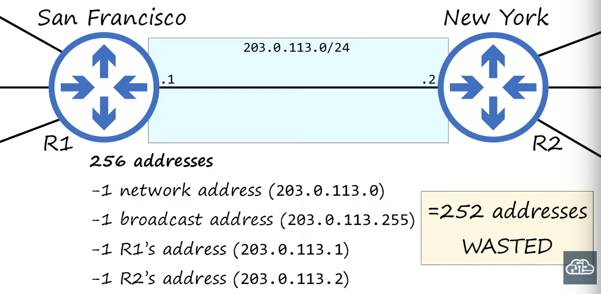
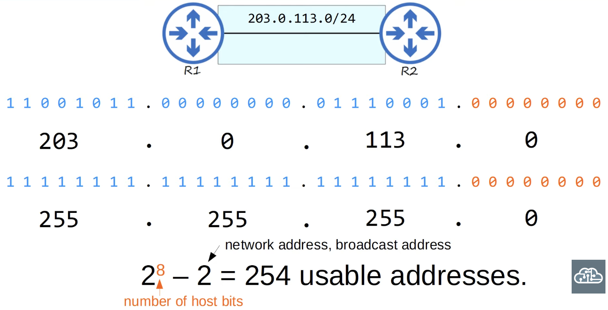
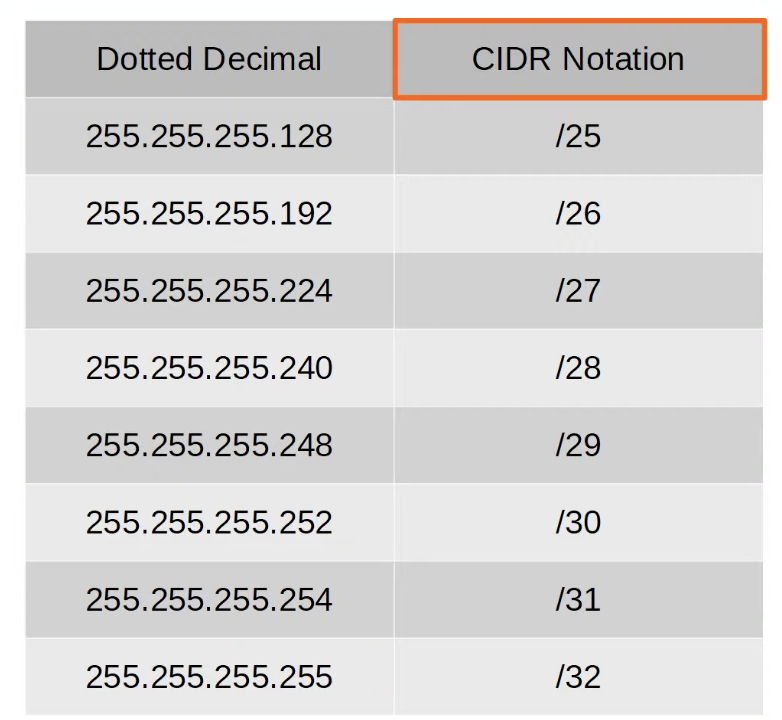
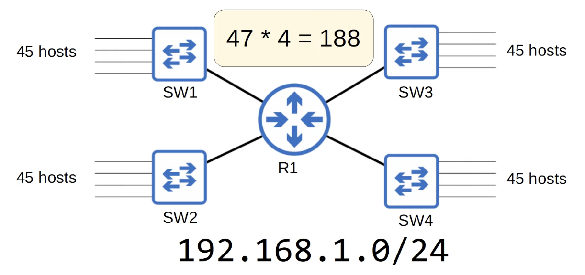
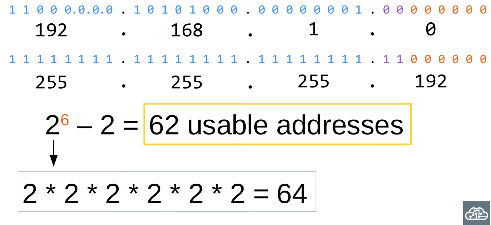
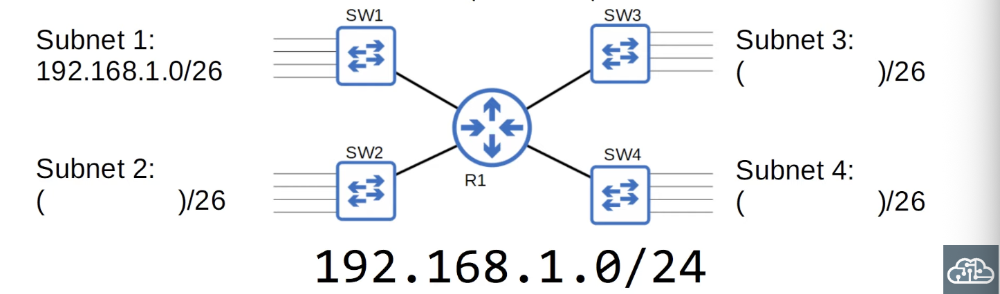

## Subnetting (Part 1)

### IPv4 Address Classes




- The IANA (Internet Assigned Numbers Authority) assigns IPv4 addresses/networks to companies based on their size
- For example, a very large company might receive a **class A** or **class B** network, while a small company might reveive a **class C** network
- However, this led to many wasted IP addresses
- Example:



- Company X needs IP addressing for 5000 end hosts
- A class C network does not provide enough addresses, so a class B network must be assigned
- This will result in about 60000 addresses being wasted

### CIDR (Classless Inter-Domain Routing)

- When the Internet was first created, the creators did not predict the Internet would become as large as it is today
- This resulted in wasted address space like the examples (there are many more examples)
- The IETF (Internet Engineering Tast Force) introduced CIDR in 1993 to replace the 'classful' addressing system
- With CIDR, the requirements of...
```bash
Class A = /8
Class B = /16
Class C = /24
```
... were removed
- This allowed larger networks to be split into smaller networks, allowing greater efficiency
- These smaller networks are called 'subnetworks'
or 'subnets'
- Example:

- *But we only need two, one for R1 and one for R2*
- How many usable addresses are there in each network?
```bash
203.0.113.0/25 - 126
203.0.113.0/26 - 62
203.0.113.0/27 - 30
203.0.113.0/28 - 14
203.0.113.0/29 - 6
203.0.113.0/30 - 2
203.0.113.0/31 - 0
203.0.113.0/32 - -1
```
- *Least (no) wasted addresses:*
.png)
- The remaining addresses in the `203.0.113.0/24` address block (`203.0.113.4 - 203.0.113.255`) are now available to be used in other subnets!
- *However, for a point-to-point connection like this, it is possible to use a `/31` mask*
.png)
- The remaining addresses in the `203.0.113.0/24` address block (`203.0.113.2 - 203.0.113.255`) are now available to be used in other networks!

- CIDR notation:


### Subnetting Scenario
- Divide the `192.168.1.0/24` network into four subnets that can accommodate the number of hosts required


- *`/26` works:*


### Quiz:
The first subnet (Subnet 1) is `192.168.1.0/26`. What are the remaining subnets?
HINT: Find the broadcast address of Subnet 1. The next address is the network address of Subnet 2. Repeat the process for Subnets 3 and 4.

```bash
192.1.168.1.0: 192.168.1.0/26 - 192.168.1.63/26
192.1.168.1.64: 192.168.1.64/26 - 192.168.1.127/26
192.1.168.1.128: 192.168.1.128/26 - 192.168.1.191/26
192.168.1.192: 192.168.1.192/26 - 192.168.1.255/26
```

