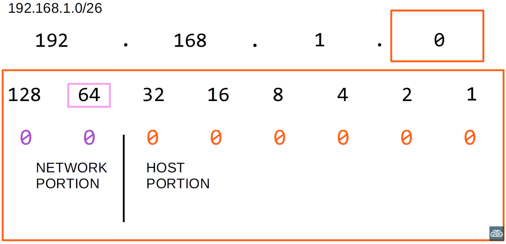
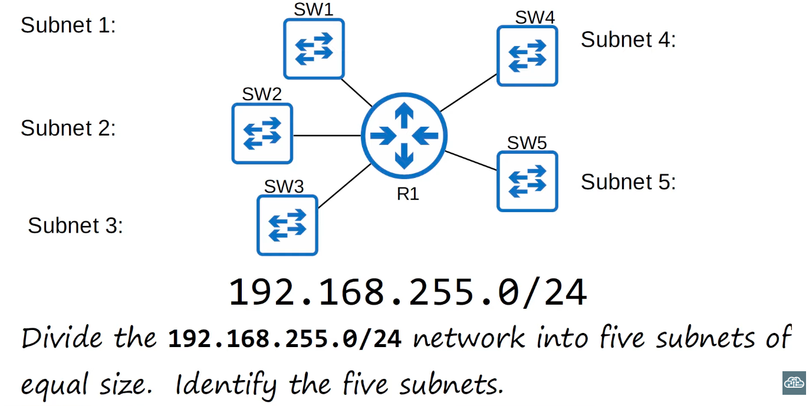
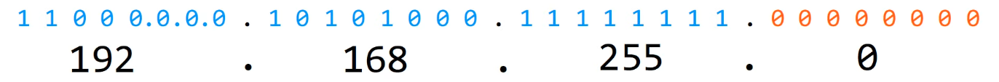
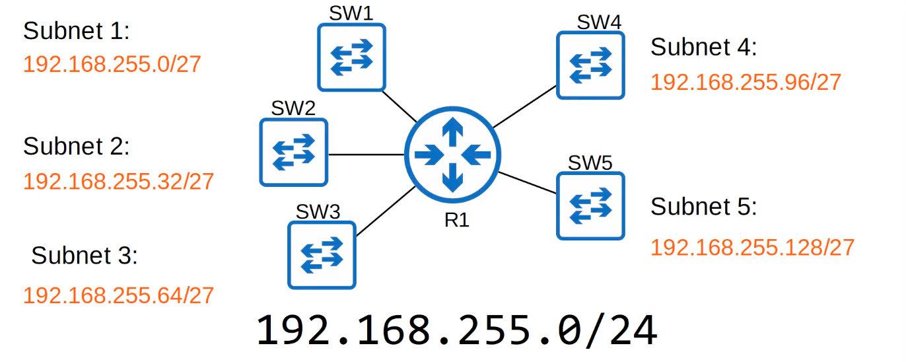
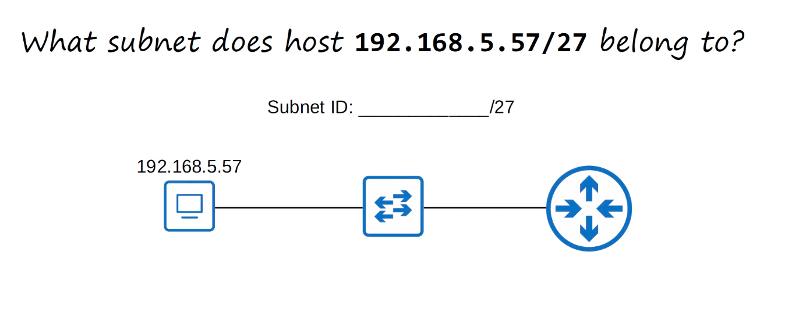
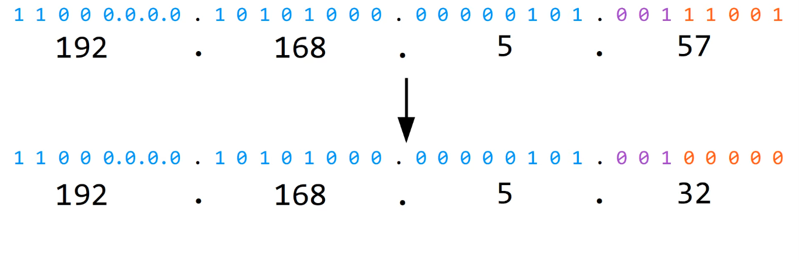
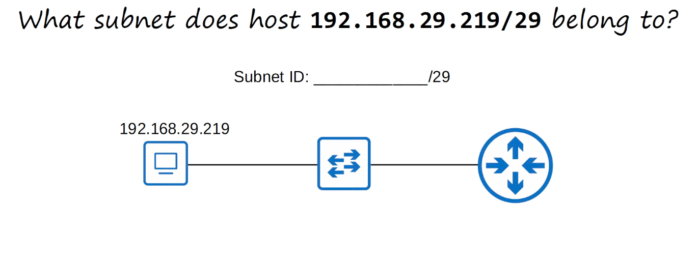
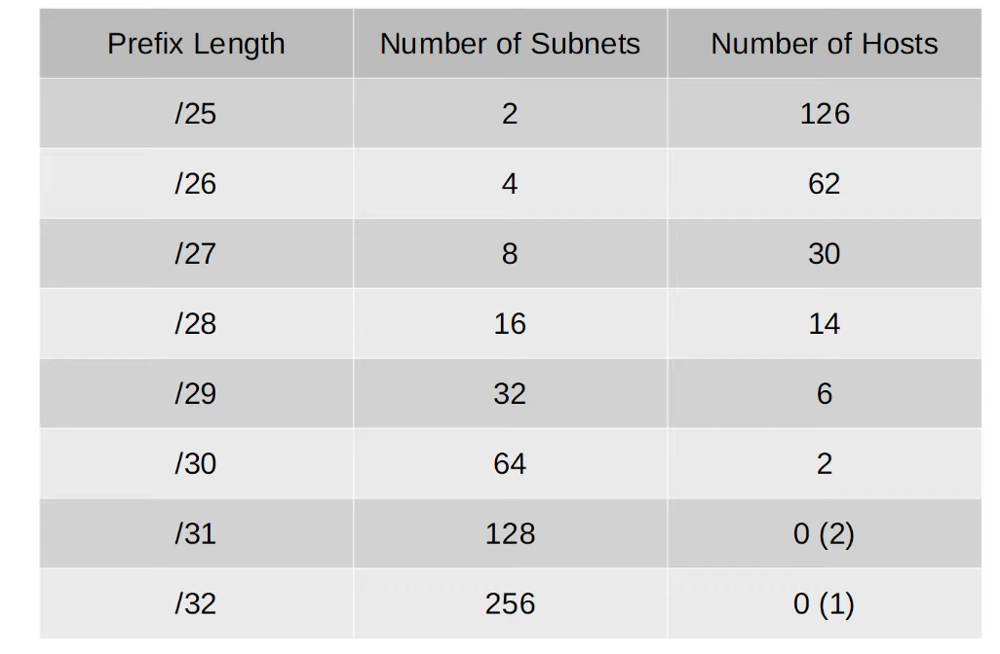
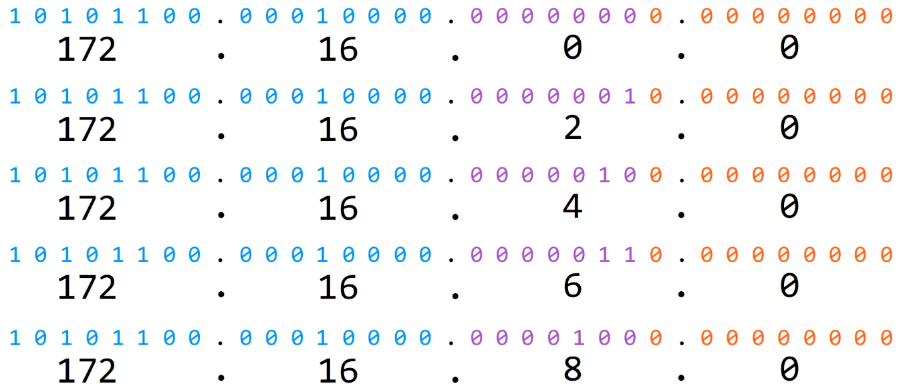
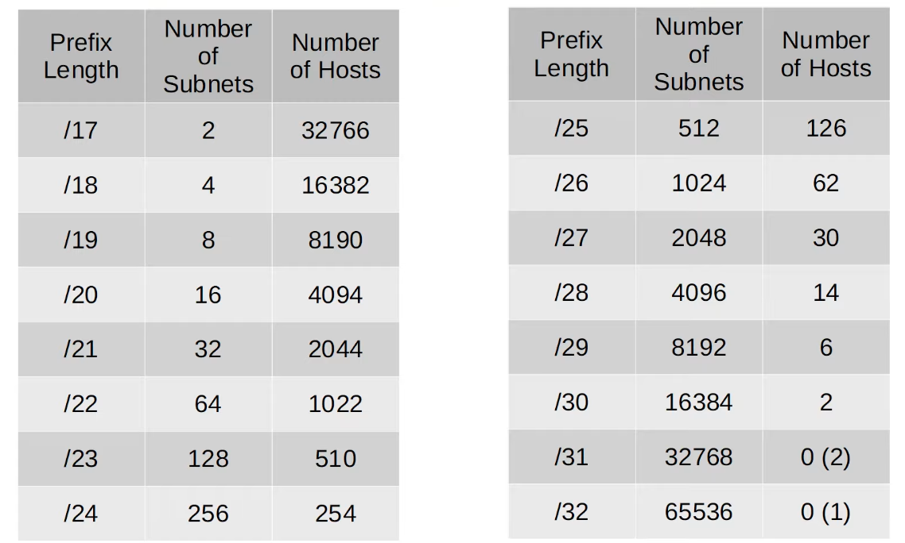

## Subnetting (Part 2)

### Subnetting trick


- By adding 64, we obtain the next subnet network address

### Subnetting


- Borrowing 0 bits = can't make any subnets (`/24`)
- Borrowing 1 bit - can make 2 subnets (`/25`)
```bash
2^x = number of subnets
(x = number of 'borrowed' bits)
```
- Borrowing 2 bits = can make 4 subnets (`/26`)
- Borrowing 3 bits = can make 8 subnets (`/27`) - this is the correct borrowed number of bits

- Remaining subnets that we do not use:
```bash
Subnet 6: 192.168.255.160/27
Subnet 7: 192.168.255.192/27
Subnet 8: 192.168.255.224/27
```
### Identify the subnet




```bash
192.168.29.219/29 = 11000000.10101000.00011101.|11011|011
=> Subnet ID: 192.168.29.216/29
```

### Subnets/Hosts (Class C)


### Subnetting Class B Networks
```
Class: B
Leading bits: 10
Size of network number bit field: 16
Size of rest bit field: 16
Number of networks: 16.384 (2^14)
Addresses per network: 65.536 (2^16)
```
- The proces of subnetting Class A, Class B, and Class C networks is EXACTLY THE SAME

- Example: You have been given the `172.16.0.0/16` network. You are asked to create 80 subenets for your company's various LANs. What prefix length should you use?
```bash
/16 => 2^0 = 1
/17 => 2^1 = 2
/18 => 2^2 = 4
/19 => 2^3 = 8
/20 => 2^4 = 16
/21 => 2^5 = 32
/22 => 2^6 = 64
/23 => 2^7 = 128 - this is the correct option
```
- The subnets we can create:

- etc.

- Example: You have been give the `172.22.0.0/16` network. You are required to divde the network into 500 separate subnets. What prefix length shoud you use?
```bash
/24 => 2^8 = 256
/25 => 2^9 = 512 - this is the correct option
```

- Example: You have been given the `172.18.0.0/16` network. Your company requires 250 subnets with the same number of hosts per subnet. What prefix length should you use?
```bash
/24 => 2^8 = 256 subnets
172.18.0.0/24 = 10101100.0010010|.00000000.|00000000 => 2^8 - 2 = 254 usable hosts per subnet
```

- Example: What subnet does host `172.25.217.192/21` belong to?
```bash:
172.25.217.192/21 = 10101100.00011001.11011|001.11000000
=> 10101100.00011001.11011|000.00000000 = 172.25.216.0 (Subnet ID)
```

### Subnets/Hosts (Class B)


### Quiz
1. You have been given the `172.30.0.0/16` network. Your company requires 100 subnets with at least 500 hosts per subnet. What prefix length should you use?
```bash
/16 => 2^16 = 65.536 subnets
...
/23 => 2^9 = 512 subnets
172.30.0.0/23 = 10101100.00011110.0000000|0.00000000 => 2^9 - 2 = 510 hosts per subnet
```

2. What subnet host `172.21.111.201/20` belong to?
```bash
172.21.111.201/20 = 10101100.00010101.0110|1111.11001001 => Subnet ID: 10101100.00010101.0110|0000.00000000 = 172.21.96.0/20
```

3. What is the **broadcast address** of the network `192.158.91.78/26` belongs to?
```bash
192.158.81.78/26 = 11000000.10011110.01010001.01|111111 => Broadcast address: 192.158.91.127/26
```

4. You divide the `172.16.0.0/16` network into 4 subnets of equal size. Identify the **network** and **broadcast** addresses of the second subnet.
```bash
/18 => 2^2 = 4 subnets
172.15.0.0/18 = 10101100.00010000.|01|000000.00000000
Network address: 172.16.64.0/18
Broadcast address: 172.16.127.255/18
```

5. You divide the `172.30.0.0/16` network into subnets of 1000 hosts each. How many subnets are you able to make?
```bash
1024 = 2^10
10101100.00011110.000000|00.00000000/22
=> 2^6 = 64 subnets
```