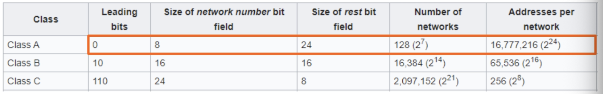
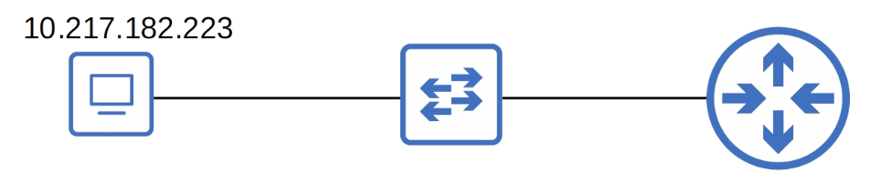
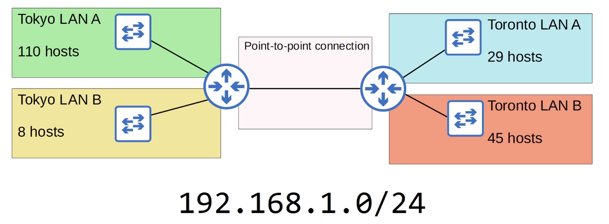
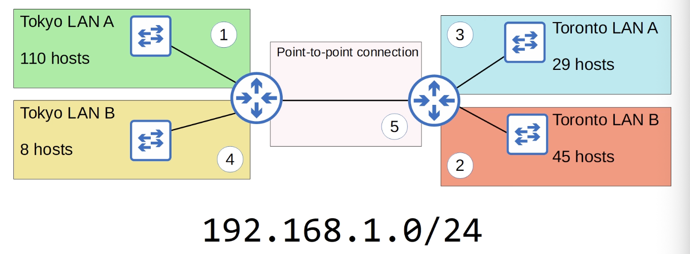
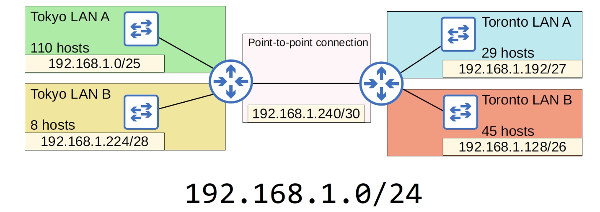
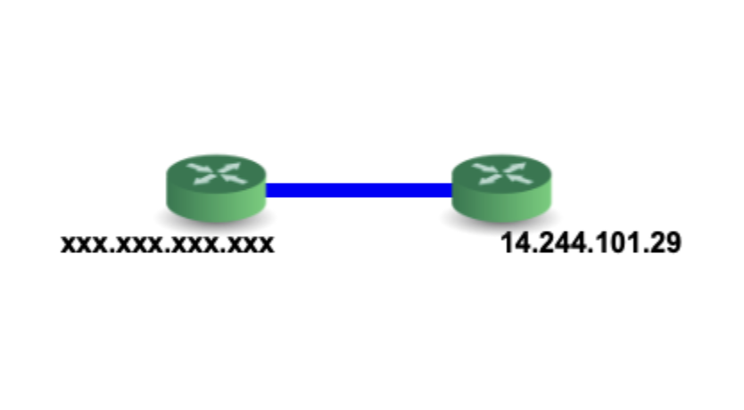
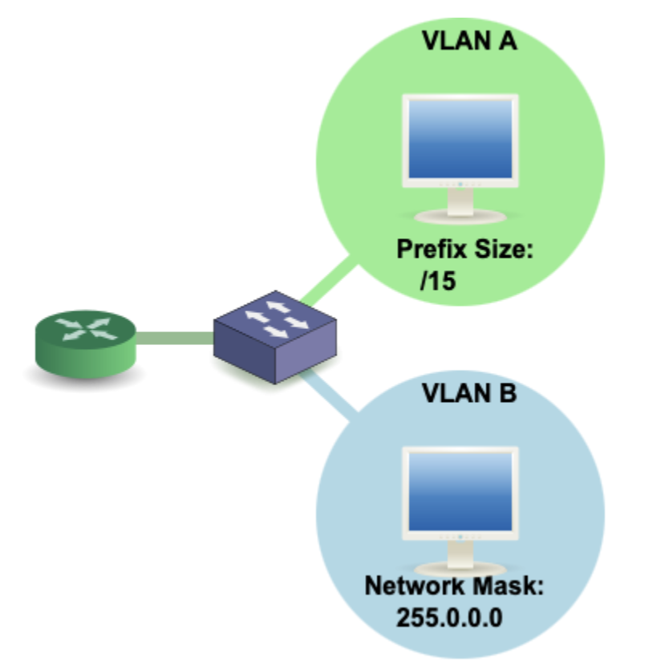
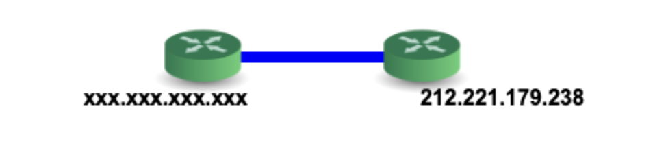
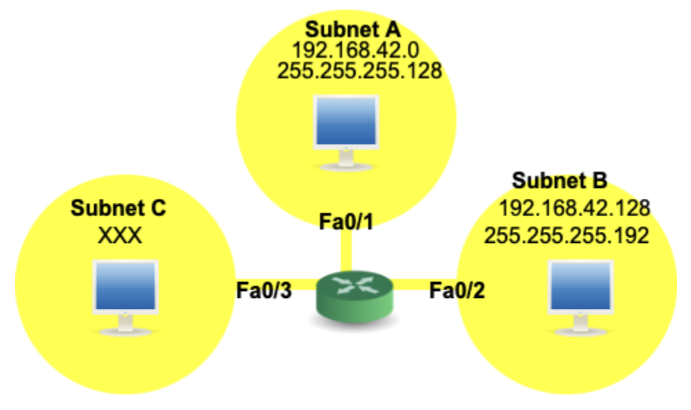

## Subnetting (Part 3 - VLSM)

### Subentting Class A Networks

- The process of subnetting Class A, Class B, and Class C networks is EXACTLY THE SAME!

- *Example:*
- You have been given the `10.0.0.0/8` network. You must create 2000 subnets which will be distributed to various enterprises.
- What prefix length must you use?
- How many host addresses (usable addresses) will be in each subnet?
```bash
10.0.0.0 = 00001010.00000000.00000000.00000000
# Subnet mask: 255.0.0.0 = 11111111.00000000.00000000.00000000
# Borrowing 0 bits = can't make any subnets
2^11 = 2048
8 + 11 = 19 prefix length => 13 bit host bits remaining
13 host bits = 2^13 - 2 = 8190 hosts per subnet
```

- *Example:*
- PC1 has an IP address of **`10.217.182.223/11`**
- Identify the following for PC1's subnet:
1) Network address
2) Broadcast address
3) First usable address
4) Last usable address
5) Number of host (usable) addresses

```bash
10.217.182.223/11 = 00001010.11011001.10110|110.11011111
# Network address:
00001010.110|00000.00000000.00000000 = 10.192.0.0/11
# Broadcast address:
00001010.110|11111.11111111.11111111 = 10.223.255.255/11
# First usable address:
00001010.110|00000.00000000.00000001 = 10.192.0.1/11
# Last usable address:
00001010.110|11111.11111111.11111110 = 10.223.255.254/11
# Number of host (usable) addresses:
2^21 - 2 = 2.097.150 hosts per subnet
```

### Variable-Length Subnet Masks
- Until now, we have practiced subnetting using FLSM (Fixed-Length Subnet Masks)
- This means that all of the subnets use the same prefix length (ie. subnetting a class C network into 4 subnets using `/26`)
- VLSM (Variable-Length Subnet Masks) is the process of creating subnets of different sizes, to make your use of network addresses more efficient
- VLSM is more complicated than FLSM, but it's easy if you follow the steps correctly
### VLSM - Steps

1) Assign the largest subnet at the start of the address space
2) Assign the second-largest subnet after it
3) Repeat the process until all subnets have been assigned

- Tokyo LAN A:
```bash
192.168.1.0/24 = 11000000.10101000.00000001|.00000000
2^7 - 2 = 126 hosts per subnet
# Network Address:
11000000.10101000.00000001.|0|0000000 = 192.168.1.0/25
# Broadcast address:
11000000.10101000.00000001.|0|1111111 = 192.168.1.127/25
# First usable address:
11000000.10101000.00000001.|0|0000001 = 192.168.1.1/25
# Last usable address:
11000000.10101000.00000001.|0|1111110 = 192.168.1.126/25
# Total number of usable host addresses:
2^7 - 2 = 126 hosts per subnet
```
- Toronto LAN B:
```bash
192.168.1.127 = broadcast address of Tokyo LAN A
=> 192.168.1.128/?? = network address of Toronto LAN B
2^6 - 2 = 62 hosts per subnet => prefix length /26 for Toronto LAN B
# Network Address:
11000000.10101000.00000001.|10|000000 = 192.168.1.128/26
# Broadcast address:
11000000.10101000.00000001.|10|111111 = 192.168.1.191/26
# First usable address:
11000000.10101000.00000001.|10|000001 = 192.168.1.129/26
# Last usable address:
11000000.10101000.00000001.|10|111110 = 192.168.1.190/26
# Total number of usable host addresses:
2^6 - 2 = 62 hosts per subnet
```
- Toronto LAN A:
```bash
192.168.1.191 = broadcast address of Toronto LAN B
=> 192.168.1.192/?? = network address of Toronto LAN A
2^5 - 2 = 30 hosts per subnet => prefix length /27 for Toronto LAN A
# Network Address:
11000000.10101000.00000001.|110|00000 = 192.168.1.192/27
# Broadcast address:
11000000.10101000.00000001.|110|11111 = 192.168.1.223/27
# First usable address:
11000000.10101000.00000001.|110|00001 = 192.168.1.193/27
# Last usable address:
11000000.10101000.00000001.|110|11110 = 192.168.1.222/27
# Total number of usable host addresses:
2^5 - 2 = 30 hosts per subnet
```
- Tokyo LAN B:
```bash
192.168.1.223 = broadcast address of Toronto LAN A
=> 192.168.1.224/?? = network address of Tokyo LAN B
2^4 - 2 = 14 hosts per subnet => prefix length /28 for Tokyo LAN B
# Network Address:
11000000.10101000.00000001.|1110|0000 = 192.168.1.224/28
# Broadcast address:
11000000.10101000.00000001.|1110|1111 = 192.168.1.239/28
# First usable address:
11000000.10101000.00000001.|1110|0001 = 192.168.1.225/28
# Last usable address:
11000000.10101000.00000001.|1110|1110 = 192.168.1.238/28
# Total number of usable host addresses:
2^4 - 2 = 14 hosts per subnet
```
- Point-to-point connection:
```bash
192.168.1.239 = broadcast address of Tokyo LAN B
=> 192.168.1.240/?? = network address of Point-to-point connection
2^2 - 2 = 2 hosts per subnet => prefix length /30 for Point-to-point connection
# Network Address:
11000000.10101000.00000001.|111100|00 = 192.168.1.240/30
# Broadcast address:
11000000.10101000.00000001.|111100|11 = 192.168.1.243/30
# First usable address:
11000000.10101000.00000001.|111100|01 = 192.168.1.241/30
# Last usable address:
11000000.10101000.00000001.|111100|10 = 192.168.1.242/30
# Total number of usable host addresses:
2^2 - 2 = 2 hosts per subnet
```


### Additional Practice
- http://www.subnettingquestions.com/
- http://subnetting.org/
- https://subnettingpractice.com/

(http://www.subnettingquestions.com/)
1. Question: How many subnets and hosts per subnet can you get from the network 10.0.0.0 255.255.240.0?
```bash
255.255.240.0 = 11111111.11111111.11110000.00000000 => /20
/20 => 2^12 - 2 = 4094 hosts per subnet
Class A network => 20 - 8 = 12 borrowed bits => 2^12 = 4096 subnets
# /21 => 2^11 - 2 = 2046 hosts per subnet
# /22 => 2^10 - 2 = 1022 hosts per subnet
# /23 => 2^9 - 2 = 510 hosts per subnet
# /24 => 2^8 - 2 = 254 hosts per subnet
# /25 => 2^7 - 2 = 126 hosts per subnet
# /26 => 2^6 - 2 = 62 hosts per subnet
# /27 => 2^5 - 2 = 30 hosts per subnet
# /28 => 2^4 - 2 = 14 hosts per subnet
# /29 => 2^3 - 2 = 6 hosts per subnet
# /30 => 2^2 - 2 = 2 hosts per subnet
# /31 => 2^1 - 2 = 0 hosts per subnet
# /32 => 2^0 - 2 = 0 hosts per subnet
```

2. Question: What is the first valid host on the subnetwork that the node 192.168.137.133/25 belongs to?
```bash
192.168.137.133/25 = 11000000.10101000.10001001.1|0000000
=> 192.168.137.129/25
```

3. Question: Which subnet does host 172.23.229.119 255.255.254.0 belong to?
```bash
255.255.254.0 = 11111111.11111111.11111110.00000000
172.23.229.119/23 = 10101100.00010111.1110010|1.01110111
Class B => 23 - 16 = 7 borrowed bits
=> subnet: 10101100.00010111.1110010|0.00000000 = 172.23.228.0/23
```

4. Question: Which subnet does host 172.22.117.103 255.255.255.128 belong to?
```bash
255.255.255.128 = 11111111.11111111.11111111.10000000
172.22.117.103/25 = 10101100.00010110.01110101.0|1100111
=> subnet: 172.22.117.0/25
```

5. Question: What is the last valid host on the subnetwork 192.168.131.88/30?
```bash
192.168.131.88/30 = 11000000.10101000.10000011.010110|00
=> 11000000.10101000.10000011.010110|10 = 192.168.131.90/30
```

6. Question: How many subnets and hosts per subnet can you get from the network 172.20.0.0/23?
```bash
32 - 23 = 9 host bits => 2^9 - 2 = 510 hosts per subnet
Class B address => 23 - 16 = 7 borrowed bits
=> 2^7 = 128 subnets
```

7. Question: What is the last valid host on the subnetwork 172.16.0.80/28?
```bash
172.16.0.80/28 = 10101100.00010000.00000000.1010|0000
=> 10101100.00010000.00000000.1010|1110 = 172.16.0.94/28
```

(http://subnetting.org/)
8. Question: What subnet does host 192.168.5.57/27 belong to?
```bash
192.168.5.57/27 = 11000000.10101000.00000101.001|11001
=> subnet: 1000000.10101000.00000101.001|00000 = 192.168.5.32/27
```

9. Question: What is the broadcast address of the network 192.168.93.0/25?
```bash
192.168.93.0/25 = 11000000.10101000.01011101.0|0000000
=> 11000000.10101000.01011101.0|1111111 = 192.168.93.127/25
```

10. Question: Which subnet does host 192.168.200.205/29 belong to?
```bash
192.168.200.205/29 = 11000000.10101000.11001000.11001|101
11000000.10101000.11001000.11001|000 = 192.168.200.200/29
```

11. Question: What is the broadcast address of the network 192.168.24.64 255.255.255.248?
```bash
255.255.255.248 = 11111111.11111111.11111111.11111000
192.168.24.64/29 = 11000000.10101000.00011000.01000|000
=> 11000000.10101000.00011000.01000|111 = 192.168.24.71/29
```

12. Question: How many subnets and hosts per subnet can you get from the network 192.168.119.0/27?
```bash
32 - 27 = 5 host bits => 2^5 - 2 = 30 hosts per subnet
Class C => 27 - 24 = 3 borrowed bits => 2^3 = 8 subnets
```

13. Question: You have the following subnetted network: 172.16.0.0/21. You need to assign your router the first usable host address on the third subnet. What address would you use?
```bash
172.16.0.0/21 = 10101100.00010000|.00000|000.00000000
third subnet: 10101100.00010000|.00010|000.00000000 = 172.16.16.0/21
first usable address on the third subnet: 172.16.16.1/21
```

14. Question: What subnet does host 192.168.24.156 255.255.255.192 belong to?
```bash
255.255.255.192 = 11111111.11111111.11111111.11000000
192.168.24.156/26 = 11000000.10101000.00011000.10|011100
=> 11000000.10101000.00011000.10|000000 = 192.168.24.128/26
```

(https://subnettingpractice.com/)
15. Given the following point to point (/30) network, what is the IP address of the unknown router (labeled xxx.xxx.xxx.xxx)?

```bash
14.244.101.29/30 = 00001110.11110100.01100101.000111|01
network address: 14.244.101.28/30
first usable address: 14.244.101.29/30 (already used)
second usable address: 14.244.101.30/30 (this one will be used by that unkown address router)
broadcast: 14.244.101.31/30
```

16. Which of the following contains more host bits? For your answer simply write 'A' or 'B'.

```bash
A:
32 - 15 = 17 host bits
B:
32 - 8 = 24 host bits
=> B
```

17. Given the following point to point (/30) network, what is the IP address of the unknown router (labeled xxx.xxx.xxx.xxx)?

```bash
network address: 212.221.179.236/30
first usable address: 212.221.179.237/30 (this will be used by the second unknown address router)
second usable address: 212.221.179.238/30 (already used)
broadcast address: 212.221.179.239/30
```

18. What is the subnet mask for a /28?
```bash
/28 => 255.255.255.240
```

19. You have a subnetwork, 192.168.42.0/24. It is divided into subnet A and subnet B. Your boss wants to add a third subnet, C, with 6 hosts. Is this possible? If yes, provide the network address of the new subnet you will be adding (i.e. 192.168.2.14). If it is not possible, type 'no' as your answer.

```bash
# Subnet:
192.168.42.0/24 = 11000000.10101000.00101010|.00000000
# Subnet A:
255.255.255.128 = 11111111.11111111.11111111.10000000
192.168.42.0/25 = 11000000.10101000.00101010.0|0000000
# Subnet B:
255.255.255.192 = 11111111.11111111.11111111.11000000
192.168.42.128/26 = 11000000.10101000.00101010.10|000000
# Subnet C:
2^3 - 2 = 6 hosts per subnet => prefix length: /29
255.255.255.248 = 11111111.11111111.11111111.11111000
192.168.42.192/29 = 11000000.10101000.00101010.11000|000
```

20. What is the slash notation for the subnet mask 255.128.0.0? (e.g. /24)
```bash
255.128.0.0 = 11111111.10000000.00000000.00000000 => /9
```

21. What is the broadcast address of the network 10.206.255.161    255.192.0.0
```bash
255.192.0.0 = 11111111.11000000.00000000.00000000
10.206.255.161/10 = 00001010.11|001110.11111111.10100001
=> 00001010.11|111111.11111111.11111111 = 10.255.255.255/10
```