## VLANs (Part 1)

### What is a LAN?
- Preivously was said that a LAN is a group of devices (PCs, servers, routers, switches, etc.) in a single location (home, office, etc.)
- A more specific definition: A LAN is a single **broadcast domain**, including all devices in that broadcast domain
- A **broadcast domain** is the group of devices which will receive a broadcast frame (destination MAC `FFFF.FFFF.FFFF`) sent by any one of the members
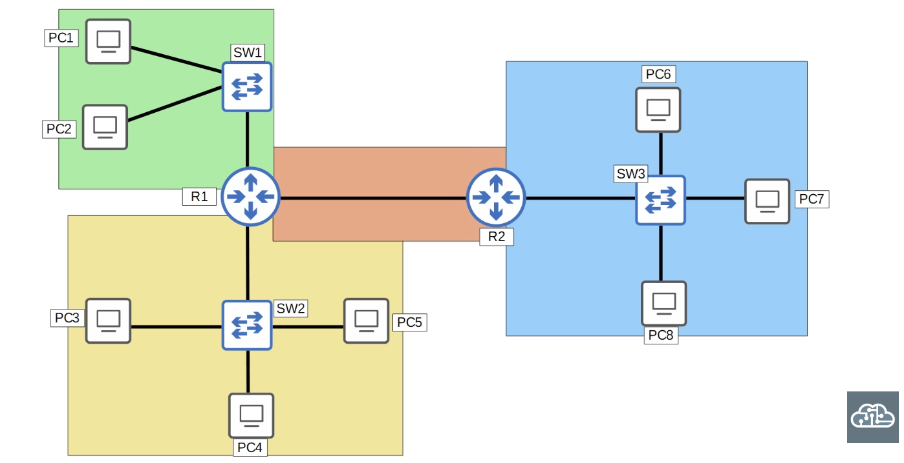

### What is a VLAN?
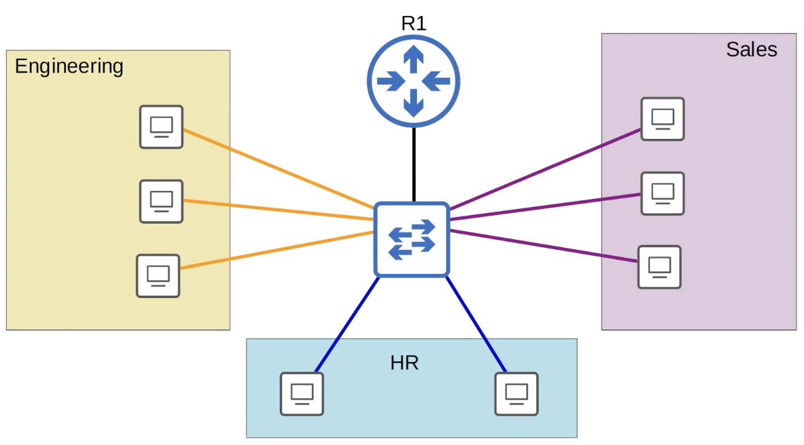
- **Performance:** Lots of unnecessaty broadcast traffic can reduce network performance
- **Security**: Even within the same office, you want to limit who has access to what; you can apply security policies on router/firewall
- Because this is one LAN, PCs can reach each other directly, without traffic passing through the router
- So, even if we configure security policies, they won't have any effect
- Subnetting example and problem:
- *Here we can configure the router to limit passing away the frame to other subnets:*
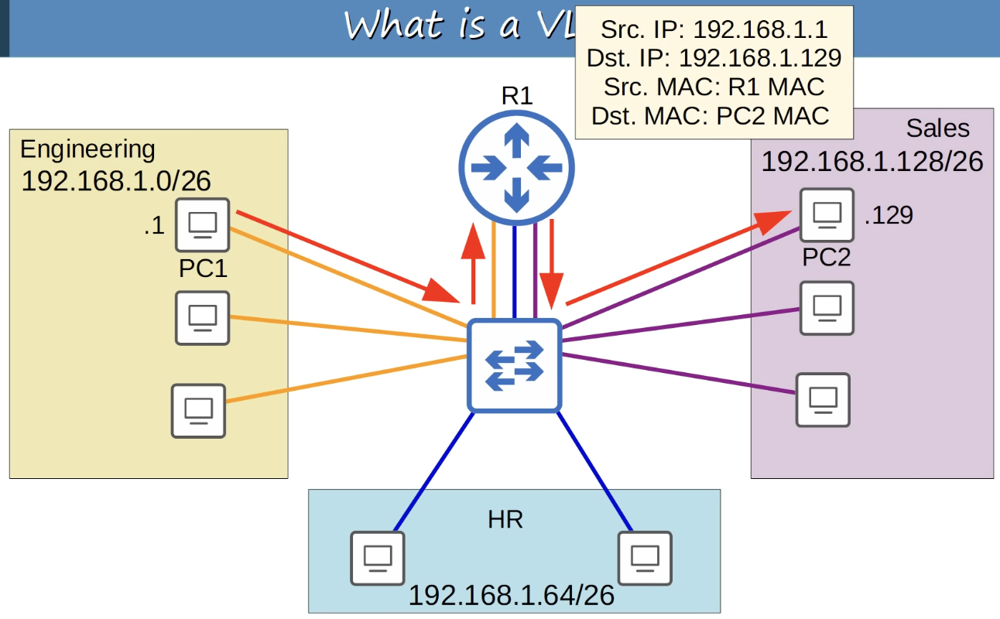
- *But:*
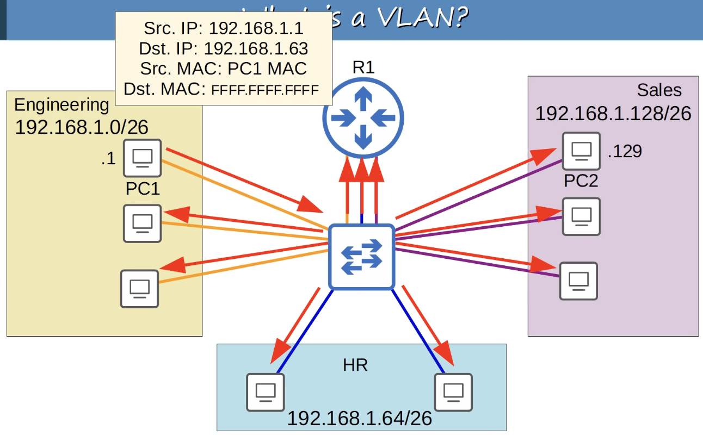
- Although we separated the three departments into three subnets (Layer 3), they are still in the same broadcast domain (Layer 2)
- *We assign each department to a VLAN:*
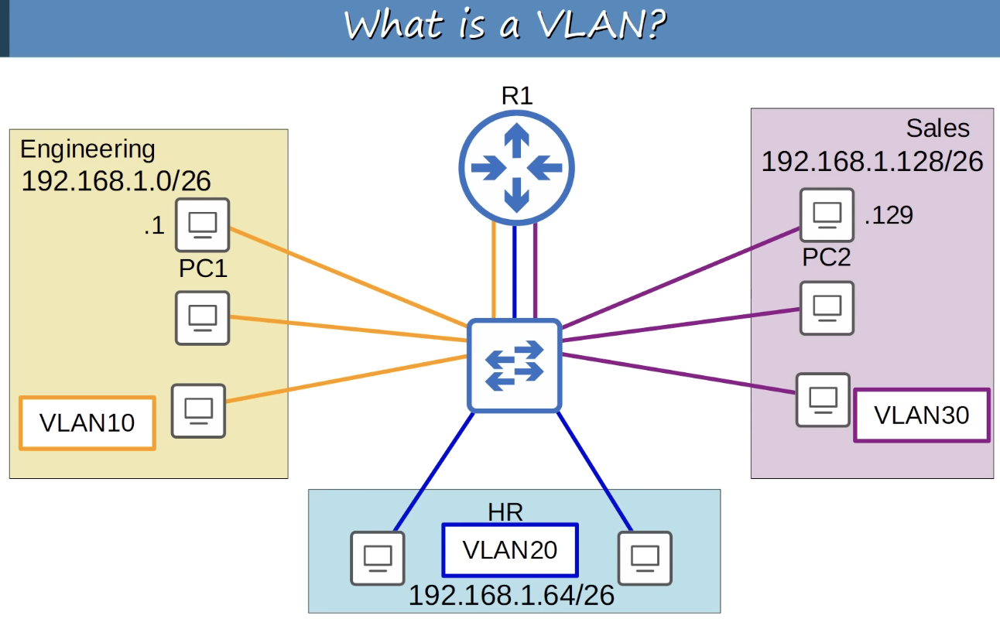
- A switch WILL NOT forward traffic between VLANs including **broadcast/unknown unicast** traffic
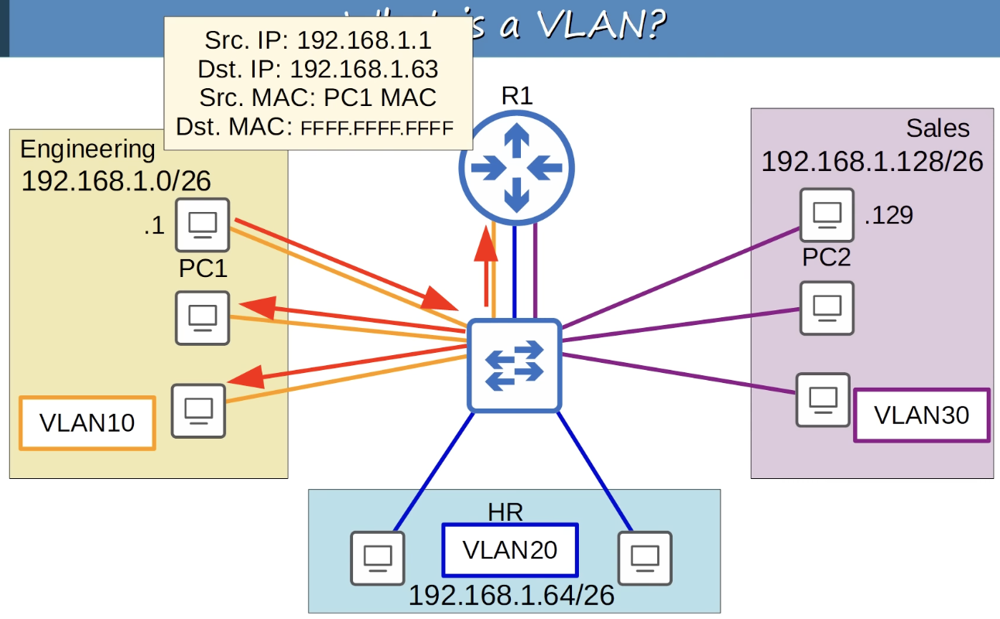
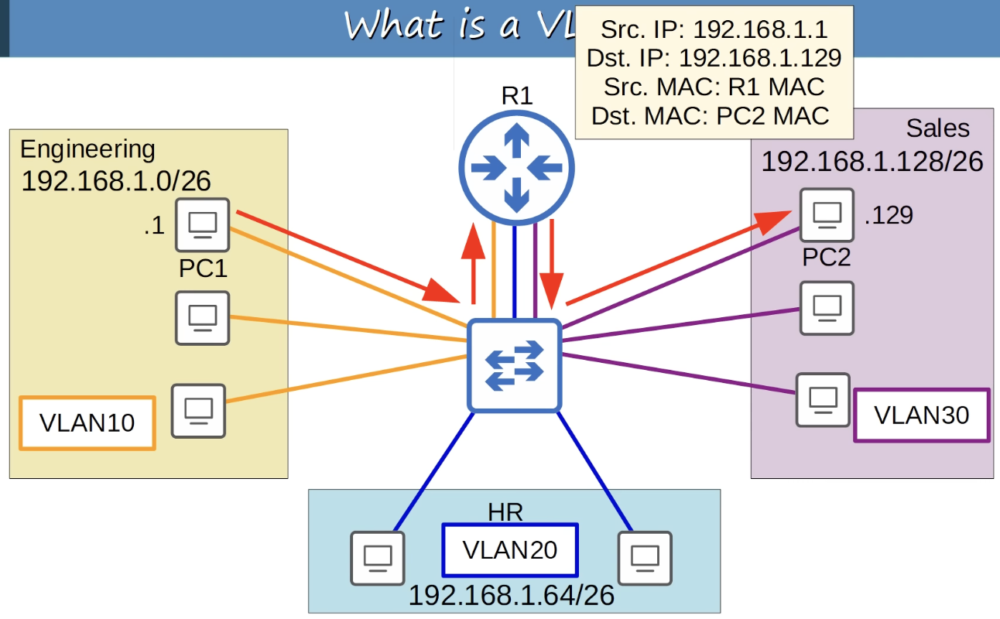
- The switch does not perform **inter-VLAN routing**; it must send the traffic through the router
- VLANs are configured on switches on a **per-interface** basis
- **Logically** separate end hosts at Layer 2
- Switches do not forward traffic directly between hosts in different VLANs

### VLAN Configuration
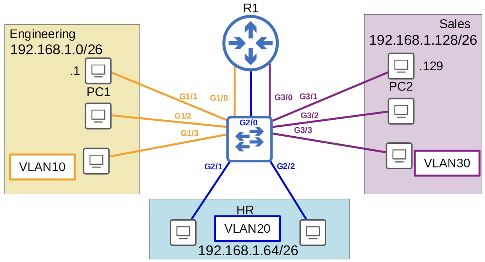
- *Default VLANs on the switch:*
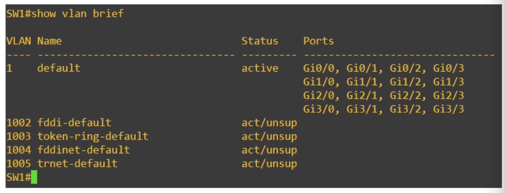
- VLANs 1, 1002-1005 exist by defualt and **cannot be deleted**
- *This is how interfaces are assigned to a VLAN:*
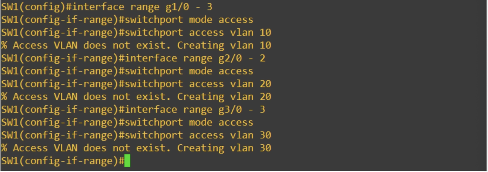
- An access port is a switchport which belongs to a single VLAN and usually connects to end hosts like PCs
- Switchports which carry multiple VLANs are called 'trunk ports'
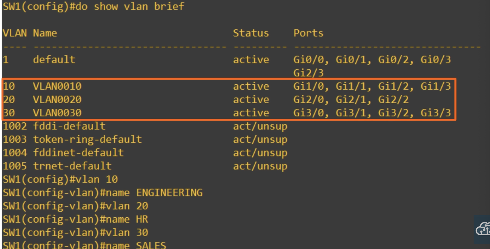
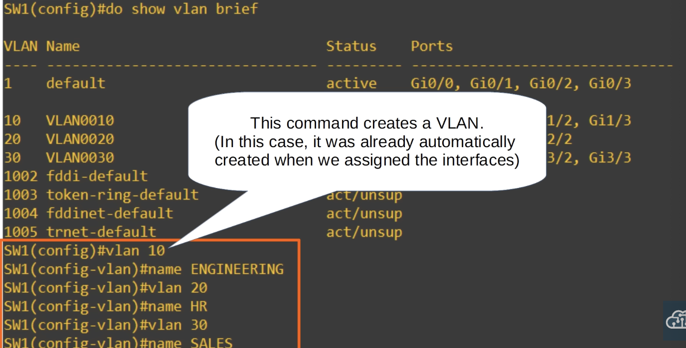
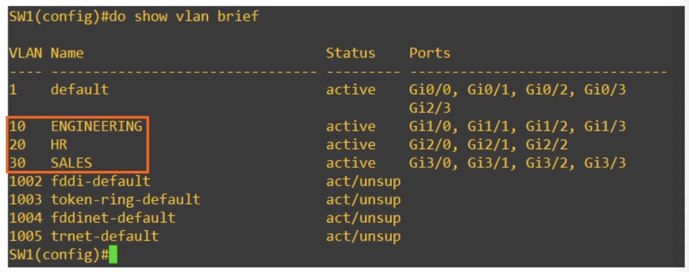
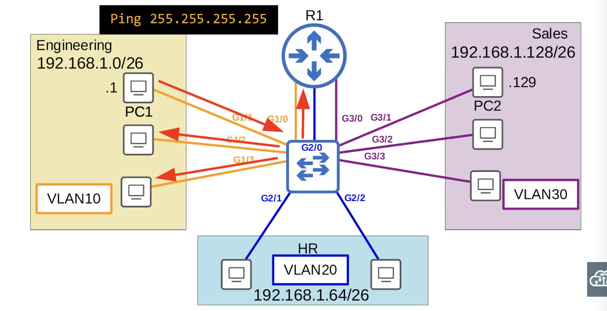

### Quiz
1. How many broadcast domains are shown in this network diagram?
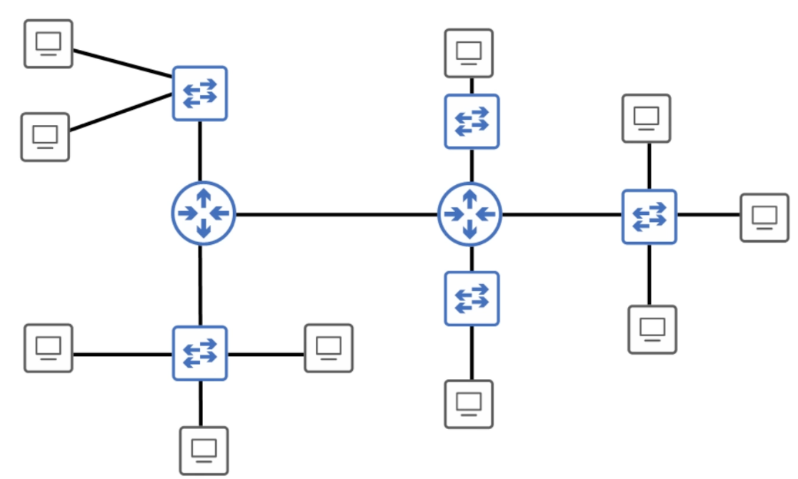
*6*

2. How many broadcast domains are shown in this network diagram?
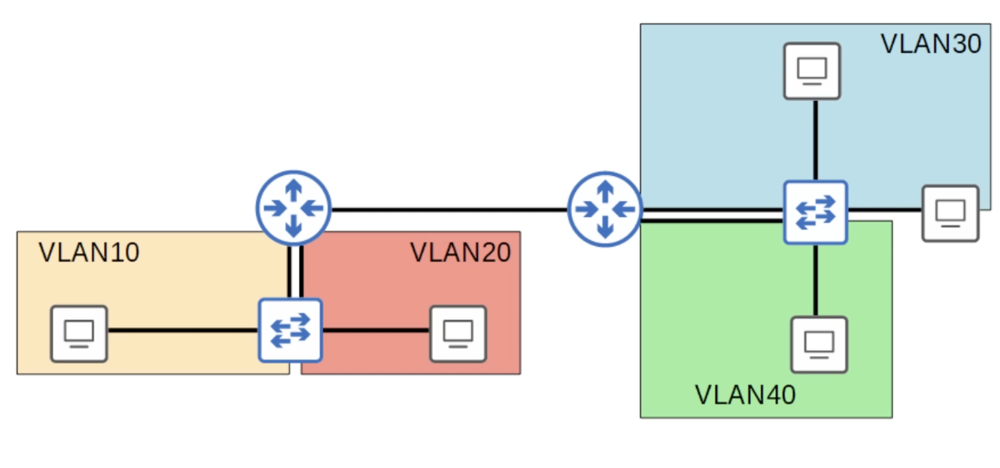
*5*

3. What happens if you try to assign a switch interface to a VLAN that doesn't exist?
*b) The switch will create the VLAN*

4. If PC3 sends a broadcast message, how many devices will receive it?
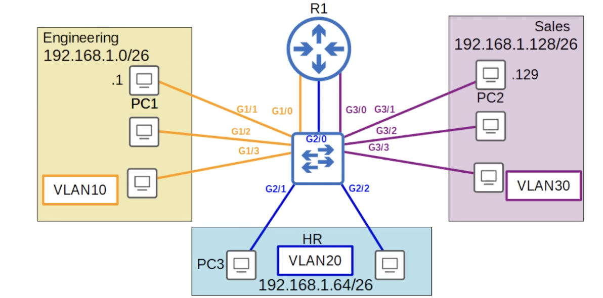
*3*

5. You create VLANs 10, 20, and 30 on a Cisco switch. How many VLANs will be displayed in the output of the `show vlan brief` command?
*c) 8*
