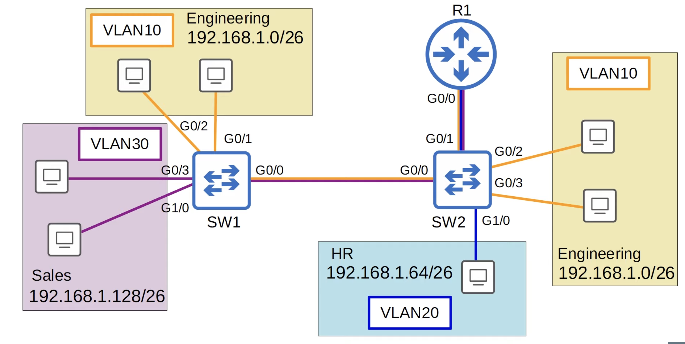
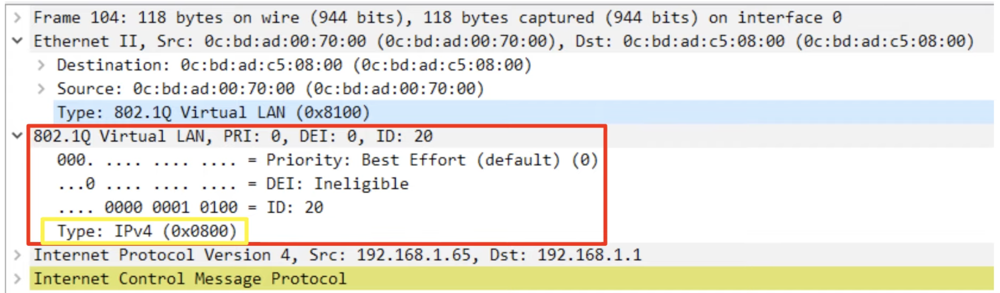
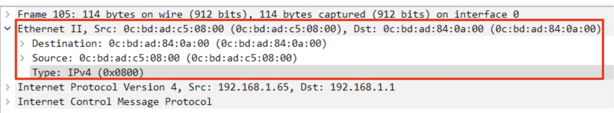
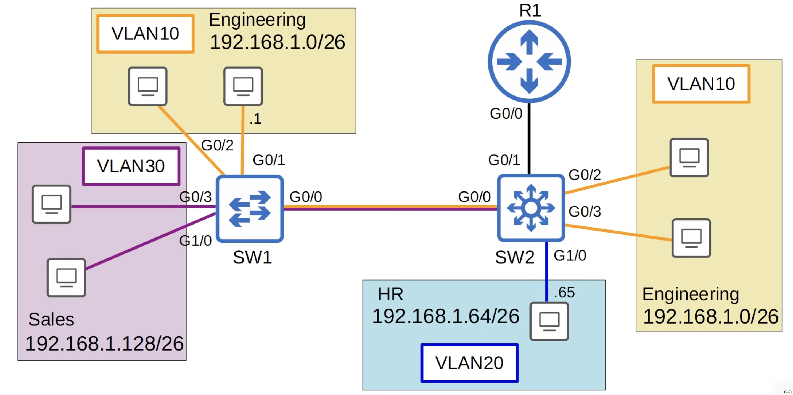
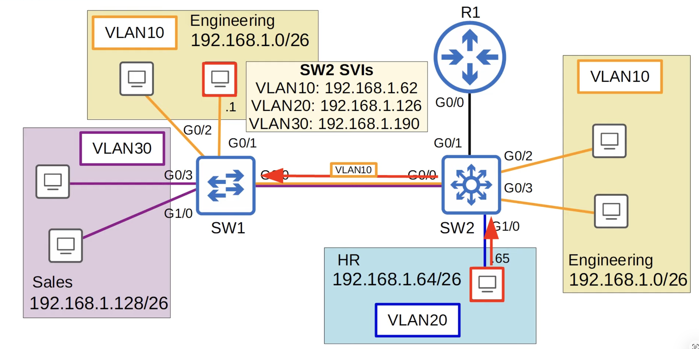
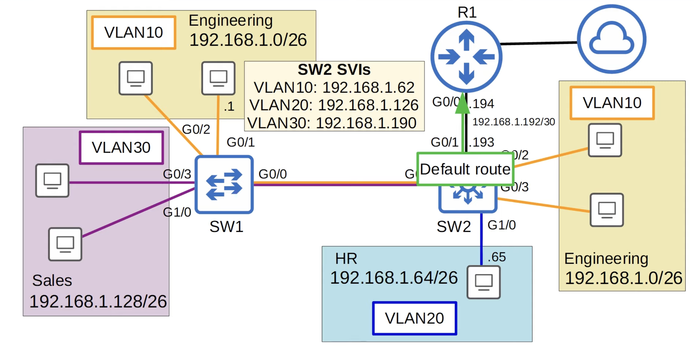

## VLANs (Part 3)

### Native VLAN on a router (ROAS)



```
SW1(config)#int g0/0
SW1(config-if)#switchport trunk native vlan 10
```

```
SW2(config)#int g0/0
SW2(config-if)#switchport trunk native vlan 10
SW2(config-if)#int g0/1
SW2(config-if)#switchport trunk native vlan 10
```

- There **2 methods** of configuring the native VLAN on a router:
    - Use the command **`encapsulation dot1q`** *`vlan-d`*
    ```
    R1(config)#int g0/0.10
    R1(config-subif)#encapsulation dot1q 10 native
    R1(config-subif)#
    ```
    - Wireshark Capture (`SW2 -> R1`):
    
    
    - Configure the IP address for the native VLAN on the router's physical interface (the **`encapsulation dot1q`** *`vlan-d`* command is not necessary)
    ```
    R1(config)#no interface g0/0.10
    R1(config)#interface g0/0
    R1(config-if)#ip address 192.168.1.62 255.255.255.192
    R1(config-if)#
    ```
    ```
    !
    interface GigabitEthernet0/0
    ip address 192.168.1.62 255.255.255.192
    duplex auto
    speed auto
    media-type rj45
    !
    interface GigabitEthernet0/0.20
    encapsulation dot1Q 20
    ip address 192.168.1.126 255.255.255.192
    !
    interface GigabitEthernet0/0.30
    encapsulation dot1Q 30
    ip address 192.168.1.190 255.255.255.192
    !
    ```

### Layer 3 (Multilayer) Switches

- A multilayer switch is capable of both *switching* AND *routing*
- It is 'Layer 3 aware'
- You can assign IP addresses to its interfaces, like a router
- You can create virtual interfaces for each VLAN, and assign IP addresses to those interfaces
- You can configure routes on it, just like a router
- It can be used for inter-VLAN routing

### Inter-VLAN Routing via SVI


- SVIs (Swtich Virtual Interfaces) are the virtual interfaces you can assign IP addresses in a multilayer switch
- Configure each PC to use the SVI (NOT the router) as their gateway address
- To send traffic to different subnets/VLANs, the PCs will send traffic to the switch, and the switch will route the traffic


```
R1(config)#no interface g0/0.10
R1(config)#no interface g0/0.20
R1(config)#no interface g0/0.30
R1(config)#default interface g0/0
Interface GigabitEthernet0/0 set to default configuration
R1(config)#do show ip interface brief
Interface              IP-Address      OK? Method Status                Protocol
GigabitEthernet0/0     unassigned      YES NVRAM  up                    up
GigabitEthernet0/0.10  unassigned      YES manual deleted               down
GigabitEthernet0/0.20  unassigned      YES manual deleted               down
GigabitEthernet0/0.30  unassigned      YES manual deleted               down
GigabitEthernet0/1     unassigned      YES NVRAM  administratively down down
GigabitEthernet0/2     unassigned      YES NVRAM  administratively down down
GigabitEthernet0/3     unassigned      YES NVRAM  administratively down down
R1(config)#
```
```
R1(config)#interface g0/0
R1(config-if)#ip address 192.168.1.194 255.255.255.252
R1(config-if)#do show ip interface brief
Interface              IP-Address      OK? Method Status                Protocol
GigabitEthernet0/0     192.168.1.194   YES manual up                    up
GigabitEthernet0/0.10  unassigned      YES manual deleted               down
GigabitEthernet0/0.20  unassigned      YES manual deleted               down
GigabitEthernet0/0.30  unassigned      YES manual deleted               down
GigabitEthernet0/1     unassigned      YES NVRAM  administratively down down
GigabitEthernet0/2     unassigned      YES NVRAM  administratively down down
GigabitEthernet0/3     unassigned      YES NVRAM  administratively down down
R1(config-if)#
```
---
- `ip routing` command enables Layer 3 routing on the switch
- `no switchport` configures an interface as a 'routed port' (Layer 3 port, not a Layer 2/switchport)
- Configure an IP address on the interface like a regular router interface
```
SW2(config)#default interface g0/1
Interface GigabitEthernet0/1 set to default configuration
SW2(config)#ip routing
SW2(config)#interface g0/1
SW2(config-if)#no switchport
SW2(config-if)#ip address 192.168.1.193 255.255.255.252
SW2(config-if)#do show ip interface brief
Interface              IP-Address      OK? Method Status                Protocol
GigabitEthernet0/0     unassigned      YES unset  up                    up
GigabitEthernet0/2     unassigned      YES unset  up                    up
GigabitEthernet0/3     unassigned      YES unset  up                    up
GigabitEthernet0/1     192.168.1.193   YES manual up                    up
GigabitEthernet1/0     unassigned      YES unset  up                    up
GigabitEthernet1/1     unassigned      YES unset  up                    up
GigabitEthernet1/2     unassigned      YES unset  up                    up
GigabitEthernet1/3     unassigned      YES unset  up                    up
GigabitEthernet2/0     unassigned      YES unset  up                    up
GigabitEthernet2/1     unassigned      YES unset  up                    up
GigabitEthernet2/2     unassigned      YES unset  up                    up
GigabitEthernet2/3     unassigned      YES unset  up                    up
```
```
SW2(config-if)#exit
SW2(config)#ip route 0.0.0.0 0.0.0.0 192.168.1.194
SW2(config)#do show ip route
Codes: L - local, C - connected, S - static, R - RIP, M - mobile, B - BGP
       D - EIGRP, EX - EIGRP external, O - OSPF, IA - OSPF inter area 
       N1 - OSPF NSSA external type 1, N2 - OSPF NSSA external type 2
       E1 - OSPF external type 1, E2 - OSPF external type 2
       i - IS-IS, su - IS-IS summary, L1 - IS-IS level-1, L2 - IS-IS level-2
       ia - IS-IS inter area, * - candidate default, U - per-user static route
       o - ODR, P - periodic downloaded static route, H - NHRP, l - LISP
       a - application route
       + - replicated route, % - next hop override

Gateway of last resort is 192.168.1.194 to network 0.0.0.0

S* 0.0.0.0/0 [1/0] via 192.168.1.194
      192.168.1.0/24 is variably subnetted, 2 subnets, 2 masks
C        192.168.1.192/30 is directly connected, GigabitEthernet0/1
L        192.168.1.193/32 is directly connected, GigabitEthernet0/1
SW2(config)#
```
```
SW2#show interfaces status

Port      Name               Status       Vlan       Duplex  Speed Type
Gi0/0                        connected    trunk        auto   auto unknown
Gi0/2                        connected    10           auto   auto unknown
Gi0/3                        connected    10           auto   auto unknown
Gi0/1                        connected    routed       auto   auto unknown
Gi1/0                        connected    20           auto   auto unknown
Gi1/1                        connected    15           auto   auto unknown
Gi1/2                        connected    1            auto   auto unknown
Gi1/3                        connected    1            auto   auto unknown
Gi2/0                        connected    1            auto   auto unknown
Gi2/1                        connected    1            auto   auto unknown
Gi2/2                        connected    1            auto   auto unknown
Gi2/3                        connected    1            auto   auto unknown
Gi3/0                        connected    1            auto   auto unknown
Gi3/1                        connected    1            auto   auto unknown
Gi3/2                        connected    1            auto   auto unknown
Gi3/3                        connected    1            auto   auto unknown
SW2#
```
- SVIs are **`shutdown`** by default, so remember to use **`no shutdown`**
```
SW2(config)#interface vlan10
SW2(config-if)#ip address 192.168.1.62 255.255.255.192
SW2(config-if)#no shutdown
SW2(config-if)#interface vlan20
SW2(config-if)#ip address 192.168.1.126 255.255.255.192
SW2(config-if)#no shutdown
SW2(config-if)#interface vlan30
SW2(config-if)#ip address 192.168.1.190 255.255.255.192
SW2(config-if)#no shutdown
```
- A problem:
```
SW2(config-if)#interface vlan40
SW2(config-if)#ip address 40.40.40.40 255.255.255.0
SW2(config-if)#no shutdown
SW2(config-if)#do show ip interface brief
Interface              IP-Address      OK? Method Status                Protocol
GigabitEthernet0/0     unassigned      YES unset  up                    up
GigabitEthernet0/2     unassigned      YES unset  up                    up
GigabitEthernet0/3     unassigned      YES unset  up                    up
GigabitEthernet0/1     192.168.1.193   YES manual up                    up

Vlan10                 192.168.1.62    YES manual up                    up
Vlan20                 192.168.1.126   YES manual up                    up
Vlan30                 192.168.1.190   YES manual up                    up
Vlan40                 40.40.40.40     YES manual down                  down
```
1. The VLAN must exist on the switch
2. The switch must have at least one access port in the VLAN in an up/up state, AND/OR one trunk port that allows the VLAN that is in an up/up state
3. The VLAN must not be shutdown (you can use the **shutdown** command to disable a VLAN)
4. The SVI must not be shutdown (SVIs are disabled by default)

```
SW2(config-if)#do show ip route
Codes: L - local, C - connected, S - static, R - RIP, M - mobile, B - BGP
       D - EIGRP, EX - EIGRP external, O - OSPF, IA - OSPF inter area 
       N1 - OSPF NSSA external type 1, N2 - OSPF NSSA external type 2
       E1 - OSPF external type 1, E2 - OSPF external type 2
       i - IS-IS, su - IS-IS summary, L1 - IS-IS level-1, L2 - IS-IS level-2
       ia - IS-IS inter area, * - candidate default, U - per-user static route
       o - ODR, P - periodic downloaded static route, H - NHRP, l - LISP
       a - application route
       + - replicated route, % - next hop override

Gateway of last resort is 192.168.1.194 to network 0.0.0.0

S* 0.0.0.0/0 [1/0] via 192.168.1.194
      192.168.1.0/24 is variably subnetted, 8 subnets, 3 masks
C        192.168.1.0/26 is directly connected, Vlan10
L        192.168.1.62/32 is directly connected, Vlan10
C        192.168.1.64/26 is directly connected, Vlan20
L        192.168.1.126/32 is directly connected, Vlan20
C        192.168.1.128/26 is directly connected, Vlan30
L        192.168.1.190/32 is directly connected, Vlan30
C        192.168.1.192/30 is directly connected, GigabitEthernet0/1
L        192.168.1.193/32 is directly connected, GigabitEthernet0/1
SW2(config-if)#
```

### Quiz

1. Which TWO answers are valid options to configure the native VLAN on a router in ROAS configuration? (select the two best answers, each answer is a complete solution)

*b) `R1(config-subif)# encapsulation dot1q 112 native`*
    *`R1(config-subif)# ip address 192.168.1.1 255.255.255.0`*
*c) `R1(config-if)# ip address 192.168.1.1 255.255.255.0`*

2. You create an SCI for VLAN255 on SW1, assign an IP address, and enable it with **`no shutdown`**, but the interface remains down/down/ Which TWO options might be causing this? (select two)

*a) VLAN255 doesn't exist on the switch*
*b) No interfaces in VLAN 255 are up/up*

3. Which command is used to configure a switch interface as a routed port?

*a) **`no switchport`***

4. You issue the following commands on a Catalyst 2950 switch:
```
SwitchA#configure terminal
SwitchA(config)#interface fastethernet 0/7
SwitchA(config-if)#switchport trunk encapsulation dot1q
SwitchA(config-if)#switchport mode trunk
SwitchA(config-if)#switchport trunk native vlan 44
```
Which of the following commands is true regarding VLAN traffic when it is sent over port `FastEthernet 0/7`?

*b) VLAN 44 traffic will be untagged*