# Domain Name Server

- DNS is used to *resolve* human-readable names (google.com) to IP addresses
- Machines such as PCs don't use names, they use addresses (ie. IPv4/IPv6)
- Names are much easier for us to use and remember than IP addresses
    - What's the IP address of youtube.com?
- When you type 'youtube.com' into a web browser, your device will ask a DNS server for the IP address of youtube.com
- The DNS server(s) your device uses can be manually configured or learned via DHCP
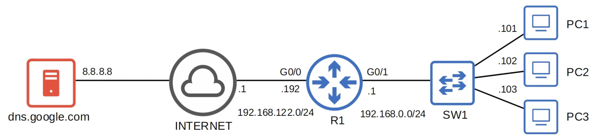

#### `ipconfig /all`
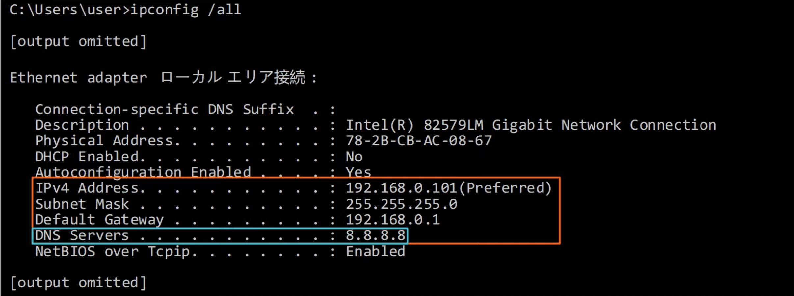
#### `nslookup`
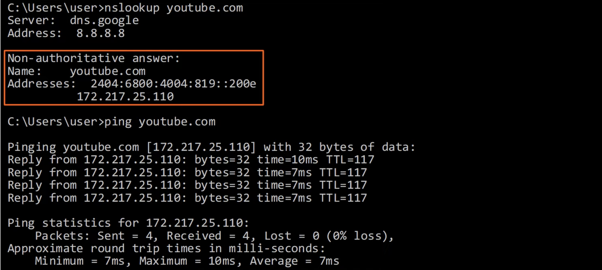
- You don't have to use the **`nslookup`** command before sending the ping
- If your device doesn't know the correct IP address ir will automatically ask the server
- *To learn the IP address of youtube.com, PC1 sends a DNS query message to its configured DNS server, `8.8.8.8`*
- *Then, the DNS server replies, telling PC1 that the IP address is `172.217.25.110`*
- In this case, R1 isn't acting as a DNS server or client; it is simply forwarding packets
- **No DNS configuration is required on R1**

#### Wireshark Capture
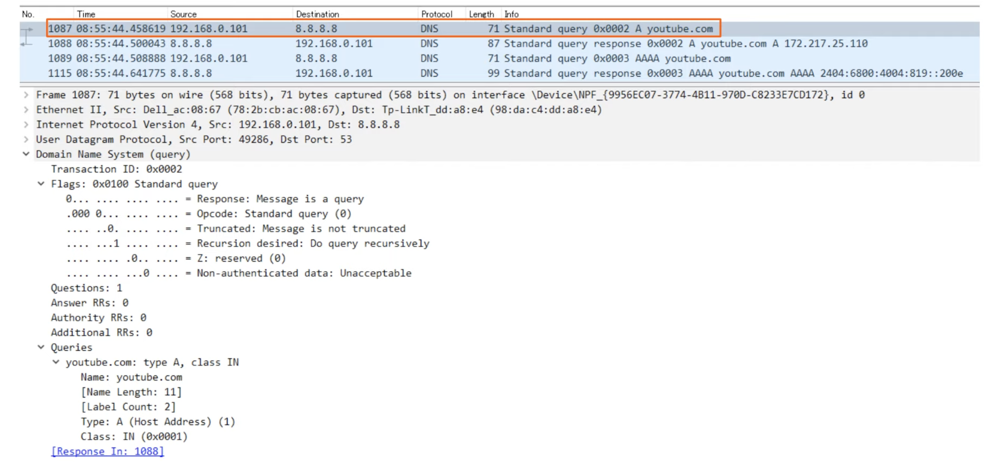
- DNS 'A' records are used to map names to IPv4 addresses
- DNS 'AAAA' records are used to map names to IPv6 addresses
- Standard DNS queries/responses typically use **UDP**
- **TCP** is used for DNS messages greater than 512 bytes
- In either case, port 53 is used

---

## DNS Cache
- Devices will save the DNS server's responses to a local DNS cache
- This means they don't have to query the server every single time they want to access a particular destination
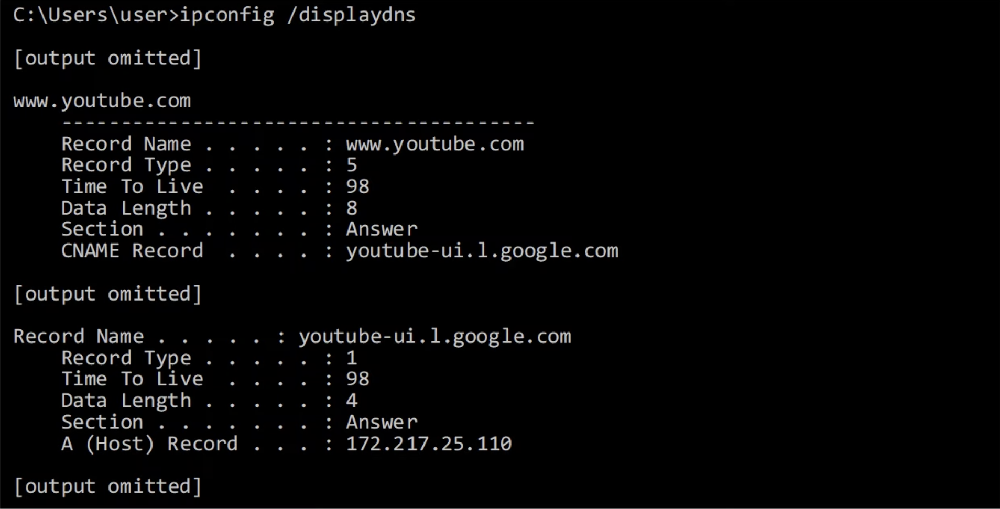

## Host file
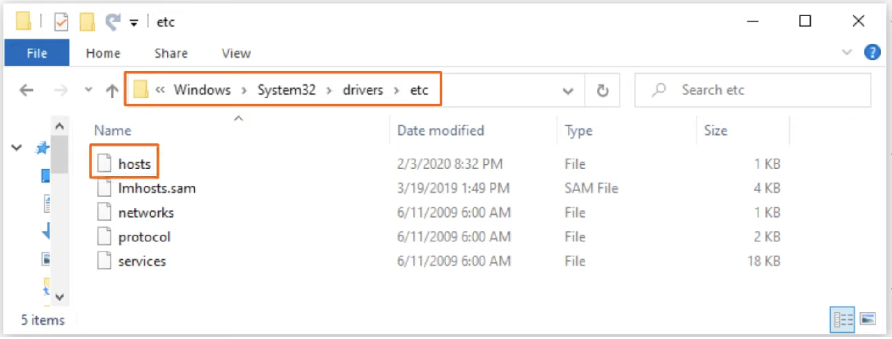
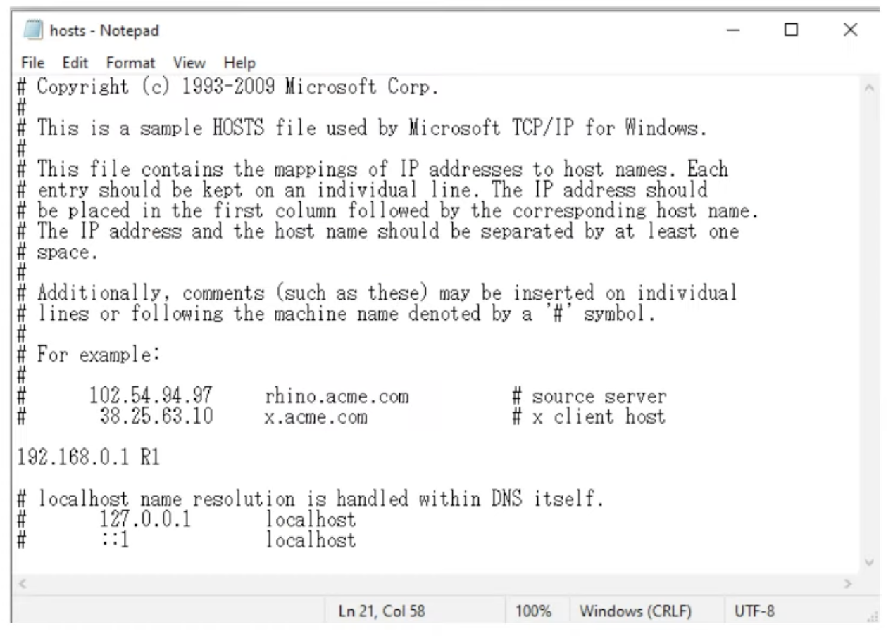
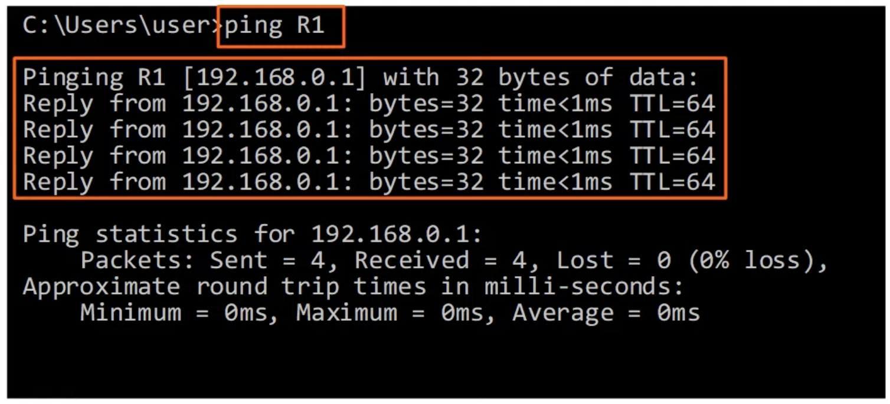

---

## DNS in Cisco IOS
- For hosts in a network to use DNS, you don't need to configure DNS on the routers
- They will simply forward the DNS messages like any other packets
- However, a Cisco router can be configured as a DNS server, although it's rare
    - If an internal DNS server is used, usually it's a Windows or Linux server
- A Cisco router can also be configured as a DNS client
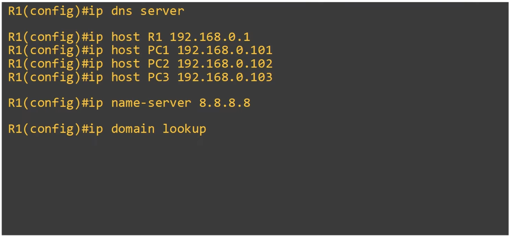
- Configure R1 to act as a DNS server
- Configure a list of hostname/IP address mappings
- Configure a DNS server that R1 will query if the requested record isn't in its host table
- Enable R1 to perform DNS queries (enabled by default) (old version of the command is **`ip domain-lookup`**)
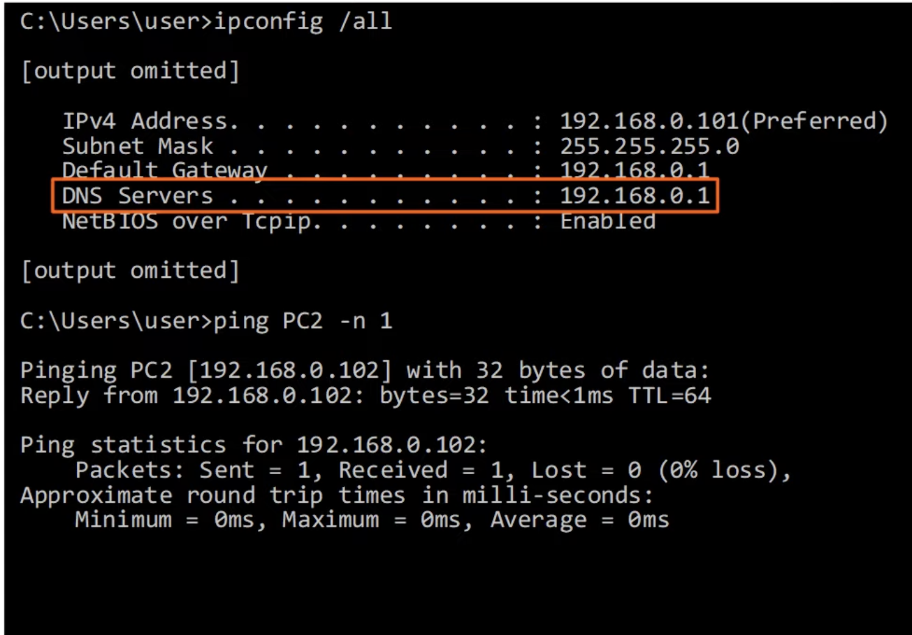
- *PC1 doesn't have an entry for PC2 in its own host table, so it has to use DNS to learn the IP address of PC2*
- *It sends a query to its DNS server R1, asking 'What's the IP address of PC2?'*
- *R1 has an entry for PC2 that was just configured using the `ip host` command, so it replies to PC1's query*
- *Finally, PC1 sends the ping to PC2, PC2 sends a reply, and the process is over*
- *Another example:*
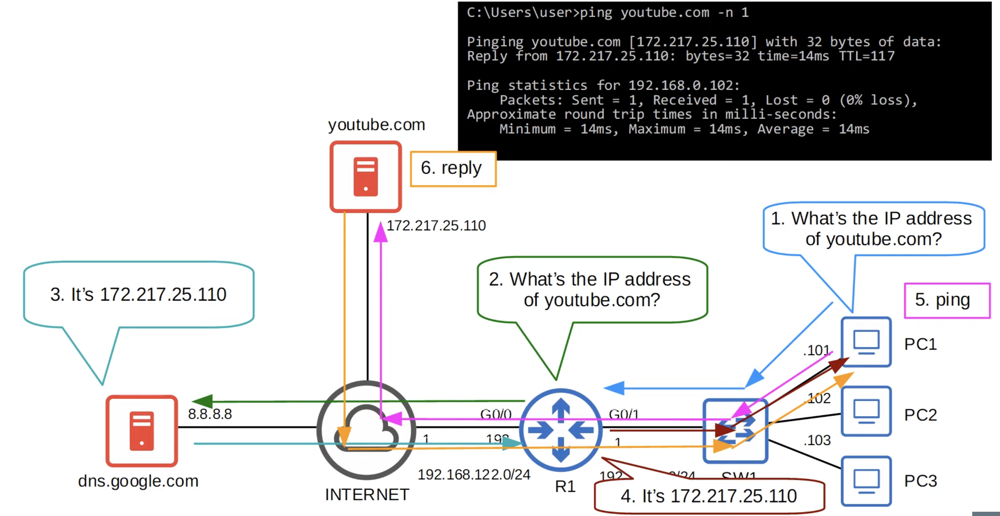
- *Viewing the cached hosts:*
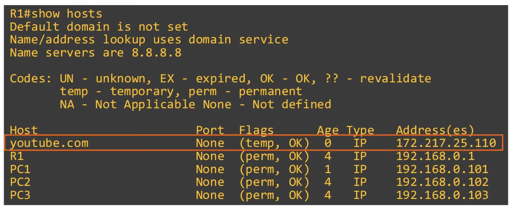
- *Configuring a Cisco router as a DNS client:*
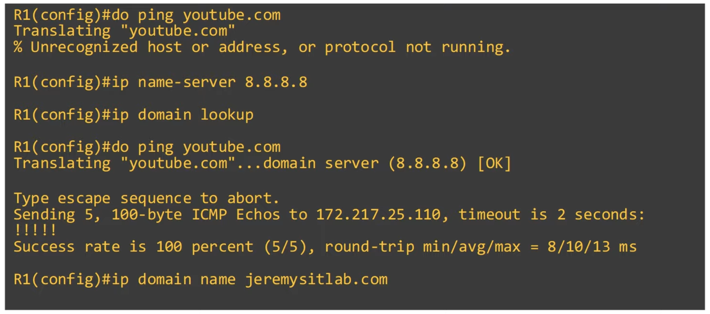
- Configure R1 to use the specified DNS server
- Enable R1 to perform DNS queries (default)
- (optional) Configure the default *domain* name
- This will be automatically appended to any hostnames without a specified *domain*
- ie. **`ping pc1`** will become **`ping pc1.jeremysitlab.com`**
- (old version of the command: **`ip domain-name`**)

---

### Command Review
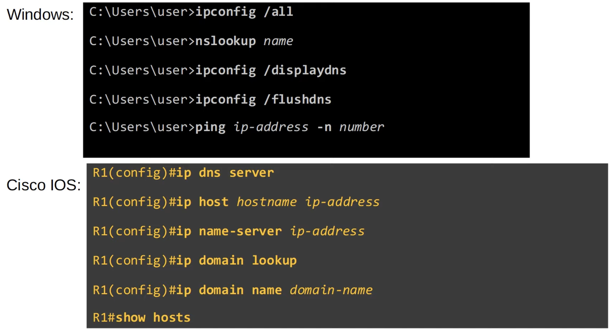

## Quiz
1. Which of the following Windows command prompt commands will display the PC's DNS server? (select two)
*b) `ipconfig /all`*
*d) `nslookup`*

2. Which of the following statements about DNS are true? (select two)
*b) 'A' records map hostnames to IPv4 addresses*
*d) A Cisco router can be configured as a DNS server and DNS client at the same time*

3. PC1 *(figure 1)* is configured to use an external server, `8.8.8.8`, as its DNS server. What DNS command is necessary on R1 to enable this?
*d) No DNS configurations are needed on R1*

4. Which of the following Cisco IOS commands shows the cached name/IP address mappings learned via DNS?
*a) `R1#show hosts`*

5. Which of the following protocols can hosts use to automatically learn the address of their DNS server?
*c) DHCP*

6. A web browser on HostA sends an HTTP request to WWW_server. This is the first time HostA has ever sent a request to WWW_server. HostA does not use a hosts file. With which of the following devices does HostA establish a TCP connection in this scenario?
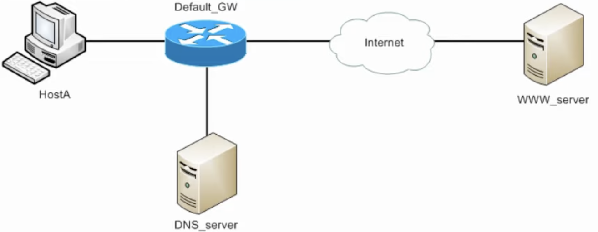
*d) only WWW_server*