# DHCP

## The Purpose of DHCP

- DHCP is used to allow hosts to automatically/dynamically learn various aspects of their network configuration, such as IP address, subnet mask, default gateway, DNS server, etc., without manual/static configuration
- It is an essential part of modern networks
    - *When you connect a phone/laptop to WiFi, do you ask the network admin which IP address, subnet mask, default gateway, etc, the phone/laptop should use?*
- Typically used for 'client devices' such as workstations (PCs), phones, etc.
- Devices such as routers, servers, etc, are usually manually configured
- In small networks (such as home networks) the router typically acts as the DHCP server for hosts in the LAN
- In larger networks, the DHCP server is usually a Windows/Linux server
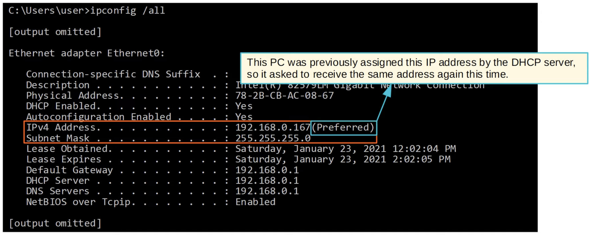
- DHCP servers 'lease' IP addresses to clients
    - These leases are usually not permanent, and the client must give up the address at the end of the lease
    - *A client can also release the address before a lease is up*

## DHCP Release

- `ipconfig /release` *(The PC releases its IP address)*
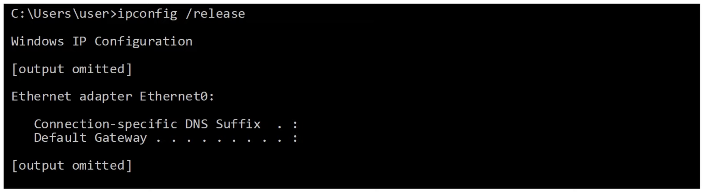
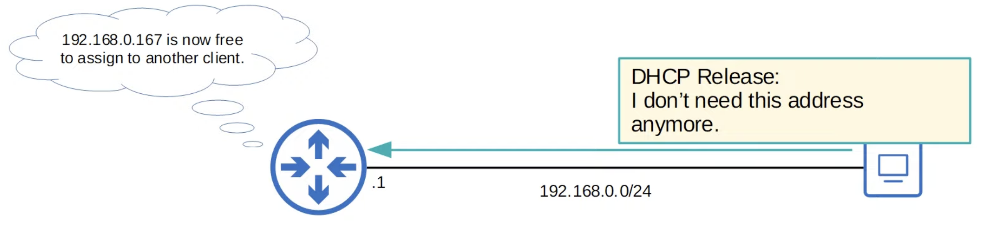
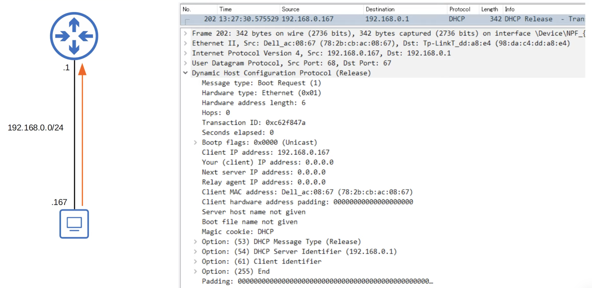
- DHCP **servers** use UDP port **67**
- DHCP **clients** use UDP port **68**

## `ipconfig /renew`
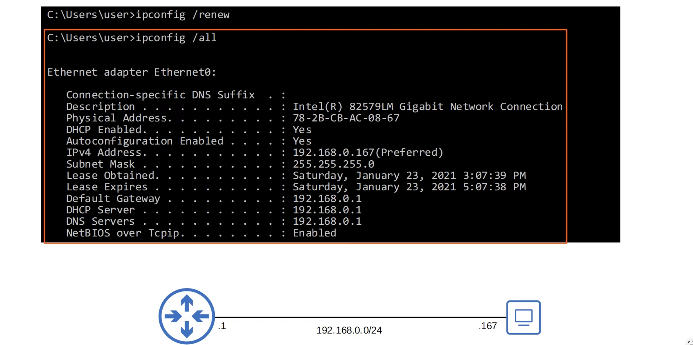
- 4 messages:
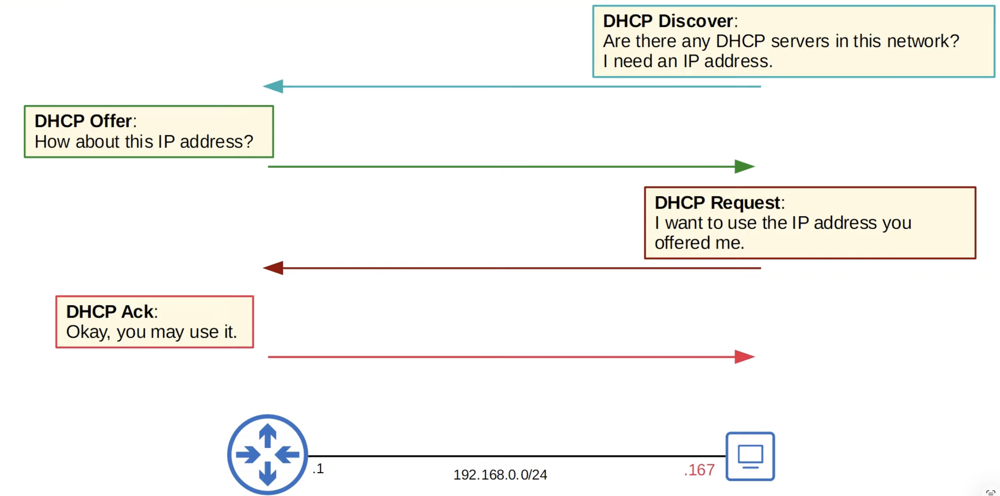
### DHCP Discover
- Client to server
- "Are there any DHCP servers in this network? I need an IP address."
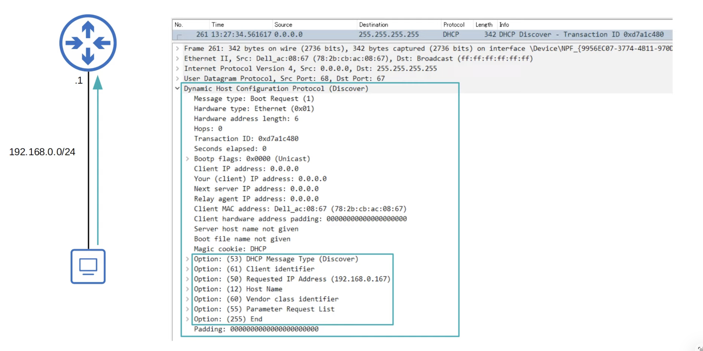
### DHCP Offer
- Server to client
- "How about this IP address?"
- The DHCP Offer message can be either **broadcast** or **unicast**
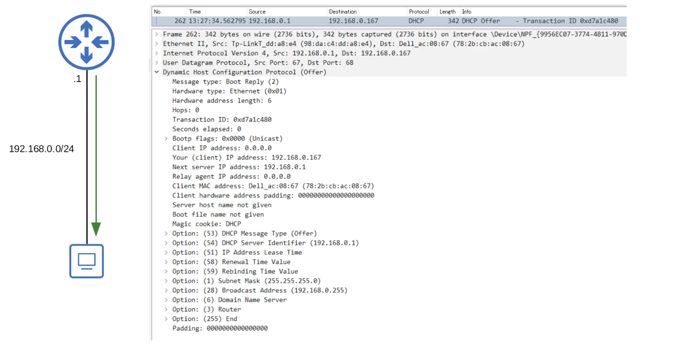
### DHCP Request
- Client to server
- "I want to use the IP address you offered me."
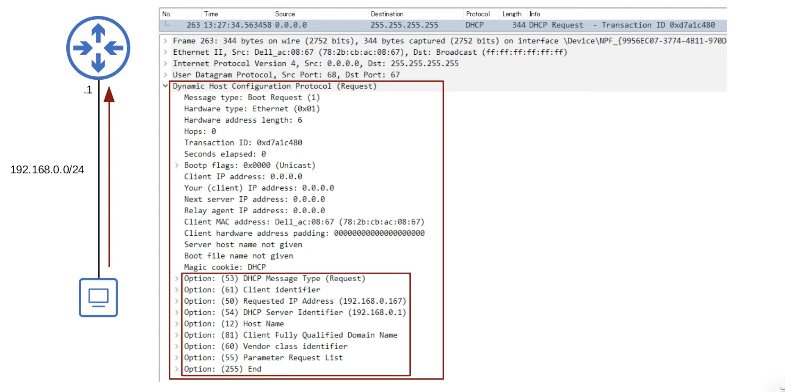
### DHCP Ack
- Server to client
- "Okay, you may use it."
- The DHCP Ack messahe can be either **broadcast** or **unicast**
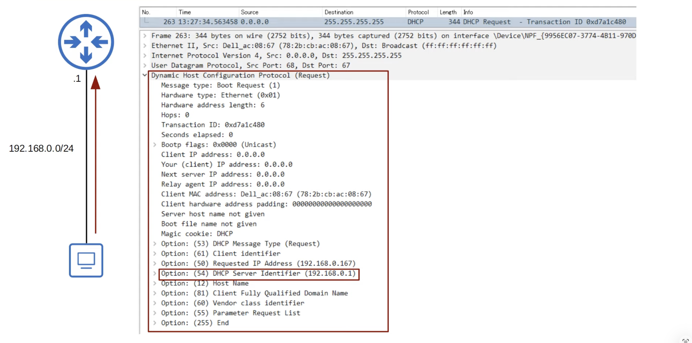

| Step | Direction | Type |
| :--- | :--- | :--- |
| **D**iscover | Client → Server | Broadcast |
| **O**ffer | Server → Client | Broadcast or Unicast |
| **R**equest | Client → Server | Broadcast |
| **A**ck | Server → Client | Broadcast or Unicast |
| Release | Client → Server | Unicast |

## DHCP Relay
- Some network engineers might choose to configure each router to act as the DHCP server for its connected LANs
- However, large enterprises often choose to use a centralized DHCP server
- If the server is centralized, it won't receive the DHCP clients' broadcast DHCP messages (broadcast messages don't leave the local subnet)
- To fix this, a router can be configured to act as a **DHCP relay agent**
- The router will forward the clients' broadcast DHCP messages to the remote DHCP server as unicast messages
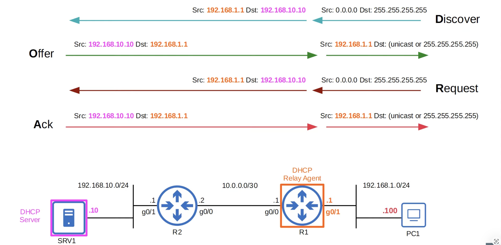

## DHCP Server Configuration in IOS
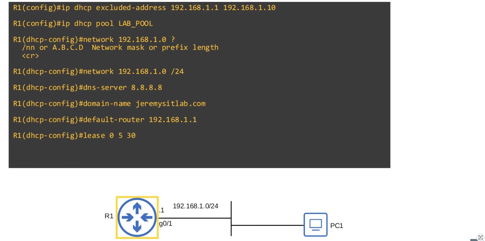
1. Specify a range of addresses that **won't** be given to DHCP clients (range) (optional)
2. Create a DHCP pool
    - A subnet of addresses that can be assigned to DHCP clients
3. Specify the subnet of addresses to be assigned to clients (except the excluded addresses)
4. Specify the DNS server that DHCP clients should use
5. Specify the domain name of the network (ie. `PC1 = pc1.jeremysitlab.com`)
6. Specify the default gateway
7. Specify the lease time
```bash
lease days hours minutes # OR
lease infinite
```
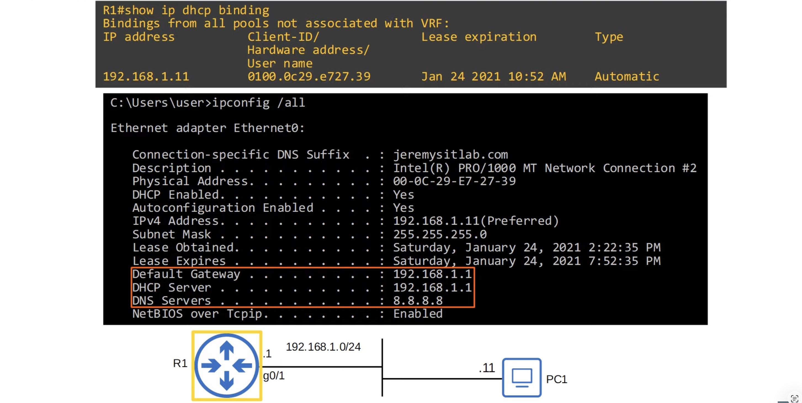

## DHCP Relay Agent Configuration in IOS
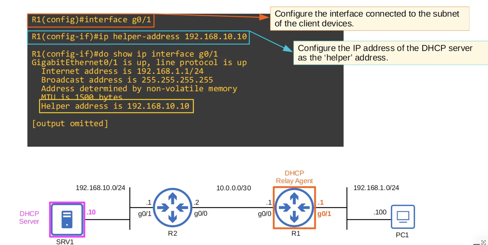

## DHCP Client Configuration in IOS
- *Rarely used*
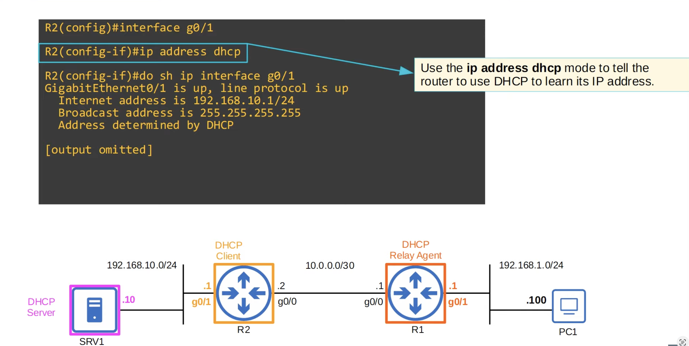

## Command Summary
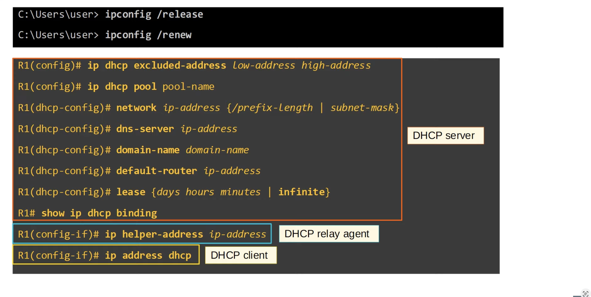

## Quiz
1. What is the correct order of messages when a DHCP client gets an IP address form a server?
*b) Discover - Offer - Request - Ack*

2. Which of the following Windows command prompt commands will cause a PC to broadcast a DHCP Discover message?
*d) `ipconfig /renew`*

3. Examine the following DHCP Offer message that SRV1 sent to R2. What destination IP address did SRV1 send it to?
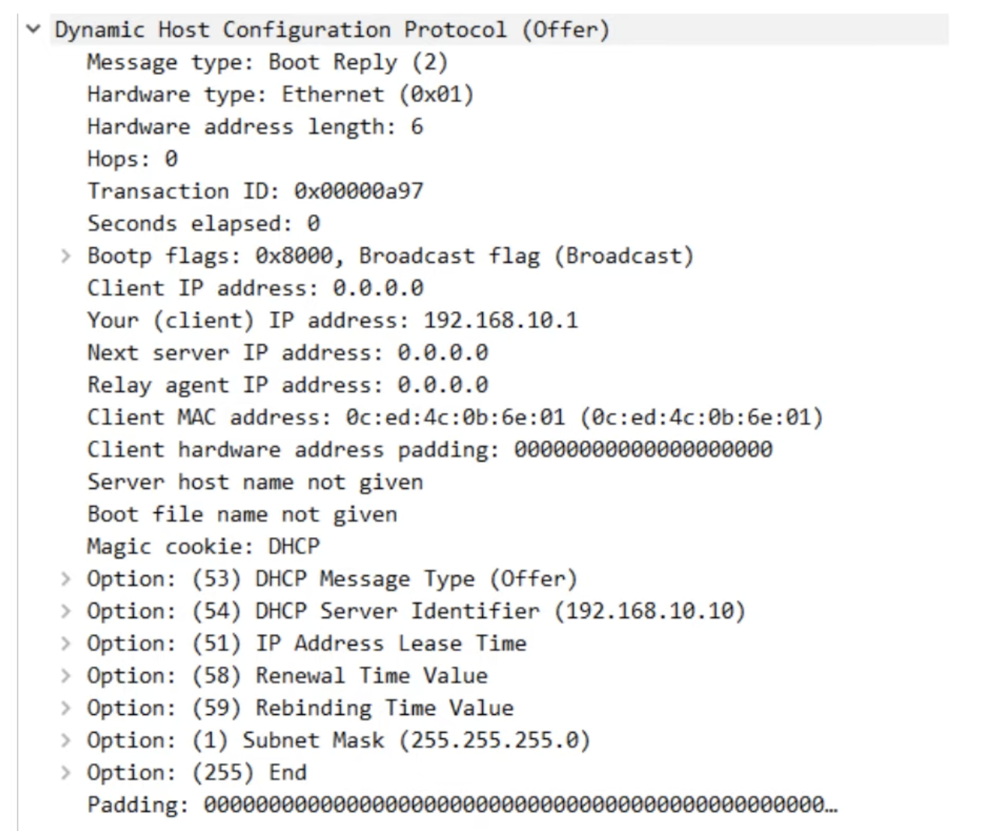
*d) `255.255.255.255`*

4. Which of the following DHCP messages can be sent using unicast? (select all that apply)
*a) `DHCP Ack`*
*c) `DHCP Release`*
*e) `DHCP Offer`*

5. In which of the following situations you configure a router as a DHCP relay agent?
*a) When the rotuer is not a DHCP server, there are DHCP clients in the router's connected LAN, and there is no ohter DHCP server in the connected LAN*

6. You are the administrator for the network shown below. DHCP services for the network are provided by the DHCP server on NetworkB. DHCP services are not running on the routers.
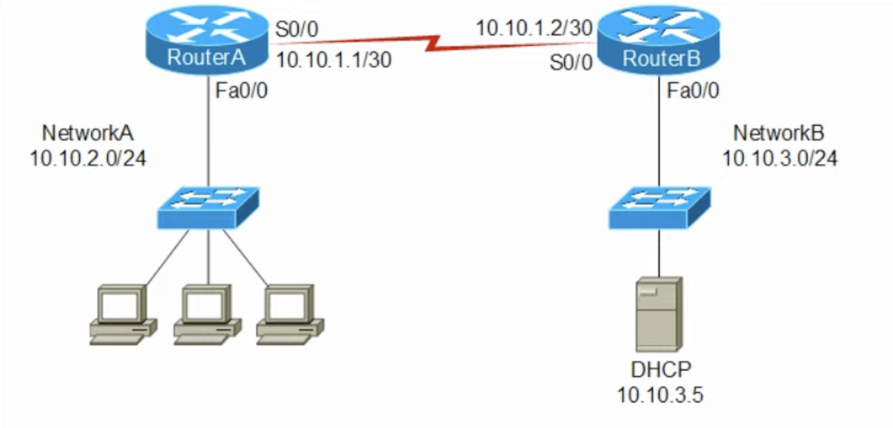
Which of the following commands should you issue to enable clients on NetworkA to receive IP addresses from the DHCP server?

*f) `RouterA(config-if)#ip helper-address 10.10.3.5`*