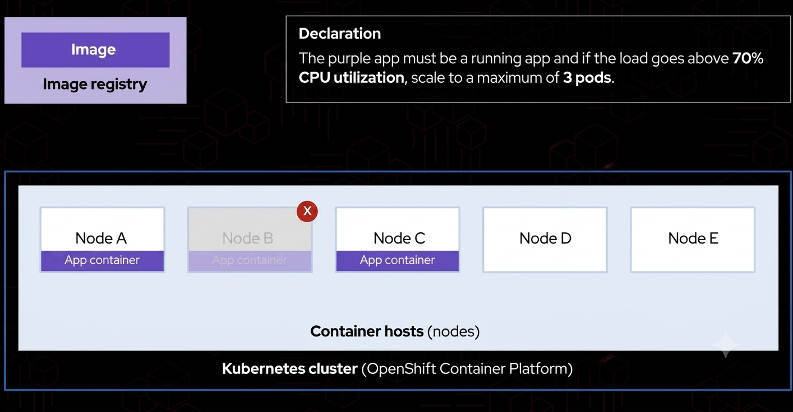
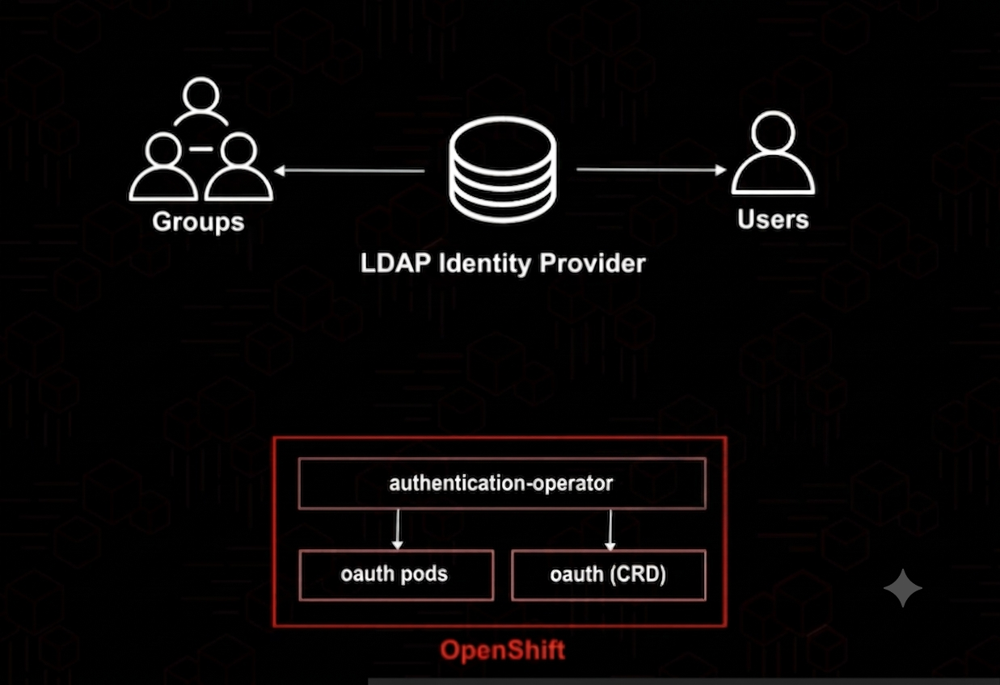
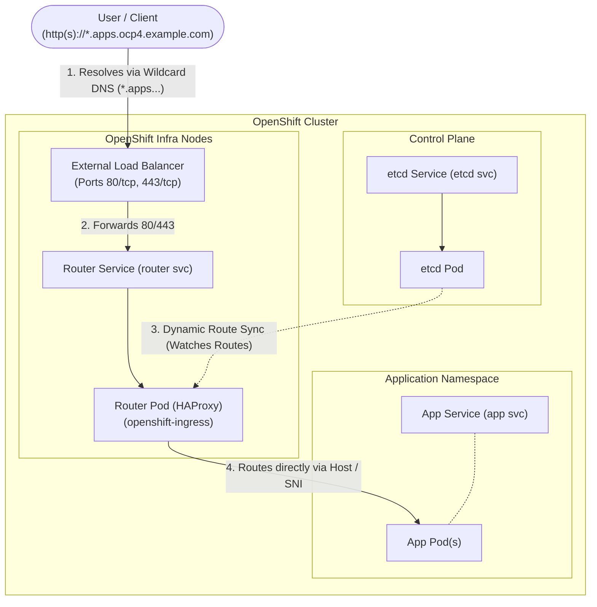
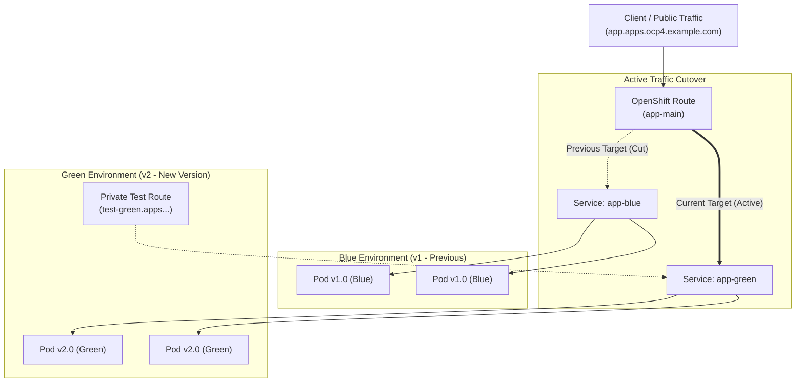
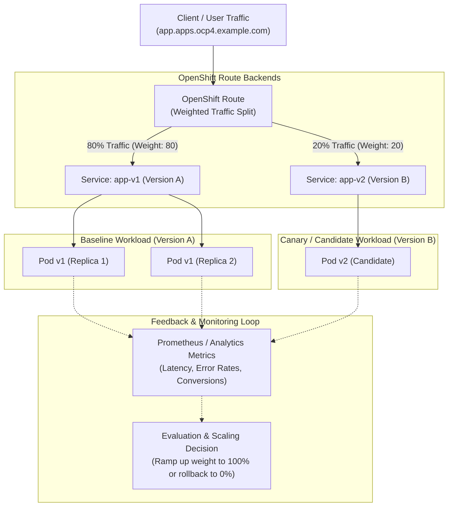
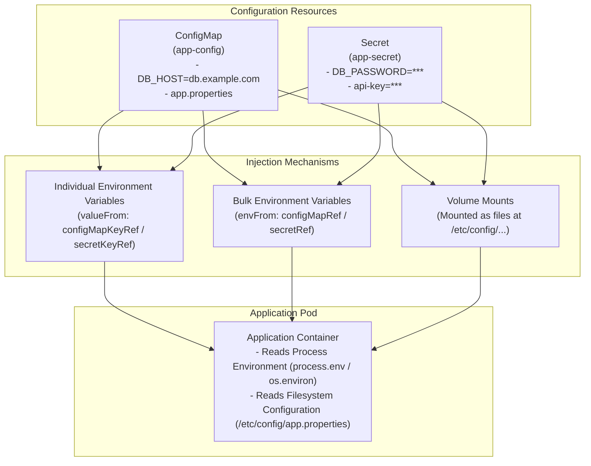

# Containers, Kubernetes and Red Hat OpenShift Technical Overview

## Container Concepts
- A **container** is a running instance of a container image.
- A **container image** is a single file (tarball) loaded with metadata, that has all the files needed to run an application, including the application itself.
- The **entry point** is the command used to start the container (any process).

### Technologies powering containerization
- **Kernel namespaces**: Used to isolate resources between processes. For example, a process can have its own PID, mount point, and network stack, which are isolated from the host system and other processes.

    - A namespace is created for each container. 
- **cgroups (control groups)**: Used to limit the resources available to processes. For example, a process can be limited to using a certain amount of CPU time, memory, or disk I/O.
- **seccomp**: Used to restrict the system calls that a process can make. For example, a process can be prevented from accessing the network or making changes to the file system.
- **SELinux**: Used to enforce mandatory access control on processes. For example, a process can be prevented from accessing files that it does not have permission to access.

### Container image
- buildah, podman can be used to build images and prebuilt container images are available in registries like Quay.io, Docker Hub, etc.
- The container runtime can be CRI-O, Docker, Podman, runC, cri-o, or containerd
- Containers are managed using podman, docker or kubernetes (these are container engines/orchestrators)
- For RedHat registry.redhat.io, registry.connect.redhat.com or quay.io can be used to pull images. Other registries can also be used.
- Image pull secrets are used to pull images from private registries.
- Containers can be **rootless**

### Container vs. VM


## Introducing Kubernetes and OpenShift

- To coordinate and orchestrate containers we use Kubernetes. 
- Kubernetes is a container orchestrator that manages a bunch of container hosts, also known as nodes.
- A cluster is a bunch of nodes.
- Compute resorces are pulled together to run applications
- Images of the containers are stored in an image registry.
- OpenShift Container Platform is RedHat's Kubernetes distribution, along with other tools around Kubernetes.
- Declarations are used for defining the desired state of the application in YAML format and stored in a version control system like git.
Ex. *The purple app must be a running app and if the load goes above 70% CPU utilization scale to a maximum of 3 pods.*
- The web console is recommended for use with OpenShift.
- Pods can be composed of one or more containers. (Kubernetes representation of a running container)

- Control plane nodes (master) are the brain of the cluster. They run components like API server, scheduler, controller manager, etcd, etc. (etcd is a distributed key-value store that stores the cluster state)
- Worker nodes are the place where the pods are running. They run the container runtime (CRI-O) and kubelet.
- RedHat OpenShift adds a lot of tools over vanilla Kubernetes such as: a container image builder (buildah), a container image registry (quay.io), a container runtime (CRI-O), a web console, monitoring (prometheus), logging (EFK stack), etc. 
- So by having multiple hosts we provide redundacy. If one host fails, the other hosts can take over the load.

## Getting started with OpenShift 
- Clusters can be deployed on bare-metal machines or cloud infrastructure (AWS, Azure, GCP, vSphere).
- Deployment models include both **Self-Managed** (OCP, Single Node OpenShift / SNO) and **Managed Cloud Services** (ROSA on AWS, ARO on Azure, ROSD).
- For a deployment of a RedHat OpenShift cluster, a minimum of 3 control plane nodes are required.

### Accessing & Interacting with OpenShift
- **OpenShift Web Console**: Provides two interface perspectives:
  - **Developer Perspective**: Application topology, Git-to-deploy workflows, build monitoring, and project metrics.
  - **Administrator Perspective**: Node health, Operators, user access management, networking, and storage.
  - **Cluster auto-scaling**: used to add or remove nodes from the cluster based on the load. (It uses a Cluster Autoscaler controller that monitors pending pods and adjusts the number of nodes in the cluster accordingly).
    - It uses the **Cluster Autoscaler** controller, which:
      - Monitors pending pods that cannot be scheduled due to insufficient resources
      - Monitors underutilized nodes
      - Adjusts the number of nodes in the cluster accordingly
    - Uses **NodeGroup** concept to scale nodes in groups based on the cloud provider (AWS, Azure, GCP, vSphere).
    - Supports **Horizontal Pod Autoscaling (HPA)** for scaling pods based on resource utilization (CPU/memory) or custom metrics.
    - Supports **Vertical Pod Autoscaling (VPA)** for adjusting CPU/memory requests and limits for pods.

- **OpenShift CLI (`oc`)**: Extended command-line tool based on `kubectl`:
  - `oc login`: Authenticates to the OpenShift API server.
  - `oc login -u <username> -p <password> --server <server>`: Login to the OpenShift API server using username and password. It also accepts the kubeconfig file generated by the openshift-install tool.
  - `oc new-app`: Creates applications from source code repositories, container images, or templates.
  - `oc status` / `oc get pods`: Queries real-time application and cluster status.
  - `oc adm top node`: Get the top node
  - `oc adm top pod --all-namespaces`: Get the top pod in all namespaces
  - `oc get nodes`: Get the nodes to list the nodes that are part of the cluster.
  - `oc get pods --all-namespaces`: Get the pods in all namespaces
  - `oc debug node/<node_name> -it --image=registry.access.redhat.com/ubi8/ubi`: Debug a node (you can get the node name using `oc get nodes`). (getting a shell for the node)

- **ROSA**: RedHat OpenShift Service on AWS, managed by AWS.
    - Provides RedHat support for the cluster.
    - Users can deploy their applications on the cluster using the oc CLI.
    - `rosa login`: Login to the ROSA cluster.
    - `rosa list clusters`: List all ROSA clusters.
    - `rosa list clusters --hosted-cp`: List all ROSA clusters with hosted control plane.
    - `rosa describe cluster --cluster <cluster name>`: Describe a ROSA cluster.
    - `rosa create cluster --cluster-name <cluster name> --hosted-cp --subnet-ids <subnet ids> --tags <tags>`: Create a ROSA cluster with hosted control plane.
    - `rosa delete cluster --cluster <cluster name>`: Delete a ROSA cluster.
    - `rosa delete cluster --cluster <cluster name> --mode delete-non-prod` : Delete a ROSA cluster with non-prod mode.
    - `rosa create operator-backings --cluster <cluster name>`: Create operator backings for a ROSA cluster.


### Core Application Capabilities
- **Source-to-Image (S2I)**: OpenShift framework that automatically builds a container image directly from source code in Git using builder images—without requiring a `Dockerfile`.
- **Services vs. Routes**:
  - **Service**: Internal Kubernetes object load balancing traffic across a set of pods.
  - **Route**: OpenShift resource that exposes an internal Service to external network traffic outside the cluster using built-in HAProxy ingress routers (supports HTTP, HTTPS, and TLS termination).
- **Operators & OperatorHub**: Automated lifecycle managers that install, configure, update, and manage stateful services (databases, monitoring stacks) using Custom Resource Definitions (CRDs).
  - A **service** in OpenShift (Kubernetes) is an abstraction that defines a logical set of pods and a policy by which to access them. It acts like a **load balancer** for the pods. It provides a stable IP address and port for the pods and allows you to access them using a single name. So for example, if we have 3 pods running a web server, the service will provide a single IP address and port that will be used to access the web server, and the service will automatically route the traffic to the pods. If one of the pods fails, the service will automatically route the traffic to the other pods.
  - A **route** in OpenShift is an abstraction that exposes an internal Service to external network traffic outside the cluster. It acts like a **reverse proxy** for the service.

## Managing machines and nodes with operators
- Cluster operators are mandatory whereas OpenShift marketplace operators are elective
- Operators are containerized applications that run in the cluster and manage other applications.
- Operators use CRDs (Custom Resource Definitions) to define new types of resources and create/update/delete pods based on the CRDs.
- CRDs reads the specified state from the user and tries to match the desired state to the actual state. If there is a mismatch, the operator will take action to correct it.
- They provide a way to automate the management of applications in a Kubernetes cluster.
- Infrastructure nodes hosts control plane and infrastructure applications. Worker nodes hosts user applications.
- A cluster runs over RedHat CoreOS.

### Machine config operator
- It is used for managing the configuration of the nodes in the cluster, using machine configs, which are a specific type of CRD which define the desired state of the nodes.
- It automatically updates the nodes to match the desired state.
- It is mandatory for the cluster to function.
- It is used to update the cluster to a new version of OpenShift.
- It is used to apply custom configuration to the nodes (for example SSH keys, kernel parameters, etc.).
- Machine Config Daemon (MCD): It is a daemon that runs on each node in the cluster and is responsible for applying the machine configs to the nodes.
- Machine Config Pool (MCP): It is a group of nodes (such as master or worker) managed together by the Machine Config Operator to apply configuration changes as a single unit.
  - Configuring machine config pool:
  ```bash
  oc create -f mcp.yml # creating a new MCP
  # configure the yml file
  oc debug node/worker04 # get a shell for the node
  # inside the shell
  mcps # list all MCPs
  mcp status # get the status of all MCPs
  mcp update node/<node_name> # update a node
  mcp drain <mcp_name> # drain a MCP
  mcp uncordon <mcp_name> # uncordon a MCP
  mcp drain node/<node_name> --disable # disable the mcp
  mcp uncordon node/<node_name> --enable # enable the mcp
  mcp status # get the status of all MCPs
  exit # exit the shell
  ```
  - `.yaml` format is used to declare the behaviour of MCPs
- Machine Config Controller (MCC): It monitors MachineConfigs and MachineConfigPools to generate target Ignition configurations.
- Machine Config Server (MCS): It serves Ignition configurations to new nodes during cluster installation and node bootstrapping.
- MachineSets are used for automatic scaling of the cluster, used to add or remove nodes from the cluster based on the load. They take advantage of autoscaling.
- A custom MachineAutoscaler object can be created to autoscale the cluster based on custom metrics.
  - Example:
  ```yaml
  apiVersion: autoscaling.openshift.io/v1beta1
  kind: MachineAutoscaler
  metadata:
    name: worker-us-east-1a
    namespace: openshift-machine-api
  spec:
    minReplicas: 1
    maxReplicas: 12
    scaleTargetRef:
      apiVersion: machine.openshift.io/v1beta1
      kind: MachineSet
      name: worker
  ```

---

- `bashrc` - file used to store the aliases and functions for the bash shell.
- `journald` - daemon used for logging in Linux. (By default, the kubelet writes logs to journald). 
- `journalctl` - tool used to view the logs of a process.

### Cluster version operator (CVO)
- It provides cluster-level configuration and lifecycle management.
- It ensures that the cluster is always running the correct version of OpenShift.
- It can be used to update the cluster to a new version of OpenShift.
- It is mandatory for the cluster to function.
- It is used to manage the cluster as a single unit.
- Cluster Version Operator manages the cluster by observing the desired cluster state and updating the actual cluster state to match the desired cluster state.

## Interfacing with OpenShift using command line tools
```bash
which kubectl # gives the path to the kubectl binary
which oc # gives the path to the oc binary
# it shows that the oc is linked to the kubectl binary - this is done so that we can use the same commands for both oc and kubectl.
md5sum $(which kubectl) # gives the md5sum of the kubectl binary
md5sum $(which oc) # gives the md5sum of the oc binary
# we should get the same md5sum for both binaries since oc is just a link to kubectl.
oc set env --help # shows the help for the set env command
oc get pods -n openshift-authentication # display the pods in the node
# with the oc command you gain additional features along with everything kubectl has to offer
oc completion bash # enable bash shell completion for oc
oc whoami --show-console # display the console url for the current user
oc logout # logout from the cluster
```

## Deploying Applications with OpenShift
- Helm is the package manager for Kubernetes. It is used to package, deploy and manage applications on Kubernetes.
- Helm charts are templated and used to create custom applications on Kubernetes. This allows you to define the desired state of your application in a declarative way and store it in a version control system like git.
- Helm charts are stored in a git repository as .yaml files (they contain templates for the resources to be deployed).
```bash
oc login -u developer https://api.ocp4.example.com:6443
oc new-project coffee-shop
oc get all
helm install <project-name> <url-to-chart>
oc get all
# a route allows traffic to come from outside of the OpenShift cluster to a service inside the cluster which runs as a pod
oc get route -n <project-name> # to get the route url
oc delete project <project-name> # to delete the project and all its resources
```
- OpenShift web console uses profiles such as Administrator or Developer to allow users to access the cluster with different perspectives and priviliges.
- Templates can be used for creating projects. It is similar to Helm Charts but with more features. They are available in the OpenShift web console.
```yaml
apiVersion: template.openshift.io/v1
kind: Template
metadata:
  creationTimestamp: null
  name: project-request
objects:
- apiVersion: project.openshift.io/v1
  kind: Project
  metadata:
    annotations:
      openshift.io/description: ${PROJECT_DESCRIPTION}
      openshift.io/display-name: ${PROJECT_DISPLAYNAME}
      openshift.io/requester: ${PROJECT_REQUESTING_USER}
    creationTimestamp: null
    name: ${PROJECT_NAME}
  spec: {}
  status: {}
- apiVersion: rbac.authorization.k8s.io/v1
  kind: RoleBinding
  metadata:
    creationTimestamp: null
    name: admin
    namespace: ${PROJECT_NAME}
  roleRef:
    apiGroup: rbac.authorization.k8s.io
```
- A project can also be instantiated from an existing Container Image.

### Scaling Applications
```bash
oc project webserver # switch the project
oc get pods # list the pod (the pod might not be running yet)
oc get deploy # list the deployment
oc scale deploy/webserver --replicas=3 # telling the deployment that we want 3 replicas for this app
oc get pods # list the pod (they should be 3 running now)
oc rsh webserver-0 # get a shell for the pod (the first replica)
cat /usr/share/nginx/html/index.html # view the index.html file
curl localhost # curl the website
exit # exit the shell
```
### Source to Image (S2I)
- **Source-to-Image (S2I)** is an OpenShift framework that builds reproducible container images directly from application source code stored in a Git repository using builder images—without requiring a `Dockerfile`.
- **How S2I works**:
  1. Detects the language/framework automatically or uses a specified builder image (e.g., Python, Node.js, Java, PHP).
  2. Spawns a build pod running the builder image.
  3. Clones the source code into the container and runs the builder image's `assemble` script to compile dependencies and package the app.
  4. Output container image is pushed to the internal OpenShift registry and deployed as a pod.
- **Key CLI Workflow**:
  ```bash
  # Create a new application directly from Git repository using S2I
  oc new-app https://github.com/sclorg/nodejs-ex.git --name=myapp

  # Monitor the build process
  oc get builds                        # list all builds
  oc logs -f build/myapp-1             # follow build logs
  oc status                            # check current deployment status

  # Trigger a manual rebuild when source code updates
  oc start-build myapp --follow

  # Expose the service externally via a Route
  oc expose svc/myapp
  oc get routes                        # inspect generated public URL
  ```
- **Benefits**:
  - **Developer Productivity**: Developers focus purely on code without writing or maintaining complex `Dockerfile`s.
  - **Security & Compliance**: Uses standardized, pre-patched, and Red Hat-certified builder images.
  - **Reproducibility**: Guarantees consistent application builds across environments.

## Controlling Access to OpenShift


- **LDAP Identity Provider**:
  - Connects OpenShift authentication to an external LDAP directory server to manage user identities and group memberships centrally.
  - Syncs LDAP users and groups into OpenShift `User` and `Group` resources for RBAC policies.
- **OpenShift Authentication Components**:
  - **`authentication-operator`**: Manages and maintains the lifecycle of the internal OAuth server and authentication services in the cluster.
  - **`oauth (CRD)`**: Custom Resource Definition used to configure cluster-wide authentication settings and identity providers (e.g., LDAP, HTPasswd, OIDC).
  - **`oauth pods`**: Containerized OAuth server instances running in the cluster that validate credentials and issue access tokens to users.

### Access Control & LDAP CLI Commands
```bash
# View authentication operator status and OAuth config
oc get clusteroperator authentication
oc get oauth cluster -o yaml

# Assign roles to users and groups
oc adm policy add-role-to-user admin developer -n coffee-shop
oc adm policy add-cluster-role-to-user cluster-admin admin-user

# Manage and sync LDAP groups to OpenShift
oc adm groups new dev-team developer1 developer2
oc adm groups sync --sync-config=ldap-sync.yaml --confirm
```

## Describing OpenShift Ingress

OpenShift Ingress provides external access to services running inside the cluster. It leverages HAProxy-based router pods managed by the OpenShift Ingress Operator, using custom `Route` resources to dynamically manage host-based routing, path routing, and TLS termination.



### Architecture & Request Flow Breakdown

1. **User Request & Wildcard DNS (`*.apps.<cluster>.<domain>`)**:
   - Users send requests to an application URL such as `http(s)://myapp.apps.ocp4.example.com`.
   - A pre-configured **Wildcard DNS** record (`*.apps.ocp4.example.com`) resolves all application subdomains to the IP address of the cluster's **External Load Balancer**.

2. **External Load Balancer (80/tcp & 443/tcp)**:
   - Listens on standard ports `80` (HTTP) and `443` (HTTPS).
   - Distributes incoming traffic evenly across the **OpenShift Infrastructure Nodes** (`infra nodes`).

3. **OpenShift Infra Nodes**:
   - Dedicated worker nodes isolated from general application compute, intended specifically to host platform services (routers, logging, monitoring, registry).
   - Each infra node receives traffic on ports 80/443 and passes it to the local or cluster **Router Service (`router svc`)**.

4. **Router Service & Router Pods (`router svc` / `router pod`)**:
   - The router runs containerized **HAProxy** instances in the `openshift-ingress` namespace.
   - It acts as the cluster's reverse proxy and Layer 7 / Layer 4 ingress controller.

5. **Dynamic Configuration via `etcd` (`etcd svc` / `etcd pod`)**:
   - When a developer creates or modifies an OpenShift `Route` (e.g., via `oc expose svc/myapp`), the resource definition is saved in **`etcd`**.
   - The OpenShift Ingress Controller watches the API/etcd for changes to `Route` and `Endpoints` resources.
   - The Router dynamically reloads its HAProxy routing tables in real time without dropping active connections.

6. **Routing to Target Application Pods (`app svc` / `app pod`)**:
   - The router inspects the incoming request's HTTP `Host` header or TLS SNI (Server Name Indication).
   - It matches the hostname to the corresponding backend `Route` and sends traffic directly to healthy backend **Application Pods (`app pod`)** bypassing `kube-proxy` for lower latency.

---

### Route TLS Termination Strategies

OpenShift Routes support multiple security configurations for TLS:

| Strategy | Description | Where TLS Terminates | Router-to-Pod Traffic |
| :--- | :--- | :--- | :--- |
| **Edge** | Router decrypts TLS using certificates stored in the `Route` object. | At the Router Pod | Unencrypted HTTP |
| **Passthrough** | Router forwards encrypted TLS traffic directly to the pod without decrypting. | At the Application Pod | Encrypted HTTPS (End-to-End) |
| **Re-encryption** | Router decrypts TLS with its certificate, inspects/routes traffic, and re-encrypts using a pod-specific certificate. | At Router and at Pod | Re-encrypted HTTPS |
| **Unsecured / None**| Standard unencrypted HTTP traffic. | None | Plain HTTP (Port 80) |

---

### Ingress & Route CLI Management

```bash
# Check status of Ingress Controller and Operators
oc get clusteroperator ingress
oc get ingresscontroller default -n openshift-ingress-operator -o yaml

# Inspect active OpenShift Router pods running on Infra nodes
oc get pods -n openshift-ingress -o wide

# Expose a service to create a standard unsecured Route
oc expose svc/myapp --name=myapp-route

# Create an Edge-terminated TLS Route
oc create route edge myapp-edge \
  --service=myapp \
  --cert=tls.crt \
  --key=tls.key \
  --hostname=myapp.apps.ocp4.example.com

# Create a Passthrough TLS Route (End-to-End Encryption)
oc create route passthrough myapp-pass \
  --service=myapp \
  --hostname=secure-app.apps.ocp4.example.com

# Inspect created Routes and test connectivity
oc get routes -n my-project
oc describe route myapp-route -n my-project
curl -Iv http://myapp.apps.ocp4.example.com
```

## Blue-Green Deployments

Blue-Green deployment is a release strategy that reduces downtime and risk by running two identical production environments called **Blue** and **Green**.

In OpenShift, this pattern is implemented at the **Route** layer by switching the Route's target service from the older version (Blue) to the newer version (Green) without modifying application code or incurring downtime.



### Key Workflow & Principles

1. **Blue Environment (Live)**:
   - The initial version (`v1.0`) runs as `app-blue` pods behind the `app-blue` Service.
   - The main public Route (`app-main`) directs 100% of production traffic to `app-blue`.

2. **Green Environment (Staging / Verification)**:
   - The new version (`v2.0`) is deployed in parallel as `app-green` pods behind the `app-green` Service.
   - An optional temporary/test Route is exposed specifically for QA and validation without affecting live users.

3. **Instant Traffic Cutover**:
   - Once the Green version is validated, the administrator/developer updates the main Route's `spec.to.name` from `app-blue` to `app-green`.
   - The OpenShift Router (HAProxy) immediately redirects all incoming client traffic to the Green pods with zero dropped connections.

4. **Instant Rollback**:
   - If unexpected issues arise in production, traffic can be instantly reverted back to `app-blue` by patching the Route.

5. **Decommissioning / Scale Down**:
   - After verifying stability in production, the Blue deployment can be scaled down (`replicas: 0`) or removed to free cluster resources.

---

### Comparison: Blue-Green vs. Rolling vs. A/B Deployments

| Deployment Strategy | Mechanism | Downtime | Rollback Speed | Resource Usage |
| :--- | :--- | :--- | :--- | :--- |
| **Blue-Green** | Route points to entire new Service instance | Zero | Instant (re-patch Route) | 2x during cutover |
| **Rolling Update** | Pods replaced incrementally (1 by 1) | Zero | Gradual (re-deploy previous pods) | 1x + buffer (e.g. 25%) |
| **A/B / Canary** | Route splits traffic by weight across two Services | Zero | Instant (adjust weights to 0/100) | 2x during testing |

---

### Step-by-Step CLI Implementation

#### 1. Deploy the Initial Version (Blue)
```bash
# Create project and deploy initial version
oc new-project blue-green-demo
oc new-app --image=quay.io/openshiftroadshow/parksmap:1.0.0 --name=app-blue

# Expose the Blue service with the main production Route
oc expose svc/app-blue --name=app-main --hostname=parksmap.apps.ocp4.example.com
oc get route app-main
```

#### 2. Deploy the New Version (Green)
```bash
# Deploy version 2.0 side-by-side
oc new-app --image=quay.io/openshiftroadshow/parksmap:2.0.0 --name=app-green

# (Optional) Create a private test route to validate the Green environment
oc expose svc/app-green --name=app-green-test --hostname=parksmap-green.apps.ocp4.example.com
curl -s http://parksmap-green.apps.ocp4.example.com
```

#### 3. Perform the Cutover (Switch Traffic to Green)
```bash
# Switch the main Route target from app-blue to app-green
oc patch route app-main -p '{"spec":{"to":{"name":"app-green"}}}'

# Verify the Route now points to app-green
oc get route app-main -o jsonpath='{.spec.to.name}'
```

#### 4. Instant Rollback (If Needed)
```bash
# Revert Route back to app-blue immediately if issues occur
oc patch route app-main -p '{"spec":{"to":{"name":"app-blue"}}}'
```

### OpenShift Web Console Workflow (Blue-Green)

1. **Open Developer Perspective & Topology**:
   - In the OpenShift Web Console, select the **Developer** perspective from the top-left dropdown.
   - Navigate to **Topology** to view the application components (`app-blue` and `app-green`).
2. **Access the Route Configuration**:
   - Click the Route decorator badge (the arrow/link icon) attached to the `app-blue` application node, or select `app-blue` and open the **Resources** tab -> **Routes**.
   - In the Route Details page, click the **Actions** dropdown in the upper right and select **Edit Route**.
3. **Perform Traffic Cutover**:
   - Under the **Service** field, change the target service from `app-blue` to `app-green`.
   - Ensure the **Target Port** remains correct (e.g., `8080 -> 8080 (TCP)`).
   - Click **Save**.
   - The Topology view instantly updates the visual Route connection to point to `app-green`, and live traffic routes to Green with zero downtime.
4. **Instant Rollback via Web Console**:
   - Click **Actions** -> **Edit Route** on the Route.
   - Change the **Service** selection back to `app-blue` and click **Save**.

---

## A-B Deployments

A/B deployment (also used for **Canary releases**) is a technique that routes a controlled proportion of live user traffic across two or more distinct versions of an application simultaneously.

While **Blue-Green** deployment performs an immediate all-or-nothing traffic cutover, **A/B deployment** allows developers to test a new version (Version B) against the baseline version (Version A) under real production traffic conditions to evaluate user feedback, application performance, and error rates.



### Architecture & Mechanism in OpenShift

1. **Route Weight Balancing**:
   - OpenShift's HAProxy ingress router dynamically distributes traffic between multiple backend Services according to integer weights defined on the Route object.
   - The primary backend is specified under `spec.to`, and additional backends are listed under `spec.alternateBackends`.
   - The probability of a request being directed to a backend is proportional to its weight relative to the sum of all weights:
     $$\text{Traffic Percentage (Backend } i) = \frac{\text{Weight}_i}{\sum \text{Weights}} \times 100\%$$

2. **Route Manifest Specification Breakdown**:
   ```yaml
   apiVersion: route.openshift.io/v1
   kind: Route
   metadata:
     name: myapp-ab-route
   spec:
     host: myapp.apps.ocp4.example.com
     to:
       kind: Service
       name: myapp-a       # Primary Service (Version A)
       weight: 80          # 80% of traffic
     alternateBackends:
       - kind: Service
         name: myapp-b     # Alternate Service (Version B)
         weight: 20        # 20% of traffic
     port:
       targetPort: 8080
   ```

3. **Session Stickiness (Affinity)**:
   - When running A/B experiments, users should consistently experience the same version throughout their session to avoid broken application state or inconsistent UI.
   - OpenShift supports session affinity at the Route level using cookies:
     - By default, HAProxy sets a cookie (`openshift.io/cookie_name`) so a client returning with that cookie is routed back to the exact same backend service and pod.

4. **Canary Rollout Workflow**:
   - **Phase 1 (Initial Canary)**: Deploy Version B and allocate a small percentage of traffic (e.g., 5% or 10%).
   - **Phase 2 (Monitoring)**: Observe application logs, Prometheus metrics, and error rates.
   - **Phase 3 (Incremental Ramp)**: Gradually increase Version B weight (e.g., 25% -> 50% -> 75% -> 100%).
   - **Phase 4 (Decommission)**: Once Version B reaches 100% and is stable, remove Version A and set Version B as the single primary backend.

---

### Step-by-Step CLI Implementation

#### 1. Deploy Version A (Baseline) and Expose Route
```bash
# Create project and deploy initial Version A
oc new-project ab-deploy-demo
oc new-app --image=quay.io/openshiftroadshow/parksmap:1.0.0 --name=app-a

# Expose Version A as the initial Route (weight defaults to 100)
oc expose svc/app-a --name=app-route --hostname=parksmap.apps.ocp4.example.com
```

#### 2. Deploy Version B (Candidate)
```bash
# Deploy Version B alongside Version A (do not expose a new public route)
oc new-app --image=quay.io/openshiftroadshow/parksmap:2.0.0 --name=app-b
```

#### 3. Configure A/B Traffic Splitting
```bash
# Split traffic: 90% to Version A, 10% to Version B
oc set route-backends app-route app-a=90 app-b=10

# Inspect the updated route weights
oc get route app-route
oc get route app-route -o jsonpath='{.spec.to.name}: {.spec.to.weight}, {.spec.alternateBackends[0].name}: {.spec.alternateBackends[0].weight}'
```

#### 4. Configure Session Stickiness (Optional)
```bash
# Enable cookie-based session stickiness on the Route
oc annotate route app-route router.openshift.io/cookie_name="APP_SESSION" --overwrite
```

#### 5. Progressively Ramp Traffic to Version B
```bash
# Increase Version B to 50%
oc set route-backends app-route app-a=50 app-b=50

# Increase Version B to 100% (Full cutover)
oc set route-backends app-route app-a=0 app-b=100
```

#### 6. Rollback (In Case of Issues)
```bash
# Immediately revert all traffic back to Version A (100%)
oc set route-backends app-route app-a=100 app-b=0
```

### OpenShift Web Console Workflow (A/B Deployments & Traffic Splitting)

1. **Open Developer Perspective & Topology**:
   - In the OpenShift Web Console, select the **Developer** perspective.
   - Navigate to **Topology** to confirm both application versions (`app-a` and `app-b`) are running as active deployments with their respective Services.
2. **Edit Route Traffic Distribution**:
   - In **Topology**, click on the Route decorator badge attached to `app-a` (or select `app-a` and navigate to the **Resources** tab -> **Routes**).
   - In the Route Details page, click the **Actions** dropdown in the top-right corner and select **Edit Route** (or click **Edit Traffic Distribution** in the sidebar drawer).
3. **Configure Multiple Service Targets & Weights**:
   - Check the **Split traffic across multiple Services** checkbox.
   - Under the primary **Service** (`app-a`), enter the desired traffic weight (e.g., `80%` or `80`).
   - Under **Alternate Service Targets**, click **Add Alternate Service**, select `app-b` from the dropdown list, and enter its traffic weight (e.g., `20%` or `20`).
   - *(Optional)* Under **Security** / **Advanced Options**, enable and configure **Cookie-based Session Stickiness** so returning users stay pinned to their assigned version.
   - Click **Save**.
4. **Visual Monitoring & Gradual Traffic Ramping**:
   - In the **Topology** view, the Route icon now displays split connector branches leading to both `app-a` and `app-b`, complete with their respective percentage badges (e.g., `80%` and `20%`).
   - To gradually ramp up traffic to Version B (e.g., `50% / 50%`, then `0% / 100%`), return to **Edit Route**, adjust the weights, and click **Save**.

---

## Injecting Configuration Data into Applications

Decoupling configuration from container images is a core tenet of cloud-native development (12-Factor App methodology). By externalizing configuration, the same immutable container image can be built once and promoted through Development, Staging, and Production environments without recompilation.

OpenShift provides two primary resources to store and inject application configuration at runtime:
- **ConfigMaps (`cm`)**: Used for plain text, non-sensitive configuration data (database URLs, application properties, log levels, feature flags).
- **Secrets**: Used for sensitive information (passwords, API tokens, TLS certificates, database credentials) encoded in Base64.



---

### Configuration Injection Methods

#### 1. Individual Environment Variables (`valueFrom`)
Injects specific individual keys from a ConfigMap or Secret into designated container environment variables.

```yaml
spec:
  containers:
    - name: myapp
      image: quay.io/example/myapp:v1
      env:
        - name: DATABASE_HOST
          valueFrom:
            configMapKeyRef:
              name: app-config
              key: db_host
        - name: DATABASE_PASSWORD
          valueFrom:
            secretKeyRef:
              name: app-secret
              key: db_password
```

#### 2. Bulk Environment Variables (`envFrom`)
Injects all key-value pairs from a ConfigMap or Secret as environment variables in a single declaration. An optional `prefix` can be prepended to avoid name collisions.

```yaml
spec:
  containers:
    - name: myapp
      image: quay.io/example/myapp:v1
      envFrom:
        - configMapRef:
            name: app-config
        - secretRef:
            name: app-secret
            prefix: SEC_
```

#### 3. Volume Mounts (Filesystem Projection)
Mounts a ConfigMap or Secret as a directory or file inside the container filesystem. Each key becomes a filename and its value becomes the file content.

```yaml
spec:
  containers:
    - name: myapp
      image: quay.io/example/myapp:v1
      volumeMounts:
        - name: config-vol
          mountPath: /etc/config
          readOnly: true
        - name: secret-vol
          mountPath: /etc/secrets
          readOnly: true
  volumes:
    - name: config-vol
      configMap:
        name: app-config
    - name: secret-vol
      secret:
        secretName: app-secret
```

> **Note on Updates**: Files projected via Volume Mounts automatically update when the underlying ConfigMap or Secret changes (subject to kubelet sync period). Environment variables require a pod restart/rollout to reflect new values.

---

### Step-by-Step CLI Implementation

#### 1. Create ConfigMaps and Secrets
```bash
# Create a ConfigMap from literal key-value pairs
oc create configmap app-config \
  --from-literal=DB_HOST="mysql.database.svc" \
  --from-literal=DB_PORT="3306" \
  --from-literal=LOG_LEVEL="debug"

# Create a ConfigMap from an entire configuration file
oc create configmap app-files \
  --from-file=application.properties=./config/application.properties

# Create a Secret from literal values
oc create secret generic app-secret \
  --from-literal=DB_USER="admin" \
  --from-literal=DB_PASSWORD="SuperSecretPassword123"

# Create a Secret from a certificate or key file
oc create secret generic tls-secret \
  --from-file=tls.crt=./certs/tls.crt \
  --from-file=tls.key=./certs/tls.key
```

#### 2. Inject Configuration into Deployments via CLI
```bash
# Inject all keys from a ConfigMap as environment variables
oc set env deployment/myapp --from=configmap/app-config

# Inject all keys from a Secret as environment variables with a prefix
oc set env deployment/myapp --from=secret/app-secret --prefix=AUTH_

# Mount a ConfigMap as a volume directory at /etc/config
oc set volume deployment/myapp --add \
  --name=config-volume \
  --type=configmap \
  --configmap-name=app-config \
  --mount-path=/etc/config

# Mount a Secret as a volume directory at /etc/secrets
oc set volume deployment/myapp --add \
  --name=secret-volume \
  --type=secret \
  --secret-name=app-secret \
  --mount-path=/etc/secrets
```

#### 3. Inspect and Verify Configuration
```bash
# View ConfigMap and Secret details
oc describe configmap app-config
oc describe secret app-secret

# Decode and view Secret contents
oc extract secret/app-secret --to=-

# Check environment variables inside running application pod
oc rsh deployment/myapp env | grep -E "DB_|AUTH_"

# Check mounted configuration files inside container
oc rsh deployment/myapp ls -la /etc/config
oc rsh deployment/myapp cat /etc/config/DB_HOST
```

---

### OpenShift Web Console Workflow

1. **Creating ConfigMaps & Secrets**:
   - In the **Developer** perspective, click **+Add** -> **Config Maps** (or navigate to the **Administrator** perspective -> **Workloads** -> **ConfigMaps** / **Secrets**).
   - Click **Create ConfigMap** or **Create Secret** (Select **Key/Value Secret**).
   - Enter keys and their corresponding configuration values. Click **Create**.

2. **Attaching Configuration to a Workload (Deployment)**:
   - In the **Developer** perspective -> **Topology**, select your application deployment.
   - Click **Actions** -> **Edit Deployment** (or click **Add Storage** / **Add ConfigMap/Secret**).
   - Under **Environment variables**:
     - Click **Add from ConfigMap/Secret**, select your ConfigMap (`app-config`) or Secret (`app-secret`), and specify variable names or bulk import.
   - Under **Volumes / Mounts**:
     - Click **Add ConfigMap volume** or **Add Secret volume**, choose the mount directory path (e.g., `/etc/config`), and save.
   - Click **Save**. OpenShift will automatically trigger a rolling restart of the pods with the new configuration injected.


