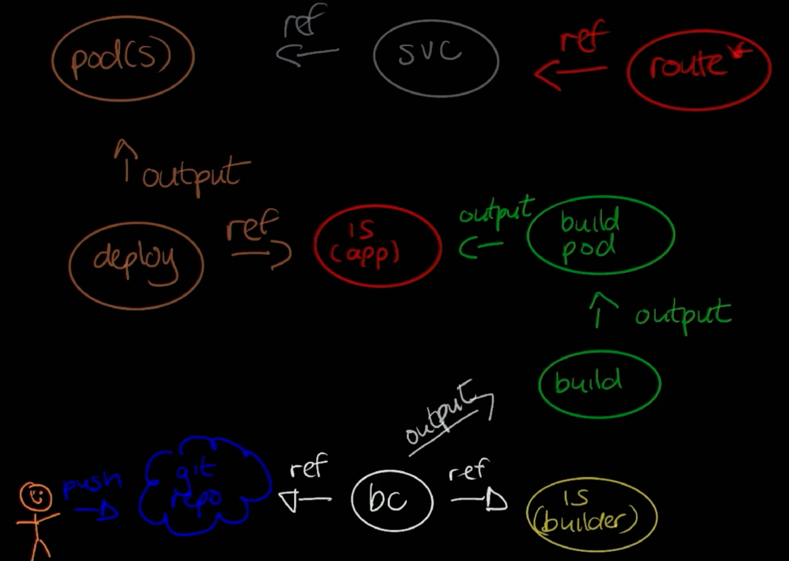
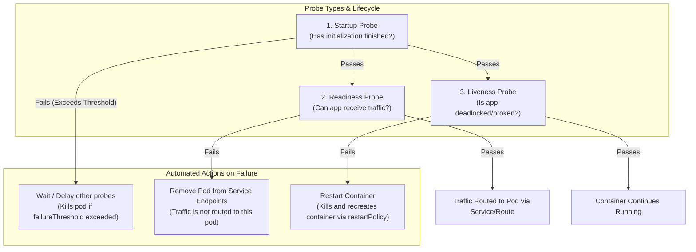

# Chapter 2: Kubernetes and OpenShift Command-line Interfaces and APIs

## 1. The Kubernetes and OpenShift Command-line Interfaces

### `kubectl` vs. `oc` CLI Overview
An OpenShift cluster can be managed using either the native Kubernetes `kubectl` CLI or the OpenShift `oc` CLI.

```
                      ┌────────────────────────────────────────┐
                      │                 oc CLI                 │
                      │   (Superset of kubectl functionality)  │
                      ├────────────────────────────────────────┤
                      │  • Native OpenShift commands           │
                      │    (oc login, oc new-app, oc status)   │
                      │  • OpenShift CRD Management            │
                      │    (projects, routes, buildconfigs)    │
                      │                                        │
                      │   ┌────────────────────────────────┐   │
                      │   │          kubectl CLI           │   │
                      │   │  (Kubernetes Native Commands)  │   │
                      │   └────────────────────────────────┘   │
                      └────────────────────────────────────────┘
```

* **`kubectl`**: The standard Kubernetes command-line tool. Provides a thin wrapper over the raw Kubernetes REST API.
  * *Version Compatibility*: The `kubectl` client version must be within **one minor version** of the cluster control plane (e.g., a `v1.30` client communicates with `v1.29`, `v1.30`, and `v1.31` control planes).
* **`oc`**: A **superset** of `kubectl`. Includes all standard `kubectl` features plus OpenShift-specific commands (`oc login`, `oc new-project`, `oc new-app`, `oc status`, `oc project`, `oc adm`).
  * The `oc` CLI package embeds `kubectl` natively.

### Installing and Verifying CLI Tools

#### 1. Manual `kubectl` Binary Installation (Linux)
```bash
# 1. Download stable binary
curl -LO "https://dl.k8s.io/release/$(curl -L -s https://dl.k8s.io/release/stable.txt)/bin/linux/amd64/kubectl"

# 2. Download and verify SHA256 checksum
curl -LO "https://dl.k8s.io/$(curl -L -s https://dl.k8s.io/release/stable.txt)/bin/linux/amd64/kubectl.sha256"
echo "$(cat kubectl.sha256)  kubectl" | sha256sum --check

# 3. Install binary to system path
sudo install -o root -g root -m 0755 kubectl /usr/local/bin/kubectl

# 4. Verify client version
kubectl version --client
```

#### 2. Installing `oc` from OpenShift Web Console
Download the exact `oc` binary tailored to your cluster version directly from the OpenShift Web Console under **Help (?) → Command Line Tools**. Available binaries support `x86_64`, `ARM64`, `s390x`, and `ppc64le` architectures across Linux, macOS, and Windows.

### CLI Inspection & Documentation Tools
* **`--help` Flag**: Displays usage syntax, available subcommands, flags, and practical examples for any command (e.g., `kubectl create --help` or `oc create --help`).
* **`oc explain <resource>`**: Queries the server's OpenAPI schema to display field descriptions, data types, and JSONPath structures for any Kubernetes resource.
  * *Field Inspection*: `oc explain pods.spec.containers.resources`
  * *Recursive Schema View*: `oc explain pods --recursive` (lists all nested fields without descriptions).

---

## 2. OpenShift Authentication Methods

Before performing API operations, clients must authenticate. OpenShift verifies identity (Authentication) before evaluating RBAC policies (Authorization).

### User Entity Types in OpenShift
1. **Regular Users**: Standard interactive user accounts represented by `User` resource objects (developers, cluster admins).
2. **System Users**: Infrastructure accounts used by system components to interact securely with the API (`system:admin`, `system:anonymous`).
3. **Service Accounts**: Represented by `ServiceAccount` objects. Enables application pods to authenticate against the API without embedding human credentials.

### Authentication Methods (`oc login`)

| Authentication Method | CLI Syntax | Characteristics & Best Practices |
| :--- | :--- | :--- |
| **Username & Password** | `oc login -u <username> -p <password> <api_url>` | Simple for lab setups. **Not recommended for production** due to plaintext credential risks in shell history. |
| **Token-Based (OAuth)** | `oc login --token=<oauth_token> --server=<api_url>` | **Production Standard**. Uses OAuth tokens issued by OpenShift's built-in OAuth server (`https://oauth-openshift.apps.<cluster>/oauth/token/request`). Ideal for CI/CD pipelines and scripts. |
| **Web Authentication** | `oc login --web <api_url>` | Opens an interactive browser window to authenticate via the configured Identity Provider (IdP) and returns an authorization token to the CLI terminal. |

---

## 3. Managing Cluster Resources at the Command Line

### Project Creation
Projects provide multi-tenant isolation boundaries around Kubernetes namespaces:
```bash
oc new-project myapp
```

### Essential Cluster Administration Commands

#### 1. Cluster Information & APIs
* `oc cluster-info`: Displays control plane endpoints and core service URLs (`oc cluster-info dump` extracts detailed diagnostic state).
* `oc api-versions`: Lists all supported API group versions on the server (e.g., `apps/v1`, `admissionregistration.k8s.io/v1`).
* `oc api-resources`: Lists all supported API resource types, shortnames, API groups, namespaced status, and kinds.
  - A **namespaced** resource means that it is tied to a specific namespace (project).
  - A **cluster-scoped** resource is not tied to any namespace. For example, nodes are cluster-scoped.
  ```bash
  # Filter namespaced resources in apps group sorted by name
  oc api-resources --namespaced=true --api-group apps --sort-by name
  ```
* `oc get clusteroperator`: Displays the operational state of all core OpenShift cluster operators (`AVAILABLE`, `PROGRESSING`, `DEGRADED`).

#### 2. Resource Querying & Export
* `oc get <resource_type>`: Displays a summary list of resources in the active project.
  * `-o wide`: Shows additional details (IP addresses, node assignments).
  * `-o yaml` / `-o json`: Exports the complete object manifest.
* `oc get all`: Retrieves a high-level summary of all primary resources in the project (pods, services, deployments, replicasets, imagestreams).
* `oc describe <resource_type> <resource_name>`: Displays comprehensive diagnostic metadata, status conditions, and chronological lifecycle events.

#### 3. Imperative & Declarative Resource Management
* `oc create -f <file.yaml>`: Instantiates resources defined in a YAML or JSON manifest file.
* `oc delete <resource_type> <resource_name>`: Removes specified resources from the cluster.
* `oc status`: Provides a high-level overview of application components, routes, builds, and configuration warnings in the active project (`--suggest` recommends fixes).
* `-n <namespace>` / `--namespace <namespace>`: Executes any command against a specific target project/namespace without switching context.

---

## 4. Kubernetes and OpenShift Resource Manifest Architecture

Every Kubernetes and OpenShift resource manifest consists of structured YAML or JSON object fields:

```
                            ┌────────────────────────────────────────┐
                            │           Resource Manifest            │
                            └───────────────────┬────────────────────┘
                                                │
       ┌───────────────────────┬────────────────┴───────┬───────────────────────┐
       ▼                       ▼                        ▼                       ▼
┌──────────────┐       ┌──────────────┐         ┌──────────────┐        ┌──────────────┐
│  apiVersion  │       │     kind     │         │   metadata   │        │     spec     │
│ (Group/Ver)  │       │(Resource Type│         │(Name/Labels) │        │(Desired State│
└──────────────┘       └──────────────┘         └──────────────┘        └──────────────┘
```

### Common Manifest Fields

| Field Name | Data Type | Purpose & Functionality |
| :--- | :--- | :--- |
| `apiVersion` | `string` | Identifies the schema group and version (e.g., `v1`, `apps/v1`). |
| `kind` | `string` | Defines the REST resource type schema (e.g., `Pod`, `Service`, `Deployment`, `Route`). |
| `metadata.name` | `string` | Unique identifier name for the resource within its namespace. |
| `metadata.namespace`| `string` | Target OpenShift project/namespace hosting the resource. |
| `metadata.labels` | `map[string]string` | Key-value pairs used for organizing, filtering, and connecting resources (e.g., `group: developers`). |
| `spec` | `object` | User-defined **desired state** of the resource (containers, images, environment variables, ports, volume mounts). |
| `status` | `object` | System-generated **actual state** maintained continuously by Kubernetes controllers (conditions, runtime readiness, IP allocations). |

### Core Kubernetes vs. OpenShift Custom Resources

#### 1. Native Kubernetes Resource Types
* **Pod (`pod`)**: Group of co-located containers sharing storage volumes and IP stack.
* **Service (`svc`)**: Internal load balancer providing a stable IP/port endpoint across pod replicas.
* **ReplicaSet (`rs`)**: Guarantees a specified count of pod replicas are running.
* **Deployment (`deploy`)**: Declarative controller managing pod rollouts and ReplicaSet updates.
* **Persistent Volume (`pv`) & Claim (`pvc`)**: Storage volume provisioned in the cluster and requested by pods.
* **ConfigMap (`cm`) & Secret**: Centralized key-value configurations and base64-encoded sensitive credentials.

#### 2. OpenShift-Specific Extensions
* **Build (`build`)**: Execution instance of a container image compilation process.
* **BuildConfig (`bc`)**: Defines build triggers, strategies (S2I, Docker, Pipeline), source Git URL, and target registry output image.
  - The BuildConfig references a builder ImageStream and outputs a build image into an ImageStream. Example:
    ```yaml
    apiVersion: v1
    kind: BuildConfig
    metadata:
      name: wildfly-build
    spec:
      source:
        git:
          uri: https://github.com/openshift/openshift-examples.git
          ref: master
        type: Git
      strategy:
        sourceStrategy:
          from:
            kind: ImageStreamTag
            name: java:openjdk-11
      output:
        to:
          kind: ImageStreamTag
          name: wildfly-build
    ```
    - This outputs a build pod which is used to build the image. After the build process is completed, a build image is pushed to the ImageStream (app) and the build pod is deleted. The deployment takes over the app ImageStream.
    - The deployment creates pods as output.
    - Service is also created along with the pods.
    - Route is also created along with the pods.
    
* **Route (`route`)**: Ingress configuration exposing an internal `Service` to external traffic using an HAProxy router hostname.
* **ImageStream (`is`)**: Abstraction tracking container image tags and automated deployment updates.

### Manifest Example & Field Breakdown
```yaml
apiVersion: v1
kind: Pod
metadata:
  name: wildfly
  namespace: my_app
  labels:
    app: wildfly
    group: developers
spec:
  containers:
    - name: wildfly
      image: quay.io/example/todojee:v1
      ports:
        - containerPort: 8080
          name: http
      resources:
        limits:
          cpu: "0.5"
          memory: "512Mi"
      env:
        - name: MYSQL_USER
          value: user1
status:
  conditions:
    - type: PodScheduled
      status: "True"
```

### Label Filtering (`--selector` / `-l`)
Filter resources using key-value labels defined in `metadata.labels`:
```bash
oc get pod --selector group=developers
```

---

## 5. Assessing OpenShift Cluster Health via CLI

To assess the operational health of an OpenShift cluster using CLI tools:

1. **Verify Control Plane Connectivity**:
   ```bash
   oc cluster-info
   ```
2. **Inspect Cluster Operators Status**:
   ```bash
   oc get clusteroperator
   ```
   *Verify that all operators display `AVAILABLE = True`, `PROGRESSING = False`, and `DEGRADED = False`.*

3. **Check Cluster Node Health**:
   ```bash
   oc get nodes
   ```
   *Ensure all control plane and worker nodes show `STATUS = Ready`.*

4. **Audit Core Infrastructure Pods**:
   ```bash
   oc get pods -n openshift-apiserver
   oc get pods -n openshift-authentication
   oc get pods -n openshift-sdn
   ```

5. **Review Project Status Summaries**:
   ```bash
   oc status -n <project_name>
   ```

---

## Monitoring Application Health (Health Probes)

In Kubernetes and OpenShift, the container engine only monitors the health of the primary container process (PID 1). If an application deadlocks, runs out of database connections, or is in the middle of a lengthy startup sequence, the process itself may still appear alive to the OS even though the application is unable to serve user traffic.

To solve this, OpenShift uses **Health Probes** (configured in the Pod/Deployment specification and executed periodically by the `kubelet` on each node) to monitor the true internal state of applications.



---

### The Three Probe Types

| Probe Type | Purpose | Behavior on Failure | Typical Use Case |
| :--- | :--- | :--- | :--- |
| **Startup Probe** | Checks if a slow-starting application has finished bootstrapping. | Kills container and restarts pod after `failureThreshold` is exceeded. Disables Liveness and Readiness until it succeeds. | Legacy applications, large Java JVM / Spring Boot / WildFly apps with heavy initialization. |
| **Readiness Probe** | Checks if the container is currently ready to accept incoming client requests. | Removes the pod IP from the `Endpoints` list of associated `Service` objects. **Does not restart** the container. | App is warming up caches, reloading large config files, or temporarily overwhelmed with work. |
| **Liveness Probe** | Checks if the container is running and healthy. | **Restarts the container** according to the pod's `restartPolicy`. | Detecting fatal application deadlocks, memory leaks, or unrecoverable thread crashes. |

---

### Probe Check Mechanisms

OpenShift supports three distinct mechanisms to test application health:

1. **HTTP GET (`httpGet`)**:
   - The kubelet performs an HTTP GET request to the specified container port and path (e.g., `/healthz`, `/ready`, `/actuator/health`).
   - Responses with HTTP status codes $\ge 200$ and $< 400$ indicate **success**.
   - Any other status code ($\ge 400$) or connection timeout indicates **failure**.

2. **TCP Socket (`tcpSocket`)**:
   - The kubelet attempts to establish a TCP connection on a specified container port.
   - If the socket can be opened successfully, the probe succeeds.
   - Useful for non-HTTP workloads (e.g., databases like MySQL/PostgreSQL, Redis caches, message brokers).

3. **Container Command Execution (`exec`)**:
   - The kubelet executes a command inside the container namespace (e.g., running a diagnostic script or checking a lockfile).
   - An exit status code of `0` indicates **success**.
   - Non-zero exit codes indicate **failure**.

---

### Key Probe Timing & Threshold Parameters

- **`initialDelaySeconds`**: Number of seconds to wait after the container has started before initiating probe checks (default: `0`).
- **`periodSeconds`**: Frequency (in seconds) at which the probe is executed (default: `10s`, minimum: `1s`).
- **`timeoutSeconds`**: Number of seconds before the probe call times out and is marked as failed (default: `1s`).
- **`successThreshold`**: Minimum consecutive successful probe runs required to mark the probe as passed after a failure (default: `1`).
- **`failureThreshold`**: Number of consecutive failures before OpenShift takes action (restart or remove from endpoints) (default: `3`).

---

### Pod Manifest Example with All Probe Types

```yaml
apiVersion: apps/v1
kind: Deployment
metadata:
  name: web-app
  namespace: my-project
spec:
  replicas: 2
  selector:
    matchLabels:
      app: web-app
  template:
    metadata:
      labels:
        app: web-app
    spec:
      containers:
        - name: web-app
          image: quay.io/example/web-app:v1
          ports:
            - containerPort: 8080
          # 1. Startup Probe: Allows up to 5 minutes (30 * 10s) for initial boot
          startupProbe:
            httpGet:
              path: /healthz/startup
              port: 8080
            failureThreshold: 30
            periodSeconds: 10

          # 2. Readiness Probe: Checks if app is ready to serve traffic
          readinessProbe:
            httpGet:
              path: /ready
              port: 8080
            initialDelaySeconds: 5
            periodSeconds: 5
            timeoutSeconds: 2
            failureThreshold: 3

          # 3. Liveness Probe: Restarts container if deadlocked
          livenessProbe:
            httpGet:
              path: /healthz
              port: 8080
            initialDelaySeconds: 15
            periodSeconds: 10
            timeoutSeconds: 2
            failureThreshold: 3
```

---

### Step-by-Step CLI Implementation (`oc`)

#### 1. Add or Update Probes on Existing Deployments
```bash
# Add an HTTP GET Readiness Probe
oc set probe deployment/web-app --readiness \
  --get-url=http://:8080/ready \
  --initial-delay-seconds=10 \
  --timeout-seconds=2 \
  --period-seconds=5

# Add an HTTP GET Liveness Probe
oc set probe deployment/web-app --liveness \
  --get-url=http://:8080/healthz \
  --initial-delay-seconds=15 \
  --timeout-seconds=2 \
  --period-seconds=10

# Add a TCP Socket Probe (e.g. for database or cache)
oc set probe deployment/database --readiness \
  --open-tcp=3306 \
  --initial-delay-seconds=5

# Add an Exec Command Probe (running health check script)
oc set probe deployment/web-app --liveness \
  --initial-delay-seconds=20 \
  -- /bin/sh -c "cat /tmp/healthy"

# Remove a probe from a deployment
oc set probe deployment/web-app --readiness --remove
```

#### 2. Inspecting and Diagnosing Probe Failures
```bash
# Inspect configured probes in deployment spec
oc describe deployment/web-app | grep -A 5 -E "(Liveness|Readiness|Startup)"

# Inspect pod lifecycle events (shows probe failure warnings)
oc describe pod <pod-name> -n my-project

# Check real-time endpoints backing a Service
oc get endpoints web-app -n my-project
```

---

### OpenShift Web Console Workflow

1. **Accessing Health Checks**:
   - Switch to the **Developer** perspective in the OpenShift Web Console.
   - Navigate to **Topology** and click on the desired application deployment ring.
   - In the side panel, click **Actions** -> **Add Health Checks** (or **Edit Health Checks** if probes already exist).

2. **Configuring Health Checks in UI**:
   - **Add Readiness Probe**:
     - Select probe type: **HTTP GET**, **Container Command (Exec)**, or **TCP Socket**.
     - Set path (e.g., `/ready`), port (e.g., `8080`), initial delay, timeout, and failure threshold.
   - **Add Liveness Probe**:
     - Set path (e.g., `/healthz`), port, and thresholds.
   - **Add Startup Probe**:
     - Useful if the application takes longer to initialize than standard liveness parameters allow.
   - Click **Add** / **Save**.

3. **Verifying Health in Web Console**:
   - The **Topology** view displays visual indicator badges on the pod ring:
     - Clear/Dark Blue: Pod is running and ready.
     - Light/Dashed Ring: Pod is starting or failing readiness (not receiving traffic).
     - Red/CrashLoop: Pod failed liveness checks and is repeatedly restarting.

