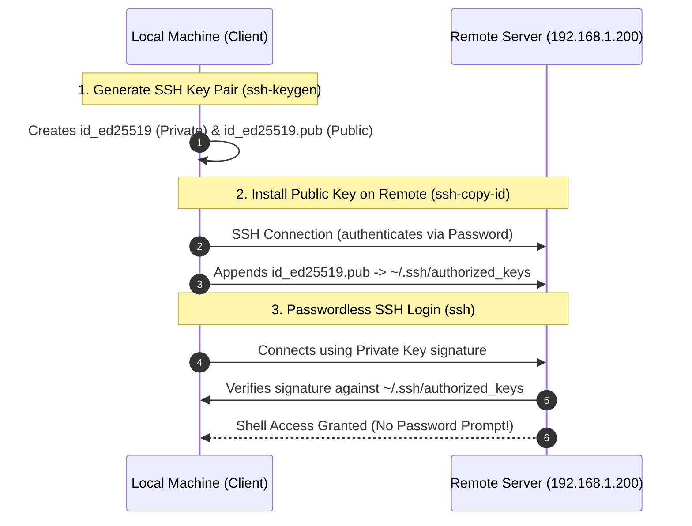

# SSH Key-Based Authentication Demo

This guide explains step-by-step how to set up passwordless SSH authentication between a local machine (client) and a remote Linux server using ED25519 SSH keys.

---

## Workflow Overview



---

## Detailed Step-by-Step Breakdown

### Step 1: Generate an SSH Key Pair (`ssh-keygen`)

Run `ssh-keygen` on the client machine to create a cryptographic key pair:

```bash
ssh-keygen
```

#### Terminal Execution:
```text
Generating public/private ed25519 key pair.
Enter file in which to save the key (/Users/luca/.ssh/id_ed25519): 
/Users/luca/.ssh/id_ed25519 already exists.
Overwrite (y/n)? y
Enter passphrase for "/Users/luca/.ssh/id_ed25519" (empty for no passphrase): 
Enter same passphrase again: 
Your identification has been saved in /Users/luca/.ssh/id_ed25519
Your public key has been saved in /Users/luca/.ssh/id_ed25519.pub
```

#### What Happens Here:
- **Algorithm Used (ED25519)**: ED25519 is an Elliptic Curve Digital Signature Algorithm (EdDSA) offering superior security, resistance to side-channel attacks, and high performance compared to legacy RSA keys.
- **Private Key (`~/.ssh/id_ed25519`)**: Secret key that remains strictly on the client machine. Never share or transfer this file!
- **Public Key (`~/.ssh/id_ed25519.pub`)**: Public portion of the key pair meant to be distributed to remote servers you wish to access.
- **Passphrase**: Leaving the passphrase empty enables seamless, automated passwordless login.
- **Fingerprint & Randomart**: SHA256 hash representation of the key used to visually verify key integrity.

---

### Step 2: Install Public Key on Remote Host (`ssh-copy-id`)

Copy the newly generated public key to the remote server:

```bash
ssh-copy-id luca@192.168.1.200
```

#### Terminal Execution:
```text
/usr/bin/ssh-copy-id: INFO: Source of key(s) to be installed: "/Users/luca/.ssh/id_ed25519.pub"
/usr/bin/ssh-copy-id: INFO: attempting to log in with the new key(s), to filter out any that are already installed
/usr/bin/ssh-copy-id: INFO: 1 key(s) remain to be installed -- if you are prompted now it is to install the new keys
luca@192.168.1.200's password: 

Number of key(s) added: 1

Now try logging into the machine, with: "ssh 'luca@192.168.1.200'"
and check to make sure that only the key(s) you wanted were added.
```

#### What Happens Under the Hood:
1. `ssh-copy-id` reads the local public key file (`~/.ssh/id_ed25519.pub`).
2. Opens an SSH session to `192.168.1.200` (authenticating via remote user password for the last time).
3. Appends the public key string to `/home/luca/.ssh/authorized_keys` on the remote server.
4. Enforces secure permissions on the remote file system:
   - `700` (`drwx------`) for `~/.ssh/`
   - `600` (`-rw-------`) for `~/.ssh/authorized_keys`

---

### Step 3: Authenticate via SSH Key (`ssh`)

Connect to the remote host without entering a password:

```bash
ssh luca@192.168.1.200
```

#### Terminal Execution:
```text
Linux debian-eos 6.12.96+deb13-amd64 #1 SMP PREEMPT_DYNAMIC Debian 6.12.96-1 (2026-07-20) x86_64
...
# luca @ debian-eos in ~ [16:23:57]
```

#### Challenge-Response Authentication Protocol:
1. Client sends key ID to server during SSH handshake.
2. Server verifies `id_ed25519.pub` exists in `~/.ssh/authorized_keys`.
3. Server generates a random challenge message, encrypts it with the public key, and sends it to the client.
4. Client decrypts/signs the challenge using private key `id_ed25519` and returns proof.
5. Server validates proof against public key and grants shell access instantly without password prompt.

---

### Step 4: Verify Authorized Keys on Remote Server (`cat ~/.ssh/authorized_keys`)

Inspect the remote `authorized_keys` file:

```bash
cat ~/.ssh/authorized_keys
```

#### Terminal Output:
```text
ssh-ed25519 AAAAC3NzaC1lZDI1NTE5AAAAINiriTy2w4BlqluFh2Nu4TRcqkuCblc/L61FFk2odw15 luca@MacBook-Air---Luca.local
```

This confirms the local machine's ED25519 public key is stored on the remote host, granting access for future SSH sessions and automated scripts.

---

## Best Practices & Security Tips

| Security Aspect | Best Practice |
| :--- | :--- |
| **Private Key Protection** | Ensure `chmod 600 ~/.ssh/id_ed25519` on client to prevent unauthorized reading. |
| **Server Permissions** | Strict permissions required on remote server (`~/.ssh` directory `700`, `authorized_keys` file `600`). |
| **Disable Password Auth** | For hardened security, set `PasswordAuthentication no` in `/etc/ssh/sshd_config` on the remote server after key verification. |
| **Key Type Choice** | Prefer **Ed25519** over standard RSA (`ssh-keygen -t ed25519`). |
