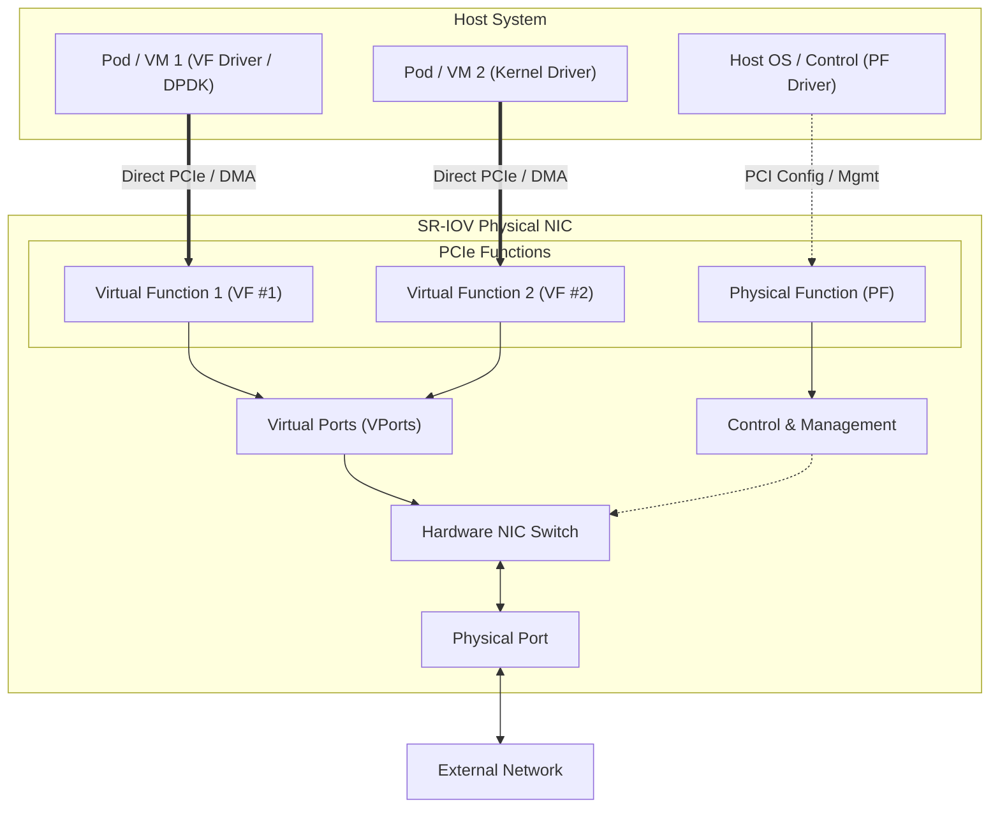

# Single Root I/O Virtualization (SR-IOV)

**Single Root I/O Virtualization (SR-IOV)** is a specification defined by the PCI-SIG (PCI Special Interest Group) that allows a single physical PCI Express (PCIe) network device to present itself to the host operating system and hypervisor as multiple separate virtual PCIe devices. 

By partitioning a physical network interface card (NIC) at the silicon level, SR-IOV enables guest Virtual Machines (VMs) or container Pods to communicate directly with physical network hardware. This bypasses the host kernel stack, hypervisor vSwitch, and context-switching overhead, achieving **near-native throughput, microsecond-level low latency, and drastic reductions in host CPU utilization**.

---

## Architecture & Core Components

An SR-IOV network card replaces software-based virtual switching with hardware-assisted switching built directly into the NIC hardware interface.



### Key Architectural Concepts

1. **Physical Function (PF)**
   - The full-featured PCIe function of the network adapter.
   - Discovered and loaded by the host management OS.
   - Possesses full PCIe configuration capabilities, used to manage device resources, configure embedded hardware switches, and allocate/instantiate Virtual Functions (VFs).

2. **Virtual Function (VF)**
   - A lightweight PCIe function allocated on the network card.
   - Each VF has its own independent PCI configuration space, register sets, and queue pairs.
   - Exposed directly to guest VMs or containers as if it were a dedicated physical NIC.
   - Shares physical hardware resources (e.g., physical port, transceiver) with the PF and other VFs.

3. **NIC Switch (Embedded Hardware Switch)**
   - On-chip hardware switch inside the NIC silicon.
   - Forwards packets between the physical port and internal **Virtual Ports (VPorts)**.
   - Handles L2/L3 packet filtering, VLAN tagging, MAC address matching, and packet switching completely in hardware without host CPU involvement.

4. **Virtual Ports (VPorts)**
   - Logical internal ports on the NIC hardware switch.
   - Each VPort connects to either the Physical Function (PF) or a Virtual Function (VF) to route ingress/egress frame traffic.

5. **Physical Port**
   - The actual physical interface (RJ45, SFP+, QSFP) connecting the network card to external physical switches/networks.

---

## Networking Modes: Traditional vs. Pass-Through vs. SR-IOV

| Feature / Metric | Traditional Software vSwitch (Bridge/OVS) | Full PCIe Pass-Through | SR-IOV (Hardware Virtualization) |
| :--- | :--- | :--- | :--- |
| **Data Path Overhead** | High (Kernel stack processing, vSwitch, CPU context switches) | Lowest (Direct hardware access) | **Lowest (Direct hardware access & DMA)** |
| **Latency** | High & Variable | Ultra-low & Deterministic | **Ultra-low & Deterministic** |
| **Host CPU Utilization** | High (Core reservation needed for packet processing) | Minimal | **Minimal** |
| **Scalability & Density** | Unlimited virtual interfaces | 1 Physical NIC = 1 VM/Pod (No sharing) | **1 Physical NIC = Tens/Hundreds of VFs** |
| **Hardware Flexibility** | High | Low | **High (Combines direct access with high density)** |

---

## SR-IOV in Containers & Kubernetes / OpenShift

In containerized environments (e.g., OpenShift, Kubernetes), SR-IOV allows pods requiring high-speed data planes to directly attach to node network hardware.

### 1. Driver Modes inside Containers

When exposing a VF to a container pod, the SR-IOV device driver determines how the interface is delivered:

- **`netdevice` Driver**:
  - Exposes the VF as a standard Linux kernel network interface inside the container’s network namespace (`netns`).
  - Ideal for applications requiring standard TCP/IP networking with raw line-rate hardware performance.
- **`vfio-pci` Driver**:
  - Exposes the VF as a raw PCI character device (`/dev/vfio/*`) inside the container.
  - Used for user-space packet processing frameworks like **DPDK (Data Plane Development Kit)** or **RDMA (Remote Direct Memory Access)**, completely bypassing the Linux kernel network stack.

### 2. OpenShift SR-IOV Architecture & Components

OpenShift manages SR-IOV hardware using the **SR-IOV Network Operator**, which orchestrates several lower-level custom resources and plugins:

- **SR-IOV Network Operator**: Manages node configurations, creates `SriovNetworkNodeState` CRs, and configures node network interfaces.
- **SR-IOV Network Device Plugin**: Discovers VFs on worker nodes and advertises them as allocatable K8s resources (e.g., `openshift.io/sriov_nic`).
- **SR-IOV CNI Plugin**: Attaches the allocated VF directly into the target container pod.
- **Multus CNI**: Enables pods to have multiple network interfaces — retaining a primary CNI interface (e.g., OVN-Kubernetes for cluster control plane) while adding an SR-IOV interface as a high-performance secondary data plane.

### 3. Node Capability & Labeling
Nodes with SR-IOV capable hardware are labeled to enable SR-IOV device scheduling:
```bash
oc label node <node_name> feature.node.kubernetes.io/network-sriov.capable="true"
```

---

## Key Use Cases & Applications

1. **Telecom & Cloud AI RAN (Radio Access Network)**:
   - 5G Distributed Units (DU) and Centralized Units (CU) handling real-time L1/L2 processing with microsecond latency requirements.
2. **High-Performance Computing (HPC) & AI/ML Training**:
   - High-throughput node-to-node communication leveraging RDMA over Converged Ethernet (RoCE) or InfiniBand VFs.
3. **Network Functions Virtualization (NFV)**:
   - Virtual Network Functions (VNFs) / Cloud-native Network Functions (CNFs) such as vRouters, Firewalls, IPsec gateways, and User Plane Functions (UPF).
4. **Financial Trading & Low-Latency Media**:
   - Ultra-low jitter, deterministically fast packet delivery for high-frequency trading (HFT) and uncompressed video streams.

---

## 🔗 Learning Resources & References

- [SR-IOV Architecture Overview & Key Components - Microsoft Learn](https://learn.microsoft.com/en-us/windows-hardware/drivers/network/sr-iov-architecture)
- [About SR-IOV Hardware Networks - Red Hat OpenShift Container Platform Documentation](https://docs.redhat.com/en/documentation/openshift_container_platform/4.18/html/hardware_networks/about-sriov)
- [SR-IOV Deep Dive & Architecture Guide - Medium (chmodshubham)](https://medium.com/@chmodshubham/sr-iov-0e7fb2752fcc)
- [SR-IOV Technical Overview & Practical Demo Video (YouTube)](https://www.youtube.com/watch?v=ltxzUUn1Mg8)
- [SR-IOV with Kubernetes & OpenShift Hardware Acceleration Video (YouTube)](https://www.youtube.com/watch?v=z-CAUG8Ia9I&t=764)
- [SR-IOV vs Software vSwitch & Pass-through Video (YouTube)](https://www.youtube.com/watch?v=ymUJHh7gzHk)