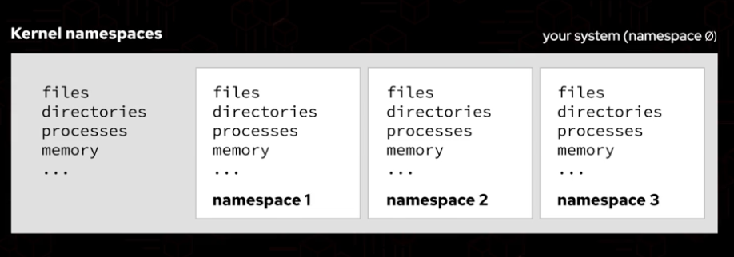
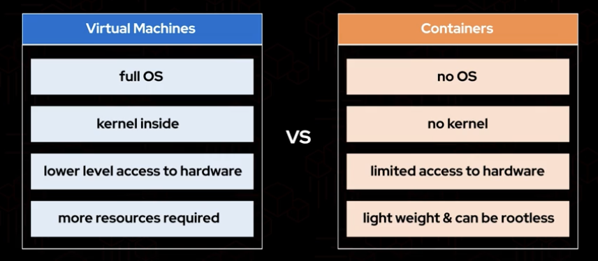

# Containers, Kubernetes and Red Hat OpenShift Technical Overview

## Container Concepts
- A **container** is a running instance of a container image.
- A **container image** is a single file (tarball) loaded with metadata, that has all the files needed to run an application, including the application itself.
- The **entry point** is the command used to start the container (any process).

### Technologies powering containerization
- **Kernel namespaces**: Used to isolate resources between processes. For example, a process can have its own PID, mount point, and network stack, which are isolated from the host system and other processes.

    - A namespace is created for each container. 
- **cgroups (control groups)**: Used to limit the resources available to processes. For example, a process can be limited to using a certain amount of CPU time, memory, or disk I/O.
- **seccomp**: Used to restrict the system calls that a process can make. For example, a process can be prevented from accessing the network or making changes to the file system.
- **SELinux**: Used to enforce mandatory access control on processes. For example, a process can be prevented from accessing files that it does not have permission to access.

### Container image
- buildah, podman can be used to build images and prebuilt container images are available in registries like Quay.io, Docker Hub, etc.
- The container runtime can be CRI-O, Docker, Podman, runC, cri-o, or containerd
- Containers are managed using podman, docker or kubernetes (these are container engines/orchestrators)
- For RedHat registry.redhat.io, registry.connect.redhat.com or quay.io can be used to pull images. Other registries can also be used.
- Containers can be **rootless**

### Container vs. VM


## Introducing Kubernetes and OpenShift

- To coordinate and orchestrate containers we use Kubernetes. 
- Kubernetes is a container orchestrator that manages a bunch of container hosts, also known as nodes.
- A cluster is a bunch of nodes.
- Compute resorces are pulled together to run applications
- Images of the containers are stored in an image registry.
- OpenShift Container Platform is RedHat's Kubernetes distribution, along with other tools around Kubernetes.
- Declarations are used for defining the desired state of the application in YAML format and stored in a version control system like git.
Ex. *The purple app must be a running app and if the load goes above 70% CPU utilization scale to a maximum of 3 pods.*
- The web console is recommended for use with OpenShift.
- Pods can be composed of one or more containers. (Kubernetes representation of a running container)

- Control plane nodes (master) are the brain of the cluster. They run components like API server, scheduler, controller manager, etcd, etc.
- Worker nodes are the place where the pods are running. They run the container runtime (CRI-O) and kubelet.
- RedHat OpenShift adds a lot of tools over vanilla Kubernetes such as: a container image builder (buildah), a container image registry (quay.io), a container runtime (CRI-O), a web console, monitoring (prometheus), logging (EFK stack), etc. 
- So by having multiple hosts we provide redundacy. If one host fails, the other hosts can take over the load.

## Getting started with OpenShift 
- Clusters can be deployed on bare-metal machines or cloud infrastructure (AWS, Azure, GCP, vSphere).
- Deployment models include both **Self-Managed** (OCP, Single Node OpenShift / SNO) and **Managed Cloud Services** (ROSA on AWS, ARO on Azure, ROSD).
- For a deployment of a RedHat OpenShift cluster, a minimum of 3 control plane nodes are required.

### Accessing & Interacting with OpenShift
- **OpenShift Web Console**: Provides two interface perspectives:
  - **Developer Perspective**: Application topology, Git-to-deploy workflows, build monitoring, and project metrics.
  - **Administrator Perspective**: Node health, Operators, user access management, networking, and storage.
  - **Cluster auto-scaling**: used to add or remove nodes from the cluster based on the load. (It uses a Cluster Autoscaler controller that monitors pending pods and adjusts the number of nodes in the cluster accordingly).
    - It uses the **Cluster Autoscaler** controller, which:
      - Monitors pending pods that cannot be scheduled due to insufficient resources
      - Monitors underutilized nodes
      - Adjusts the number of nodes in the cluster accordingly
    - Uses **NodeGroup** concept to scale nodes in groups based on the cloud provider (AWS, Azure, GCP, vSphere).
    - Supports **Horizontal Pod Autoscaling (HPA)** for scaling pods based on resource utilization (CPU/memory) or custom metrics.
    - Supports **Vertical Pod Autoscaling (VPA)** for adjusting CPU/memory requests and limits for pods.

- **OpenShift CLI (`oc`)**: Extended command-line tool based on `kubectl`:
  - `oc login`: Authenticates to the OpenShift API server.
  - `oc login -u <username> -p <password> --server <server>`: Login to the OpenShift API server using username and password. It also accepts the kubeconfig file generated by the openshift-install tool.
  - `oc new-app`: Creates applications from source code repositories, container images, or templates.
  - `oc status` / `oc get pods`: Queries real-time application and cluster status.
  - `oc adm top node`: Get the top node
  - `oc adm top pod --all-namespaces`: Get the top pod in all namespaces
  - `oc get nodes`: Get the nodes to list the nodes that are part of the cluster.
  - `oc get pods --all-namespaces`: Get the pods in all namespaces
  - `oc debug node/<node_name> -it --image=registry.access.redhat.com/ubi8/ubi`: Debug a node (you can get the node name using `oc get nodes`). (getting a shell for the node)

- **ROSA**: RedHat OpenShift Service on AWS, managed by AWS.
    - Provides RedHat support for the cluster.
    - Users can deploy their applications on the cluster using the oc CLI.
    - `rosa login`: Login to the ROSA cluster.
    - `rosa list clusters`: List all ROSA clusters.
    - `rosa list clusters --hosted-cp`: List all ROSA clusters with hosted control plane.
    - `rosa describe cluster --cluster <cluster name>`: Describe a ROSA cluster.
    - `rosa create cluster --cluster-name <cluster name> --hosted-cp --subnet-ids <subnet ids> --tags <tags>`: Create a ROSA cluster with hosted control plane.
    - `rosa delete cluster --cluster <cluster name>`: Delete a ROSA cluster.
    - `rosa delete cluster --cluster <cluster name> --mode delete-non-prod` : Delete a ROSA cluster with non-prod mode.
    - `rosa create operator-backings --cluster <cluster name>`: Create operator backings for a ROSA cluster.


### Core Application Capabilities
- **Source-to-Image (S2I)**: OpenShift framework that automatically builds a container image directly from source code in Git using builder images—without requiring a `Dockerfile`.
- **Services vs. Routes**:
  - **Service**: Internal Kubernetes object load balancing traffic across a set of pods.
  - **Route**: OpenShift resource that exposes an internal Service to external network traffic outside the cluster using built-in HAProxy ingress routers (supports HTTP, HTTPS, and TLS termination).
- **Operators & OperatorHub**: Automated lifecycle managers that install, configure, update, and manage stateful services (databases, monitoring stacks) using Custom Resource Definitions (CRDs).

## Managing machines and nodes with operators
- Cluster operators are mandatory whereas OpenShift marketplace operators are elective
- Operators are containerized applications that run in the cluster and manage other applications.
- Operators use CRDs (Custom Resource Definitions) to define new types of resources and create/update/delete pods based on the CRDs.
- CRDs reads the specified state from the user and tries to match the desired state to the actual state. If there is a mismatch, the operator will take action to correct it.
- They provide a way to automate the management of applications in a Kubernetes cluster.
- Infrastructure nodes hosts control plane and infrastructure applications. Worker nodes hosts user applications.
- A cluster runs over RedHat CoreOS.

### Machine config operator
- It is used for managing the configuration of the nodes in the cluster, using machine configs, which are a specific type of CRD which define the desired state of the nodes.
- It automatically updates the nodes to match the desired state.
- It is mandatory for the cluster to function.
- It is used to update the cluster to a new version of OpenShift.
- It is used to apply custom configuration to the nodes (for example SSH keys, kernel parameters, etc.).
- Machine Config Daemon (MCD): It is a daemon that runs on each node in the cluster and is responsible for applying the machine configs to the nodes.
- Machine Config Pool (MCP): It is a group of nodes (such as master or worker) managed together by the Machine Config Operator to apply configuration changes as a single unit.
  - Configuring machine config pool:
  ```bash
  oc create -f mcp.yml # creating a new MCP
  # configure the yml file
  oc debug node/worker04 # get a shell for the node
  # inside the shell
  mcps # list all MCPs
  mcp status # get the status of all MCPs
  mcp update node/<node_name> # update a node
  mcp drain <mcp_name> # drain a MCP
  mcp uncordon <mcp_name> # uncordon a MCP
  mcp drain node/<node_name> --disable # disable the mcp
  mcp uncordon node/<node_name> --enable # enable the mcp
  mcp status # get the status of all MCPs
  exit # exit the shell
  ```
  - `.yaml` format is used to declare the behaviour of MCPs
- Machine Config Controller (MCC): It monitors MachineConfigs and MachineConfigPools to generate target Ignition configurations.
- Machine Config Server (MCS): It serves Ignition configurations to new nodes during cluster installation and node bootstrapping.
- MachineSets are used for automatic scaling of the cluster, used to add or remove nodes from the cluster based on the load. They take advantage of autoscaling.
- A custom MachineAutoscaler object can be created to autoscale the cluster based on custom metrics.
  - Example:
  ```yaml
  apiVersion: autoscaling.openshift.io/v1beta1
  kind: MachineAutoscaler
  metadata:
    name: worker-us-east-1a
    namespace: openshift-machine-api
  spec:
    minReplicas: 1
    maxReplicas: 12
    scaleTargetRef:
      apiVersion: machine.openshift.io/v1beta1
      kind: MachineSet
      name: worker
  ```

---

- `bashrc` - file used to store the aliases and functions for the bash shell.
- `journald` - daemon used for logging in Linux. (By default, the kubelet writes logs to journald). 
- `journalctl` - tool used to view the logs of a process.

### Cluster version operator (CVO)
- It provides cluster-level configuration and lifecycle management.
- It ensures that the cluster is always running the correct version of OpenShift.
- It can be used to update the cluster to a new version of OpenShift.
- It is mandatory for the cluster to function.
- It is used to manage the cluster as a single unit.
- Cluster Version Operator manages the cluster by observing the desired cluster state and updating the actual cluster state to match the desired cluster state.

## Interfacing with OpenShift using command line tools
```bash
which kubectl # gives the path to the kubectl binary
which oc # gives the path to the oc binary
# it shows that the oc is linked to the kubectl binary - this is done so that we can use the same commands for both oc and kubectl.
md5sum $(which kubectl) # gives the md5sum of the kubectl binary
md5sum $(which oc) # gives the md5sum of the oc binary
# we should get the same md5sum for both binaries since oc is just a link to kubectl.
oc set env --help # shows the help for the set env command
oc get pods -n openshift-authentication # display the pods in the node
# with the oc command you gain additional features along with everything kubectl has to offer
oc completion bash # enable bash shell completion for oc
oc whoami --show-console # display the console url for the current user
oc logout # logout from the cluster
```

## Deploying Applications with OpenShift
- Helm is the package manager for Kubernetes. It is used to package, deploy and manage applications on Kubernetes.
```bash
oc login -u developer https://api.ocp4.example.com:6443
oc new-project coffee-shop
oc get all
helm install <project-name> <url-to-chart>
oc get all
# a route allows traffic to come from outside of the OpenShift cluster to a service inside the cluster which runs as a pod
oc get route -n <project-name> # to get the route url
oc delete project <project-name> # to delete the project and all its resources
```
- OpenShift web console uses profiles such as Administrator or Developer to allow users to access the cluster with different perspectives and priviliges.
- Templates can be used for creating projects. It is similar to Helm Charts but with more features. They are available in the OpenShift web console.
```yaml
apiVersion: template.openshift.io/v1
kind: Template
metadata:
  creationTimestamp: null
  name: project-request
objects:
- apiVersion: project.openshift.io/v1
  kind: Project
  metadata:
    annotations:
      openshift.io/description: ${PROJECT_DESCRIPTION}
      openshift.io/display-name: ${PROJECT_DISPLAYNAME}
      openshift.io/requester: ${PROJECT_REQUESTING_USER}
    creationTimestamp: null
    name: ${PROJECT_NAME}
  spec: {}
  status: {}
- apiVersion: rbac.authorization.k8s.io/v1
  kind: RoleBinding
  metadata:
    creationTimestamp: null
    name: admin
    namespace: ${PROJECT_NAME}
  roleRef:
    apiGroup: rbac.authorization.k8s.io
```
- A project can also be instantiated from an existing Container Image.

### Scaling Applications
```bash
oc project webserver # switch the project
oc get pods # list the pod (the pod might not be running yet)
oc get deploy # list the deployment
oc scale deploy/webserver --replicas=3 # telling the deployment that we want 3 replicas for this app
oc get pods # list the pod (they should be 3 running now)
oc rsh webserver-0 # get a shell for the pod (the first replica)
cat /usr/share/nginx/html/index.html # view the index.html file
curl localhost # curl the website
exit # exit the shell
```
### Source to Image (S2I)
- **Source-to-Image (S2I)** is an OpenShift framework that builds reproducible container images directly from application source code stored in a Git repository using builder images—without requiring a `Dockerfile`.
- **How S2I works**:
  1. Detects the language/framework automatically or uses a specified builder image (e.g., Python, Node.js, Java, PHP).
  2. Spawns a build pod running the builder image.
  3. Clones the source code into the container and runs the builder image's `assemble` script to compile dependencies and package the app.
  4. Output container image is pushed to the internal OpenShift registry and deployed as a pod.
- **Key CLI Workflow**:
  ```bash
  # Create a new application directly from Git repository using S2I
  oc new-app https://github.com/sclorg/nodejs-ex.git --name=myapp

  # Monitor the build process
  oc get builds                        # list all builds
  oc logs -f build/myapp-1             # follow build logs
  oc status                            # check current deployment status

  # Trigger a manual rebuild when source code updates
  oc start-build myapp --follow

  # Expose the service externally via a Route
  oc expose svc/myapp
  oc get routes                        # inspect generated public URL
  ```
- **Benefits**:
  - **Developer Productivity**: Developers focus purely on code without writing or maintaining complex `Dockerfile`s.
  - **Security & Compliance**: Uses standardized, pre-patched, and Red Hat-certified builder images.
  - **Reproducibility**: Guarantees consistent application builds across environments.

## Controlling Access to OpenShift


- **LDAP Identity Provider**:
  - Connects OpenShift authentication to an external LDAP directory server to manage user identities and group memberships centrally.
  - Syncs LDAP users and groups into OpenShift `User` and `Group` resources for RBAC policies.
- **OpenShift Authentication Components**:
  - **`authentication-operator`**: Manages and maintains the lifecycle of the internal OAuth server and authentication services in the cluster.
  - **`oauth (CRD)`**: Custom Resource Definition used to configure cluster-wide authentication settings and identity providers (e.g., LDAP, HTPasswd, OIDC).
  - **`oauth pods`**: Containerized OAuth server instances running in the cluster that validate credentials and issue access tokens to users.

### Access Control & LDAP CLI Commands
```bash
# View authentication operator status and OAuth config
oc get clusteroperator authentication
oc get oauth cluster -o yaml

# Assign roles to users and groups
oc adm policy add-role-to-user admin developer -n coffee-shop
oc adm policy add-cluster-role-to-user cluster-admin admin-user

# Manage and sync LDAP groups to OpenShift
oc adm groups new dev-team developer1 developer2
oc adm groups sync --sync-config=ldap-sync.yaml --confirm
```
